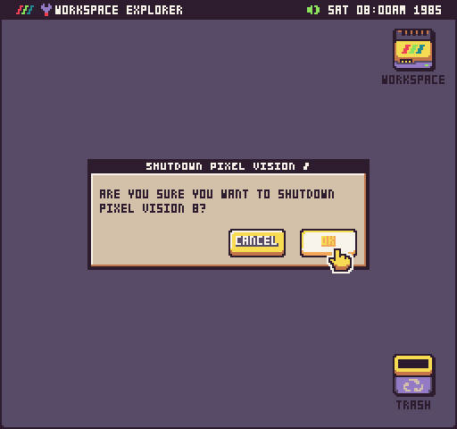
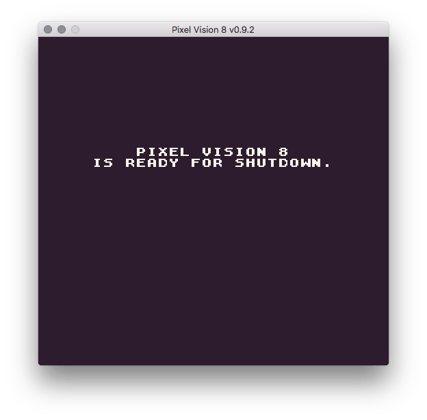

# Shutting Down Pixel Vision OS

When you are done running Pixel Vision OS, be sure to select Shutdown from the menu before quitting.

While this isn’t critical, since you can quit Pixel Vision 8 at any time, it does ensure that Pixel Vision OS saves any changes to the user’s bios file making it save to quit.

You’ll know its safe to quit Pixel Vision 8 when you see the following screen.


