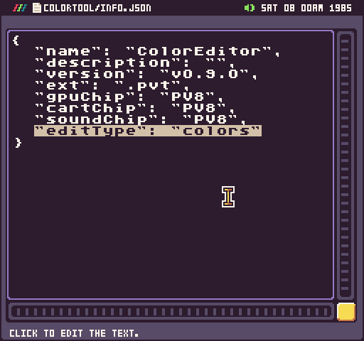

# Included Tools 

Pixel Vision OS includes built-in tools to help you create PV8 games. These tools are located in the `/Workspace/System/Tools/` folder.

Each tool is registered to edit a specific Pixel Vision 8 file type. For example, if you open up the Color Tool’s info.json file, you’ll see it is set to edit color files.

Pixel Vision OS includes the following built-in tools:

<table>
  <tr>
    <td>Tool</td>
    <td>Edit Type</td>
    <td>File</td>
  </tr>
  <tr>
    <td>Color Tool</td>
    <td>colors</td>
    <td>colors.png</td>
  </tr>
  <tr>
    <td>Image Preview</td>
    <td>png</td>
    <td>*.png</td>
  </tr>
  <tr>
    <td>Installer Tool</td>
    <td>installer</td>
    <td>installer.txt</td>
  </tr>
  <tr>
    <td>Music Tool</td>
    <td>music</td>
    <td>music.json</td>
  </tr>
  <tr>
    <td>Settings Tool</td>
    <td>settings</td>
    <td>n/a</td>
  </tr>
  <tr>
    <td>SFX Tool</td>
    <td>sounds</td>
    <td>sounds.json</td>
  </tr>
  <tr>
    <td>Sprite Tool</td>
    <td>sprites</td>
    <td>sprites.png</td>
  </tr>
  <tr>
    <td>Text Editor Tool</td>
    <td>txt, json, info, lua</td>
    <td>*.txt, *.json, info.json, *.lua</td>
  </tr>
  <tr>
    <td>Tilemap Tool</td>
    <td>tilemap, tiles</td>
    <td>tilemap.json, tilemap.png</td>
  </tr>
  <tr>
    <td>Workspace Tool</td>
    <td>workspace</td>
    <td>n/a</td>
  </tr>
</table>

In addition to the built-in tools, you can also build your own. If a PV8 game is located in a /System/Tools/ folder, Pixel Vision OS will attempt to register it with the file type it is associated with in the info.json file. That means you can create or modify replacements for any of the built-in tools for your own specific needs. You can even have System folders on disks and they will load on top of the Workspace drive if you want to run your tools from disks and not install them over the built-in ones.


