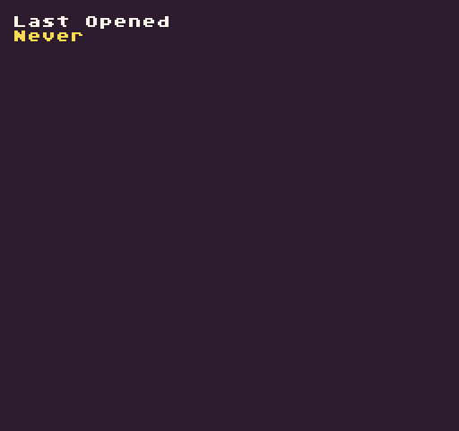

# ReadSaveData

The `ReadSaveData()` API allows you to read saved data by supplying a key. If no matching key exists, "`undefined`" is returned.

## Usage

`ReadSaveData ( key, defaultValue )`

## Arguments

<table>
  <tr>
    <td>Name</td>
    <td>Value</td>
    <td>Description</td>
  </tr>
  <tr>
    <td>key</td>
    <td>string</td>
    <td>The string key used to find the data.</td>
  </tr>
  <tr>
    <td>defaultValue</td>
    <td>string</td>
    <td>The optional string to use if data does not exist.</td>
  </tr>
</table>

## Returns

<table>
  <tr>
    <td>Value</td>
    <td>Description</td>
  </tr>
  <tr>
    <td>string</td>
    <td>Returns string data associated with the supplied key.</td>
  </tr>
</table>

## Example

In this example, we are going to attempt to read the last time the game was loaded. When the game shuts down, it will save a timestamp to be read the next time the game is run:

    class ReadSaveDataExample : GameChip
    {
        public override void Init()
        {
            // Draw the last opneded text
            DrawText("Last Opened", 1, 1, DrawMode.Tile, "large", 15);

            // Draw the saved data to the display
            DrawText(ReadSaveData("LastOpened", "Never"), 1, 2, DrawMode.Tile, "large", 14);

        }

        public override void Draw()
        {
            // Redraw the display
            RedrawDisplay();
        }

        // When the game shuts down, it will automatically save the timestamp
        public override void Shutdown()
        {
            // Write timestamp to the saves.json file.
            WriteSaveData("LastOpened", DateTime.Now.ToString());

            //  TODO need a utility to write this to the file system since it's not run in the main engine

        }
    }

Running this code will output the following:


