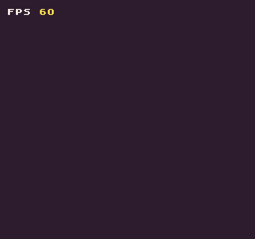

The `RedrawAPI()` allows you to execute both the `Clear()` and `DrawTilemap()` APIs in a single call. This is a simple helper function to make redrawing the display easier. If you need to supply additional arguments to either the `Clear()` or `DrawTilemap(`) APIs then you’ll need to call each one independently without using `RedrawDisplay()`.

## Usage

`RedrawDisplay ( )`

## Example

In this example, we’ll be using RedrawDisplay() to clear the screen and draw the FPS, frames per second, to the screen:

    class RedrawDisplayExample : GameChip
    {
        public override void Init()
        {
            // Draw the FPS label to the tilemap
            DrawText("FPS ", 1, 1, DrawMode.Tile, "large", 15);

        }

        public override void Draw()
        {
            // Redraw the display
            RedrawDisplay();

            // Draw the FPS value to the display on every frame
            DrawText(fps.ToString(), 40, 8, DrawMode.Sprite, "large", 14);
        }
    }

Running this code will output the following:


