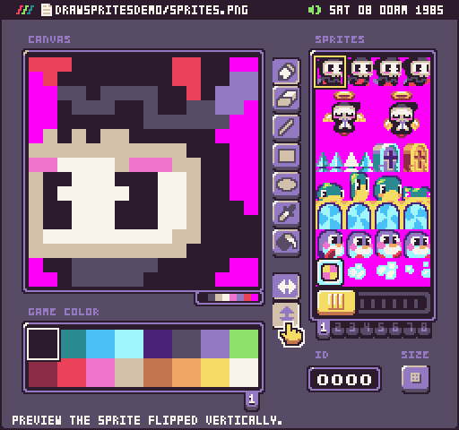

# Rendering Sprites

You can draw a single sprite to the display via the `DrawSprite()` API. This API requires a sprite `ID` as well as an `x` and `y` position for where to place the sprite on the screen. By default, the display wraps sprites so if you draw a sprite to an `x` or `y` position past the display’s dimensions, it part of it will appear on the opposite side of the screen. 

For example, let’s draw a sprite to the display with the following code.

`DrawSprite(376, 8, 8)`

Here is what you’d see on the screen.

We can flip the sprite by passing in a boolean for the `flipH `and `flipV `arguments.

`DrawSprite(376, 8, 8, true, true)`

This will flip the sprite like so.

We can also define which layer the sprite renders to via the draw mode argument. This accepts a DrawMode enum. By default, all sprites are drawn to the sprite layer. But, you can also draw sprites to the background behind the tilemap like so.

`DrawSprite(376, 8, 8, true, true, DrawMode.SpriteBelow)`

In this example, we’ll use some clouds to illustrate some tiles on the tilemap layer and how the sprite will now render behind it.

It’s important to keep in mind that games will have a limit to the number of sprites they can draw in a single frame. While you can combine sprites to make larger graphics on the screen, each draw call to the `Sprite `or `SpriteBelow `later will reduce the number of sprites on the display during this render cycle.


