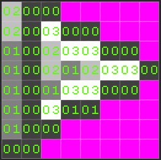
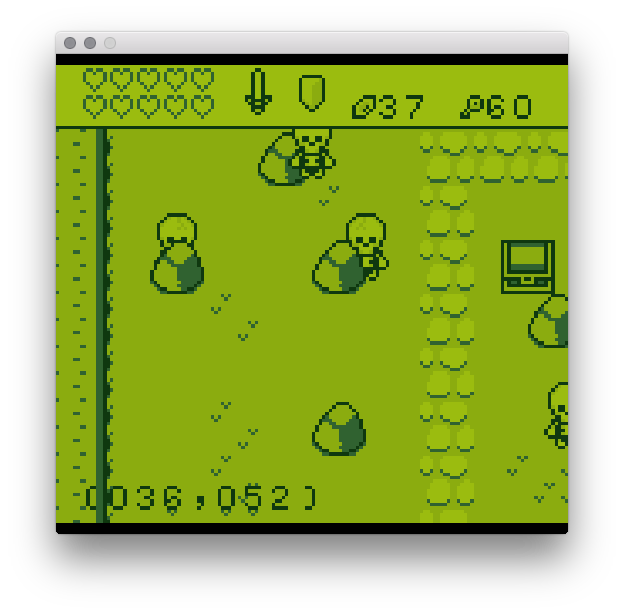
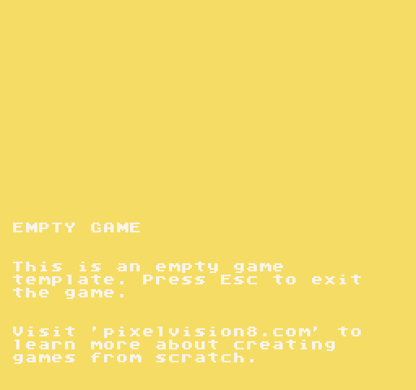
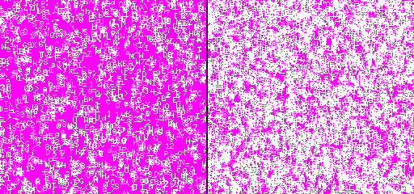

Pixel Vision 8 is designed specifically to render pixel data to the screen. The way that the `DisplayChip` does this differs greatly from modern rendering techniques. It is the job of Pixel Vision 8's importers to convert sprite color data into color index values. Each color ID references a position in the `ColorChip`'s memory. 



By converting pixel data into color IDs, Pixel Vision 8 can optimize storing graphic data in memory. This technique was popular for 8-bit consoles with limited resources. Another advantage of storing pixel data like this is being able to dynamically replace the color of a given ID at run-time; letting developers recolor sprites at run-time. It is the job of the `DisplayChip` to make this possible. 

## The Screen

Pixel Vision 8’s window is considered the screen. If the game is running in fullscreen mode, the computer’s resolution will be used. However, in window mode, the screen’s resolution is `512` x `480` which is defined in the bios. When in window mode, you can apply a screen multiplier from `1x` to `4x`. Pixel Vision 8 will not let you set a scale larger than the computer’s resolution can display. This means if you set the screen scale to `2x`, the window will be `1024 `x `960.`

All games, no matter what their resolution is set to in the `data.json` file, will be upscaled to fill Pixel Vision 8’s screen. If the game is scaled up, it will be done in a way that preserves square pixels to avoid distorting or stretching. That means if your game’s resolution is set to `160 `x `144`, which is the native resolution of a Game Boy, black bars appear at the top and bottom of the screen.



It’s important to note that the game is still being rendered at 160 x 144, even though it will appear larger as it’s upscaled to fill the screen. The screen and the game’s resolution are independent. Changing the game’s resolution will not be perfectly reflected since the game will automatically be upscaled to fill the screen.

Older consoles usually worked in smaller resolutions and were upscaled to fit the TV. Pixel Vision 8 games are rendered at `256 `x `280`. That means the game will effectively be upscaled by `2x` in order to fit the screen. Likewise if you set your game to its maximum resolution of `512 `x `480`, it will be scaled at `1x`.

## Resolution

Each game can have its own resolution define which is defined in the game’s `data.json` file. There are 4 properties that help make up a game’s final resolution. These properties have their own minimum and maximum values which help ensure that Pixel Vision 8’s renderer is able to correctly draw to the screen without impacting performance. Here is a list of the `DisplayChip`’s properties and value range.

| DisplayChip Property | Minimum Value | Maximum Value |
|----------------------|---------------|---------------|
| width                | 64            | 512           |
| height               | 64            | 480           |
| overscanX            | 0             | 4             |
| overscanY            | 0             | 4             |

Keep in mind that a game’s resolution will not affect the screen’s resolution. The game is automatically upscaled to fill the screen.

While it’s possible to have resolutions larger than 256 x 240, there may be a performance penalty. At Pixel Vision 8’s default resolution of 256 x 240 pixels, the display will render 61,440 pixels per frame. Larger resolutions increase this number exponentially and drastically slow down rendering. If you are having issues with a game running on lower-powered systems, it is best to use a smaller resolution. The fewer pixels you attempt to render, the better the performance.

## Overscan

The `DisplayChip`’s `overscan `property tells the engine how many pixels to crop from the right and bottom side of the screen. Leveraging Pixel Vision 8's overscan area is useful when trying to hide sprites off-screen to keep them from wrapping. Older consoles had the ability to "blank", or not render, a row or column of the display to account for this. This was one way they were able to account for the non-visible areas CRT monitors had around their edges and to deal with sprites wrapping around the display.

If no overscan value is set, the sprites will immediately wrap around the right and bottom edges of the screen. Let’s take a look at two turtle shells as they move horizontally and vertically towards the edge of the screen.  As you can see, Any pixel data that goes past the edge of the screen immediately wrap to the opposite side of the screen.


We can use the overscan to hide sprites offscreen. Let’s say we change the overscan `X` and `Y` values to `1`. This will effectively give us an 8-pixel offscreen buffer on the right and bottom of the display. Here you can see the overscan area in black.


The display will automatically remove the overscan area. If we look at the screen with the new overscan value, we’ll see that the turtle shell no longer appears on the right side of the screen when its `X` greater than `248 `pixels.


When overscan is combined with the `DrawSprites()` API you can automatically handle hiding sprites offscreen by setting the `onScreen `argument to true. The DrawSprites() method will check to see which sprites are inside of the visible area and not render the ones outside of it. This allows you to account for sprite wrapping and you can use the overscan area to hide sprites offscreen.

It’s important to note that if your game is running at the maximum resolution, `512` x `480`, there will be no overscan. If you need a buffer to hide images off-screen, the maximum resolution you can display your game at will effectively be `504` x `472`.

## Draw Calls

Pixel Vision 8’s renderer takes draw calls and copies their pixel data to the display. These calls are sorted based on their priority and are stored until the display is ready to draw. While the process of how this works isn’t important, it’s helpful to understand the types of draw calls, how they are sorted, and the arguments you can use to configure them. At the rendering pipeline’s core, there is a single process that accepts raw pixel data and copies it to the display. This is part of the `DisplayChip` and is called `NewDrawCall()`.

Pixel Vision 8 exposes the Display’s `NewDrawCall()` method via several helper APIs which makes copying pixel data to the display easier. When you call `DrawSprite()` or `DrawText()`, these methods leverage the `GameChip`’s main draw API called `DrawPixels()`. The `DrawPixels()` API is the bridge between the `GameChip` and the `DisplayChip`. You can always call `DrawPixels()` directly and pass in an array of color IDs to render on the display, but the helper APIs are there to make this process easier. Also, pushing raw pixel data to the display by hand is expensive. Pixel Vision 8 does pixel data caching under the hood to optimize rendering sprites and tiles.

When you use the Drawing APIs, you will need to supply a `DrawMode` enum. Each `DrawMode `targets a specific layer and helps define the priority of each draw call when rendering. Calls with lower values are drawn first, and higher values are drawn over previous requests. Depending on how you configured the system, you can limit the number of layers a game can display to better match the limitations of different 8-bit systems. Here are the layers which are defined in the `DrawMode` enum.

| Enum                   | Value | Description                                                                                                                                                                                     |
|------------------------|-------|-------------------------------------------------------------------------------------------------------------------------------------------------------------------------------------------------|
| DrawMode\.TilemapCache | \-1   | This is technically not a layer and is used to draw pixel data directly into the tilemap’s pixel data cache\.                                                                                   |
| DrawMode\.Background   | 0     | This is the clear layer and is usually reserved for filling the screen with a background color\.                                                                                                |
| DrawMode\.SpriteBelow  | 1     | This is a layer dedicated to sprites just above the background\.                                                                                                                                |
| DrawMode\.Tile         | 2     | This is the tilemap layer and is drawn above the SpriteBelow layer allowing sprites to appear behind the background\.                                                                           |
| DrawMode\.Sprite       | 3     | This is the default layer for sprites to be rendered at\. It is above the background\.                                                                                                          |
| DrawMode\.UI           | 4     | This is a special layer that can be used to draw raw pixel data above the background and sprites\. It's designed for HUDs in your game and other graphics that do not scroll with the tilemap\. |
| DrawMode\.SpriteAbove  | 5     | This layer allows sprites to render above the UI layer\. It is useful for mouse cursors or other graphics that need to be on top of all other layers\.                                          |

Just keep in mind that using `DrawMode`.`Tile` will change the `X` and `Y` position to `columns` and `rows`. The tile layer is the only layer that doesn’t require to be constantly updated from frame to frame. You should only draw sprites to the tile layer when needed since updating it will force the engine to re-cache parts of the tilemap’s pixel data and may actually slow down rendering. Likewise, you can draw raw pixel data into this tilemap cache layer on top of a tile by using the `DrawMode.TilemapCache` enum.


## Clearing

When you create a new project without any code in it, the display simply shows the background color. This default color is 0 which is the first color in the `ColorChip`. If the color is out of range, it will default to the background color as well.


You can always override the default background color in the `data.json` file by calling `BackgroundColor(colorID)` in your code. In order to see the background color, you’ll need to tell the renderer to clear the screen. The easiest way to do this is by calling `Clear()`at the beginning of your game’s `Draw()` method.



Not only does this method display the current background color, but it also removes the previous frame's pixel data. If you were to render a sprite to the display and move it without calling clear, it would ghost.



You can update the background color at any time, and the next time the engine calls `Clear()`,  the color reflects the change. Try adding this to your `Update()` method:

```lua
BackgroundColor(math.random(0, 3))
```

Now when you refresh your game, the background will randomly change between the first 3 colors. Understanding how to correctly clear the display is critical to creating clean render logic for your game.
