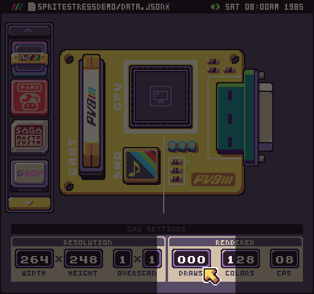
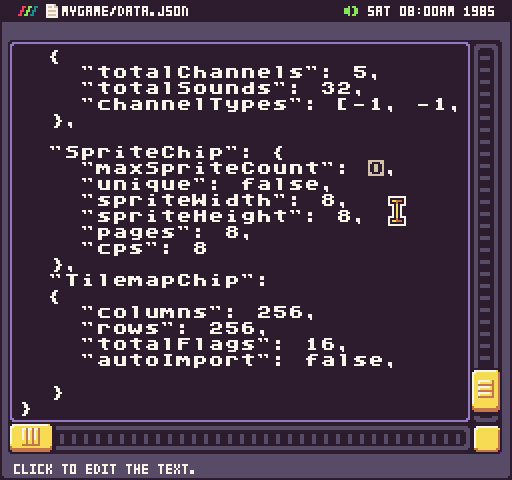
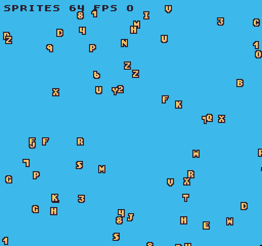
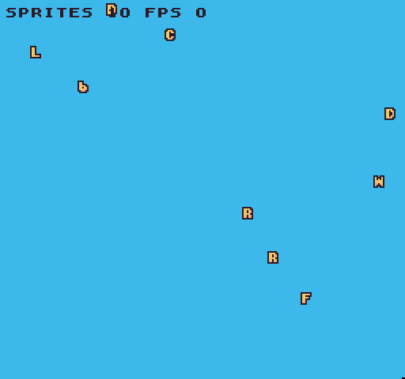

# Sprite Limits

Original 8-bit consoles had hard limits on the number of sprites they could display during a single frame. Each one of the Pixel Vision 8 system templates has its own draw value. For example, the default Pixel Vision 8 template sets the draw count to 0 which turns off the sprite limit.

The Fami template, which attempts to set the limitations to closer to what you would expect from a NES, sets the draws to 64. When editing the data.json file by hand, you’ll want to modify the `SpriteChip`’s `maxSpriteCount` property.

You can see how changing this value works by loading up the Sprite Stress Test Demo. Here you can see a screenshot of this demo attempting to render 64 sprites to the display in each frame.

If you change the value to 10, it automatically caps the sprites drawn to the screen even though the `DrawSprite()` method is being called 200 times per frame.

The total number of draw calls allows you to not only create a more authentic-looking 8-bit game, but it also limits the amount of pixel data pushed to the renderer in each pass. The maximum you can set this value to in the Chip Editor is 512.


