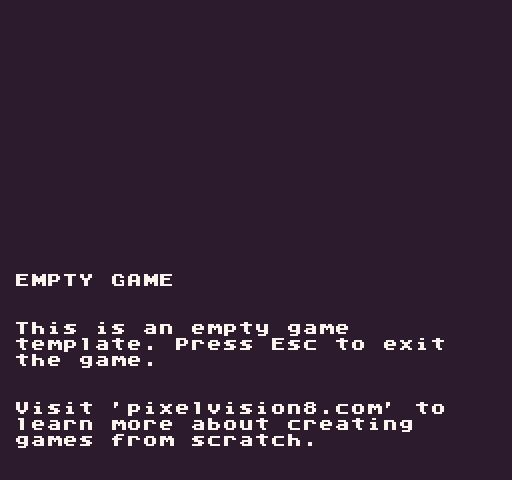
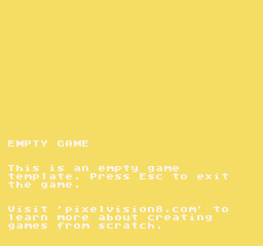
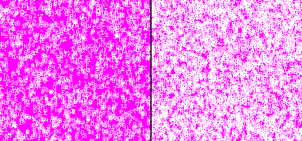

# Clearing the Display

When you create a new project without any code in it, the display simply shows the background color. This default color is 0 which is the first color in the `ColorChip`. If the color is out of range, it will default to the background color as well.

You can always override the default background color in the `data.json` file by calling `BackgroundColor(colorID)` in your code. In order to see the background color, you’ll need to tell the renderer to clear the screen. The easiest way to do this is by calling `Clear()`at the beginning of your game’s `Draw()` method.

Not only does this method display the current background color, but it also removes the previous frame's pixel data. If you were to render a sprite to the display and move it without calling clear, it would ghost.

You can update the background color at any time, and the next time the engine calls `Clear()`,  the color reflects the change. Try adding this to your `Update()` method:

`BackgroundColor(math.random(0, 3))`

Now when you refresh your game, the background will randomly change between the first 3 colors. Understanding how to correctly clear the display is critical to creating clean render logic for your game.


