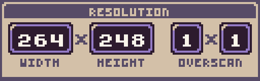
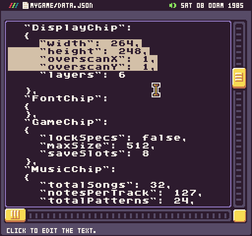

# Configuring the Screen

You can customize the game’s display by modifying the resolution and overscan values. Just click on the GPU chip to modify the properties.

These properties can also be changed on the Display Chip’s json data in the Text Tool.

Each property has a minimum and maximum value to make sure Pixel Vision 8’s renderer is able to correctly draw to the screen without impacting performance.

<table>
  <tr>
    <td>DisplayChip Property</td>
    <td>Minimum Value</td>
    <td>Maximum Value</td>
  </tr>
  <tr>
    <td>width</td>
    <td>64</td>
    <td>512</td>
  </tr>
  <tr>
    <td>height</td>
    <td>64</td>
    <td>480</td>
  </tr>
  <tr>
    <td>overscanX</td>
    <td>0</td>
    <td>4</td>
  </tr>
  <tr>
    <td>overscanY</td>
    <td>0</td>
    <td>4</td>
  </tr>
</table>

It’s important to note that Pixel Vision 8’s window’s native resolution is 512 x 480. So your game will automatically be scaled to fix the resolution while maintaining its aspect ration. For Pixel Vision 8 games which are set to a resolution of 256 x 248, after subtracting overscan, it will effectively be scaled by 2x to fit the window. Likewise if you set your game to its maximum resolution of 512 x 480, it will be scaled at 1x.


