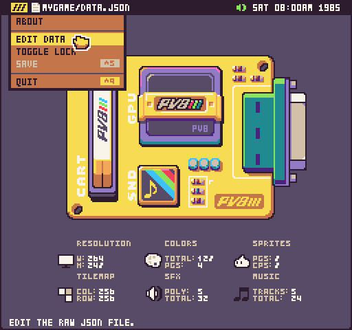
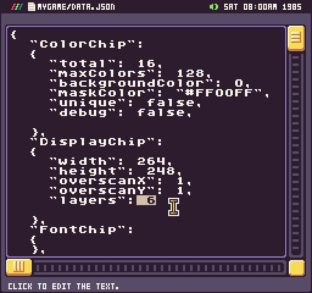

# Layers

There is one advanced property that is not exposed in the Chip Editor called layers. You can find this by editing the data.json file directly. By default, Pixel Vision 8 games will have 6 layers.

<table>
  <tr>
    <td>ID</td>
    <td>Name</td>
    <td>Description</td>
  </tr>
  <tr>
    <td>1</td>
    <td>Background</td>
    <td>This is the default background color which is used to clear the screen. It can not be directly drawn to.</td>
  </tr>
  <tr>
    <td>2</td>
    <td>Sprite Below</td>
    <td>Sprites drawn to this layer will appear behind the tilemap (if there is transparency in the tile sprite).</td>
  </tr>
  <tr>
    <td>3</td>
    <td>Tile</td>
    <td>All tiles in the tilemap are rendered to a special layer called the Tilemap Cache to help with rendering performance. You can also draw directly to the Tilemap Cache, which shows up above any existing tile pixel data.</td>
  </tr>
  <tr>
    <td>4</td>
    <td>Sprite</td>
    <td>This is the default sprite layer and is drawn on top of the tilemap.</td>
  </tr>
  <tr>
    <td>5</td>
    <td>UI</td>
    <td>This is a special layer that sits above the sprites letting you draw UI on top of the other layers.</td>
  </tr>
  <tr>
    <td>6</td>
    <td>SpriteAbove</td>
    <td>This final layer sits on top of the UI layer and is designed for special sprite calls that must be on top of all the other layers such as mouse cursors or special effects like borders.</td>
  </tr>
</table>

You can limit the number of layers to create a more authentic feeling. For example, the original Nintendo only supported the first four layers. The original Game Boy could support the first five layers since it had a special Window layer which you can emulate by using the UI layer.

If you want to modify the layers property from the Chip Editor, select Edit Data from the dropdown menu.

Likewise, if you do not have the Pro Tools installed, you can edit the data.json file directly. Changing this value will limit the layers you display on the screen so only modify this if you know what you are doing.


