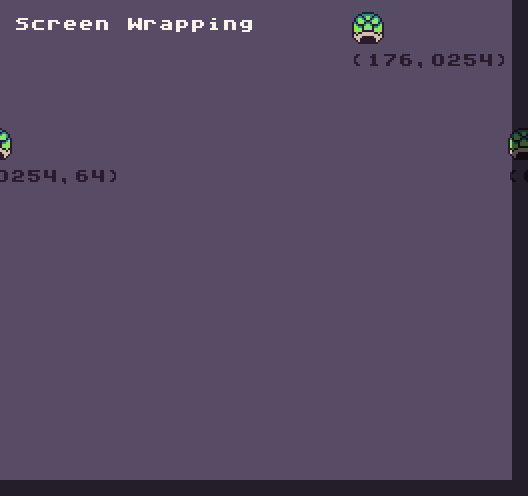
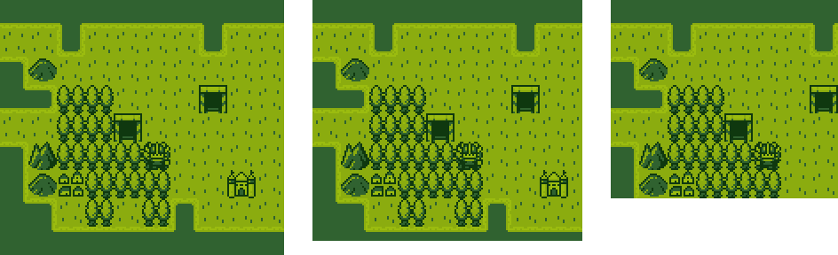
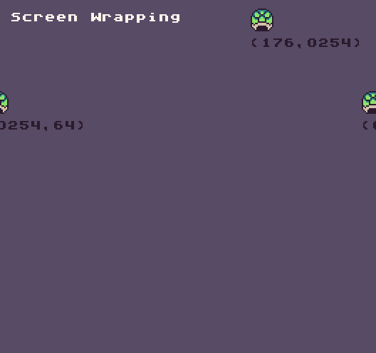
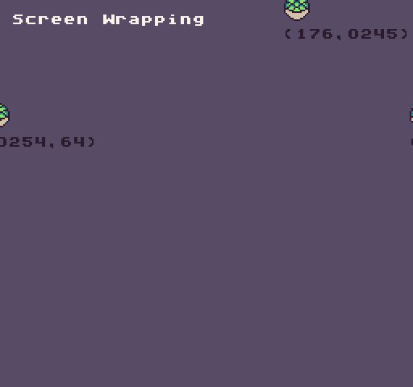

# Overscan

The overscan fields tell the engine how many pixels to crop from the right and bottom side of the screen. Leveraging Pixel Vision 8's overscan area is useful when trying to hide sprites off-screen to keep them from wrapping. Older consoles had the ability to blank, or not render, a row or column of the display to account for this. This was one way they were able to account for the non-visible areas CRT monitors had around their edges and to deal with sprites wrapping around the display.

The first overscan value represents the right border of the screen and the second represents the bottom. Each value removes 8 pixels, which is a single row or column, from the visible display. 

You can also access these properties directly by editing the `data.json` file manually.

Let's look at a demo running at the GBoy resolution of 160 x 144 with an overscan set to 0. If we change the overscan to 1 x 1, the last right-most column and bottom row will not render. 

Changing the overscan makes the resolution 152 x 136 since Pixel Vision 8 automatically scales the game to hide the overscan area. On its own, overscan cropping is hard to visualize. To help illustrate it, here are the 3 different overscan values next to each other.

On the left we have an overscan of 0 x 0 at a resolution of 160 x 144, in the middle overscan is set to 1 x 1 and on the right, the overscan is 4 x 4, the maximum value, which makes the visible resolution 128 x 112.

It’s important to note that if your game is running at the maximum resolution, 512 x 480, there will be no overscan. If you need a buffer to hide images off-screen, the maximum resolution you can display your game at will effectively be 504 x 472.

So how can we use overscan in Pixel Vision 8 games? If no overscan value is set, the sprites will immediately wrap around the right and bottom edges of the screen. Let’s take a look at two turtle shells as they move horizontally and vertically towards the edge of the screen.  As you can see, Any pixel data that goes past the edge of the screen immediately wrap to the opposite side of the screen.

We can use the overscan to hide sprites offscreen. Let’s say we change the overscan X and Y values to 1. This will effectively give us an 8-pixel offscreen buffer on the right and bottom of the display. If we go back to our previous example but with an overscan value set to 1, we’ll see that the turtle shell no longer appears on the right side of the screen when its X greater than 248 pixels.

When overscan is combined with the `DrawSprites()` API you can automatically handle hiding sprites offscreen by setting the `onScreen `argument to false.


