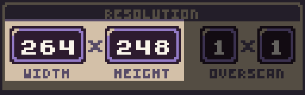
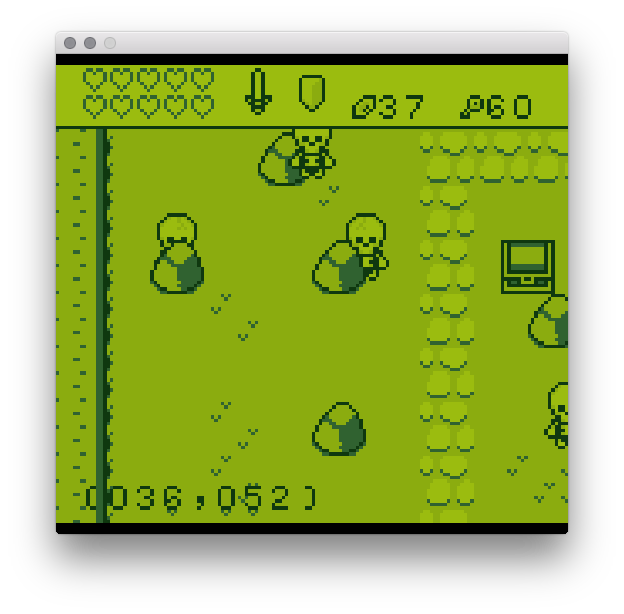

# Resolution

The resolution panel is broken up into 3 main groups. The first handles the width and height of the screen. 

By default, the Runner’s native resolution is 512 x 480. While you are not limited to this resolution, all games are scaled to fit inside of it. That means if you change the resolution to 160 x 144, which is the resolution of the GBoy template, black bars appear at the top and bottom of your game.

The maximum resolution you can set a game to is 512 x 480. It is also important to note that resolutions higher than 256 x 240 may incur a performance penalty. At its default resolution of 256 x 240 pixels, the display will render 61,440 pixels per frame. Larger resolutions increase this number exponentially and drastically slow down rendering. If you are having issues with a game running on lower-powered systems, it is best to use a smaller resolution. The fewer pixels you attempt to render, the better the performance.


