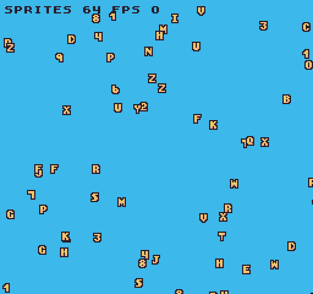

# Sprite Limits

Original 8-bit consoles had hard limits on the number of sprites they could display during a single frame. The total number of draw calls allows you to not only create a more authentic-looking 8-bit game, but it also limits the amount of pixel data pushed to the renderer in each pass. 

For example, the original NES was only able to render 64 sprites at one time. This can be achieved by editing the `data.json` and modifying the `SpriteChip`’s `maxSpriteCount` property. 

When your game has a sprite limitation, any additional draw calls will be ignored if the counter has reached its maximum value. In this example, there are 200 `DrawSprite()` requests happening during the `Draw()` loop, but only 64 of those are executed.

You can check the total sprite draw requests at any time via the `MaxSpriteCount()` API. This limitation is very powerful. First, it can help boost performance by putting a cap on the number of draw calls that can happen in a single frame. The maximum you can set this value to `512`.

