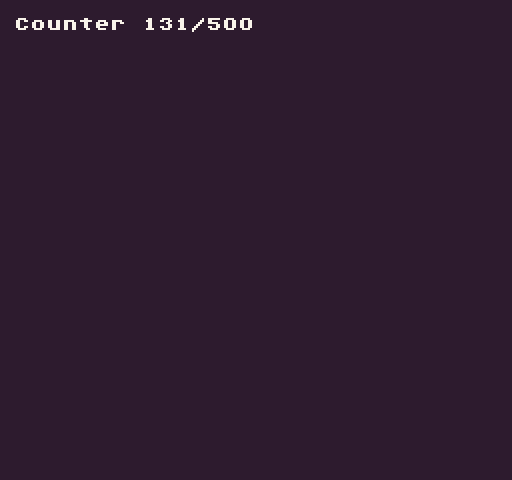

The `Repeat()` API allows you to reset the value of a number if it goes past a maximum value. When counting backward, `Repeat()` will set the value to the maximum when below 0. 

## Usage

`Repeat ( val, max )`

## Arguments

<table>
  <tr>
    <td>Name</td>
    <td>Value</td>
    <td>Description</td>
  </tr>
  <tr>
    <td>val</td>
    <td>int</td>
    <td>The value to repeat.</td>
  </tr>
  <tr>
    <td>max</td>
    <td>int</td>
    <td>The maximum the value can be.</td>
  </tr>
</table>

## Returns

<table>
  <tr>
    <td>Value</td>
    <td>Description</td>
  </tr>
  <tr>
    <td>int</td>
    <td>Returns an int that is never less than 0 or greater than the max.</td>
  </tr>
</table>

## Example

In this example, we will increase a counter by `1` on every frame and use `Repeat()` to have it wrap back to `0` when it goes greater than the max value:

    class RepeatExample : GameChip
    {
        // Store the counter value and max value
        private int counter;
        private int counterMax = 500;

        public override void Update(int timeDelta)
        {
            // Increase the counter by 1 every frame
            counter = Repeat(counter + 1, counterMax);

        }

        public override void Draw()
        {
            // Redraw display
            RedrawDisplay();

            // Draw the counter value to the display
            DrawText("Counter " + counter + "/" + counterMax, 8, 8, DrawMode.Sprite, "large", 15);

        }
    }

Running this code will output the following:


