The SFX Tool allows you to create sound effects for your game and instruments to be used in the Music Tool. At a high level, the SFX Tool is optimized to make sound effects for your games as easy as possible by offering templates to streamline the creation of sound assets. Here is what the tool looks like:

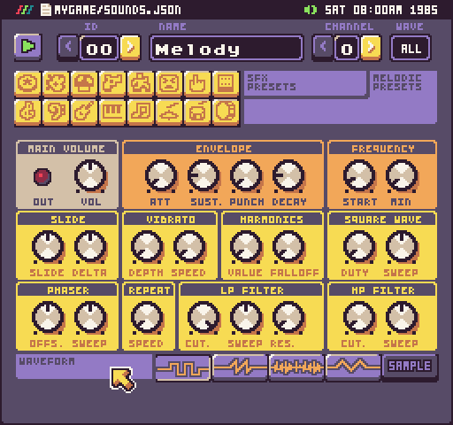

The tool is broken up into 3 main areas: sound info, presets, and settings.

## Keyboard Shortcuts

The SFX Tool has the following keyboard shortcuts based on what actions are available.

| Name       | Shortcut  | Description                                                                           |
|------------|-----------|---------------------------------------------------------------------------------------|
| New        | Ctrl \+ N | Creates a new sound effect over the currently loaded sound\.                          |
| Save       | Ctrl \+ S | Save the changes to the sounds\.json file\.                                           |
| Export SFX | Ctrl \+ E | Exports the current sound effect as a \.wav file\.                                    |
| Revert     | Ctrl \+ R | Reverts the current song back to its previously loaded state\.                        |
| Undo       | Ctrl \+ Z | Undo the last sound property change\.                                                 |
| Redo       | Ctrl \+ Y | Redo the last sound property change\.                                                 |
| Copy       | Ctrl \+ C | Copy the currently selected sound\.                                                   |
| Paste      | Ctrl \+ V | Paste the previously copied sound over to the currently selected sound\.              |
| Mutate     | Ctrl \+ M | Randomly mutates the current sound effects properties to produce a new sound effect\. |
| Quit       | Ctrl \+ Q | Quit the current tool\.                                                               |

##  Preview Sounds

The first area focuses on selecting sounds and playback.

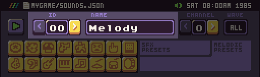

You can use the left and right arrows to navigate the SFX IDs or enter an ID by hand to load a sound effect. Each sound can have a label that is there to help make organizing sound effects easier in the tool. The engine does not use the label; sound effects are only accessible by their ID in code.

You can control a sound’s playback to the left of the SFX Name field.

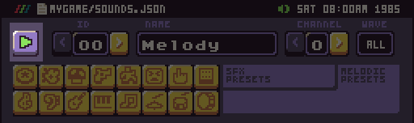

Here you can play the currently loaded sound effect.

## Sound Channels

Finally, to the right is the channel preview options. These control which channels a sound will play on when you press the play button and shows you a preview of the waveform assigned to that channel.

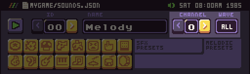

The Sound Chip relies on several values from the data.json file total number of sound effects (Sounds) and the number of channels (Poly) to play them back on. You can modify this by hand or with the Chip Editor.

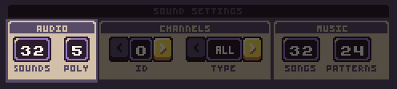

The total sounds field represents how many sound effects are available in the `SoundChip`. Sound effect IDs start at 0. If the total value is 32, the last sound effect ID is 31. Channels, which are labeled as Poly in the Chip Editor Tool, control how many sounds can play at the same time.

Older game consoles had hard limits on the number of sounds that could play at once. Pixel Vision 8 only allows a single sound effect to run per channel. Attempting to play a different sound effect on the same channel stops the currently playing sound effect and immediately plays the new one. Channels are shared with the `MusicChip` as a track. Each music track plays on a single channel. You can not play a sound effect and a music track at the same time.


## Sound Templates

The next area of the SFX Tool is the template buttons. The first row contains common game sound effects.

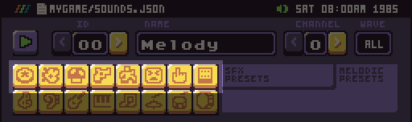

Each button generates a sound effect for you based on a theme. There are 8 sound effect templates buttons:

| Sound Effects   |
|-------------------------------------------------------|
| Create a randomized ‘pickup’ or coin sound effect\.   |
| Create a randomized ‘explosion’ sound effect\.        |
| Create a randomized ‘power\-up’ sound effect\.        |
| Create a randomized ‘laser’ or ‘shoot’ sound effect\. |
| Create a randomized ‘jump’ sound effect\.             |
| Create a randomized ‘hit’ or ‘hurt’ sound effect\.    |
| Create a randomized ‘blip’ or ‘select’ sound effect\. |
| Create a completely random sound effect\.             |

The second row contains templates to create musical instruments more suited to use with the Music Tool.

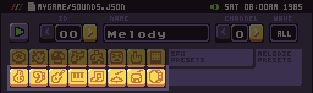

There are 8 musical instrument templates to choose from:

| Instruments   |
|-------------------------------------------------------|
|  Create a ‘melody’ instrument sound effect\.  |
|  Create a ‘harmony’ instrument sound effect\. |
|  Create a ‘bass’ instrument sound effect\.    |
|  Create a ‘pad’ instrument sound effect\.     |
|  Create a ‘lead’ instrument sound effect\.    |
|  Create a ‘drums’ instrument sound effect\.   |
|  Create a ‘snare’ instrument sound effect\.   |
|  Create a ‘kick’ instrument sound effect\.    |


Each time you press a template button, the SFX Tool creates a new sound effect with a slight variation. Creating a new sound from a template overwrites the current sound so when you find something you like, be sure to change the sound ID before trying to generate a new sound effect. When you are happy with the changes, be sure to save them from the drop-down menu. Sound effects are saved as Sfxr strings in the `sounds.json` file. You can even modify these by hand from any compatible Sfxr app.

## Customizing Sounds

Each sound effect is made up of a collection of properties that can be modified by a collection of knobs.

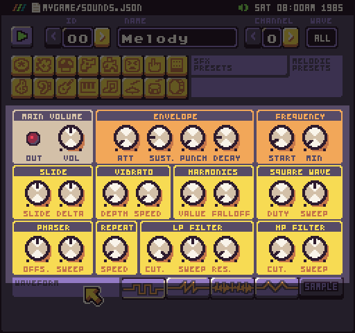

Pixel Vision 8 uses an open-source sound engine called SFXR. Each set of properties are group together by categories to help make it clear which knob modifies which sound setting. The majority of the values range from 0 - 1 but a few go from -1 to 1. When you roll over a knob, it will show you the value below.

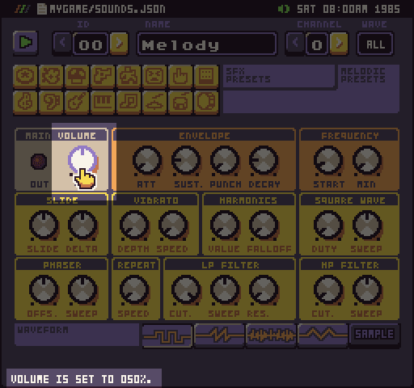

To modify a value, click on the knob and drag it to the left or right. Each sound effect is saved as a string that PV8 parses when loading a game. These values are the same strings that SFXR generates so if you’ve used this in the past, you can manually copy those values over to the sounds.json file. Here is what sound json object looks like:

```json
{
  "name": "Melody",`
  "settings": "0,.5,,.2,,.2,.3,.1266,,,,,,,,,,,,,,,,,,1,,,,,,"`
}
```

It’s important to note that not all of the properties SFXR uses are exposed in Pixel Vision 8’s sound tool but are supported by the sound chip. The ones that are visible in the Sound Tool simplify the properties to help create a more authentic 8-bit sound effect. If you chose to manually tweak the values in the json file, be warned that unsupported properties may not work as expected.

## Waveforms

The last option in the Sound FX toolbar is the waveform buttons. This displays more granular options for configuring the currently loaded sound’s wave type.

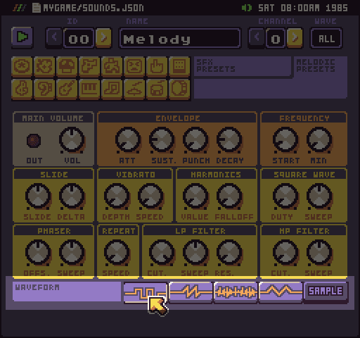

Currently, in Pixel Vision 8, each channel can play any of the available Waveform types. Early 8-bit systems were limited in which waveform worked on which channel. By default, the Pixel Vision 8 template allows for all waveforms to be played back on a channel but other templates, such as the Fami, have hard limits on each channel. You can modify these in the Chip Editor.

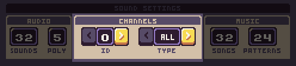

As you cycle through each channel, you can also assign one of the 5 different waveform types:

| ID | Name     | Description                                                                      |
|----|----------|----------------------------------------------------------------------------------|
| 0  | All      | Allows any waveform to be played                                                 |
| 1  | Square   | Limits any sound effect being played on the channel to use the square waveform   |
| 2  | Saw      | Limits any sound effect being played on the channel to use the saw waveform      |
| 3  | Noise    | Limits any sound effect being played on the channel to use the noise waveform    |
| 4  | Triangle | Limits any sound effect being played on the channel to use the triangle waveform |
| 5  | Wav      | Limits the channel to only play \.wav sample files\.                             |
It’s important to note that each sound effect can be assigned a default waveform that is independent of the channel it will play on. The channel’s own limitation will override the sound effect’s waveform. For example, if you set channel 0 to Saw and try to playback the default harmony sound effect which is set to square, it will be played with the saw waveform instead.

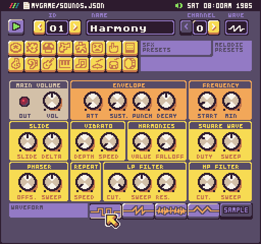

## Samples

The last optional waveform is sample, which is only enabled when you have a .wav file in your project with the same name as a sound effect. For example, if you export the first default sound, which is named Melody, and copy the .wav file to the root of your project folder like so, it will enable the sample option for this sound effect.

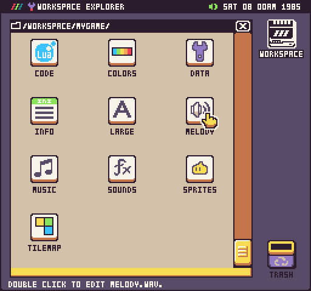

When you open the Sound Tool, the Melody sound effect will be set to Sample. In this mode, you are only able to preview the sound effect and change its volume. All of the dynamic sound effect options will be disabled.

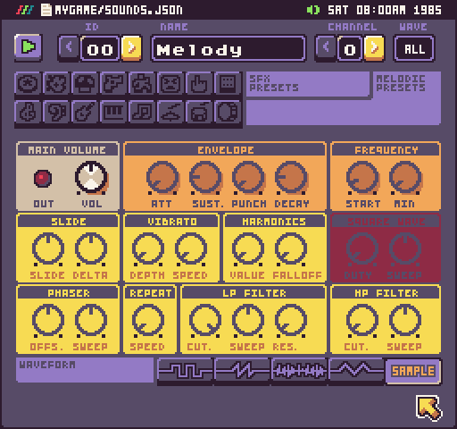

This is a powerful option and allows you to simulate how the original NES had a dedicated sample channel.