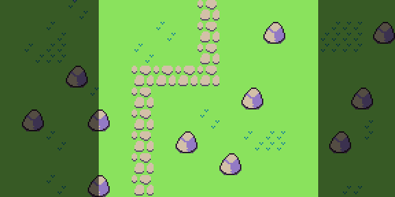
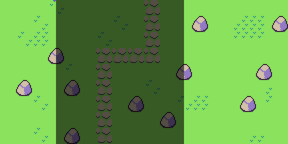
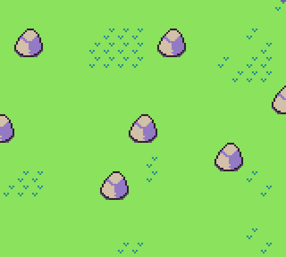
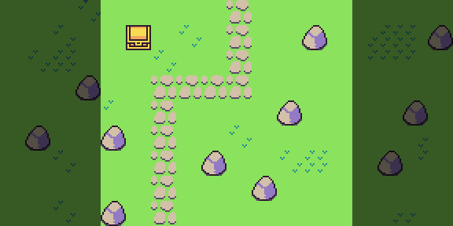
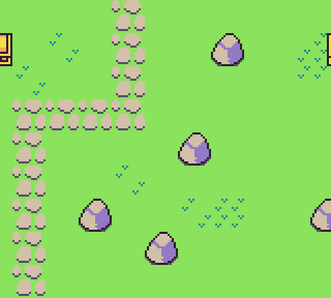
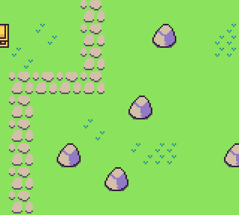
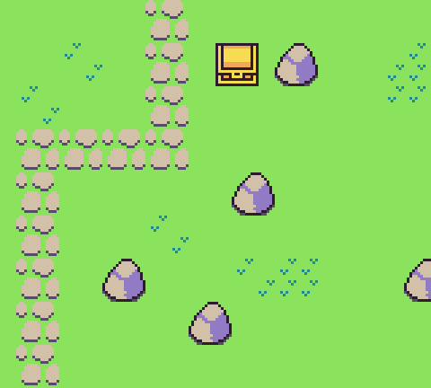
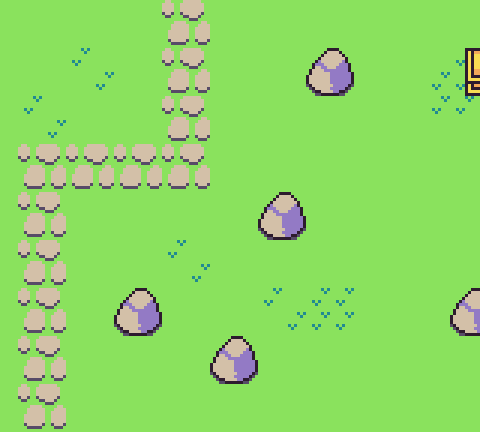
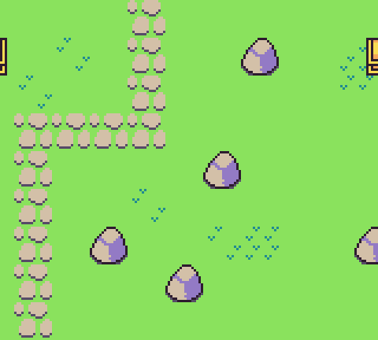

The `TilemapChip` allows you to cache an entire tilemap in memory which helps optimize rendering larger maps. The advantage here is that only the data visible to the screen is copied over to the display when calling `DrawTilemap()`. Changing the scroll value allows you to move the background which was a popular technique seen in side-scrolling games. To scroll the tilemap, you can use the `ScrollPosition()` method and supply an `x` and `y` offset value.

For example. If the game’s resolution is 160 x 144 and our tilemap is `288` x `144`, we can scroll horizontally by setting the scroll position’s X value to 72.

`ScrollPosition(72)`

As the map’s scroll position changes, only the visible area is rendered to the display. Here you can see what will be drawn to the screen out of the entire tilemap.

Tilemaps will repeat as you scroll horizontally or vertically. So if the viewpoint goes past the edge of the tilemap, it will sample tilemap pixel data from the opposite side. In this example, we set the same tilemap scroll position to `184` the tilemap will sample from the right edge and left edge of the tilemap.

In the game, you’ll see the following tilemap.

You can use this to your advantage by designing tilemaps that can wrap or you’ll need to manually limit the scroll position before it hits the edge of the tilemap. This the above example, we’d want to make sure that the scroll position `X` value is greater than `0` and less than `128` so it doesn’t go bast the left or right boundaries.

Sprites, on the other hand, are not affected by the scroll position value. Sprites will always render based on their position on the screen. That means that their `X` and `Y` position is locked to the screens coordinate system where `0`, `0` is the upper left-hand corner. Since sprites wrap around the screen when they go out of bounds, this can create a scenario where sprites appear to be moving independently from the tilemap as it scrolls.

If you are using any of the more advanced draw calls, such as `DrawSpriteBlock()`, they will automatically account for this and help you draw sprites in sync with the scroll position. Let’s say you want to draw a chest on top of the tilemap at `80`, `16` like so:

`DrawSpriteBlock(40, 80, 16, 2, 2)`

It will only draw the sprites they are within the viewport’s scroll position.

Let’s say for some reason you want the chest to not scroll with the tilemap. If you have a player, for example, you would not want them to move with the tilemap but instead stay fixed on the screen. You can change the `DrawSpriteBlock()`’s `onScreen` and `useScrollPos` arguments. The first flag, `onScreen` will only render the sprite when it is within the viewport. If you set this to false, it will render even when off-screen meaning it will wrap around the screen as the scroll position changes.

Take a look at the following code which represents the full Dr`awSpriteBlock()` API calls with values up to the `onScreen` flag argument:

`DrawSpriteBlock(40, 80, 16, 2, 2, false, false, DrawMode.Sprite, 0, false)`

As you can see, we are changing the `onScreen` flag to `false` and change the scroll position `X` value to `90`, the treasure chest will now wrap around the screen.

If we change the value of the `onScreen` argument back to `true`, the chest would stop rendering when its sprites are offscreen like so.

The `useScrollPosition` argument defines if the sprites will use the scroll position or not. By default, the scroll position `X` and `Y` values will be added to each of the sprites as they are rendered to the display. If we set this to false, we can manually move the sprite in defiantly of the scrolling background like so.

`DrawSpriteBlock(40, 80, 16, 2, 2, false, false, DrawMode.Sprite, 0, true, false)`

This will use the screen’s coordinate space to render the sprite. Now it is no longer to the left of the path and sits towards the middle of the screen, in essence, over the entire tilemap regardless of what the scroll position offset is.

In this example, we are setting the `onScreen` value to true. If we moved the chest’s `X` position to `155`, it would render half off the screen.

Finally, if we set the `onScreen` and `useScrollPosition` to false, the chest will wrap around the screen.

These advanced concepts may not be clear at first but image you want to make a side-scrolling platformer. You will want to render the player on the screen independent of the scrolling so you’d set the useScrollPosition to false. If you have enemies on the map, you want them to move with the map as it scrolls but only renders when they are inside of the viewport. So they will have onScreen set to true and useScrollPosition set to true, which are the default values. Now as the player moves forward or backward, they stay centered on the screen, you change the scroll position accordingly and then enemies show up only when they are visible.


