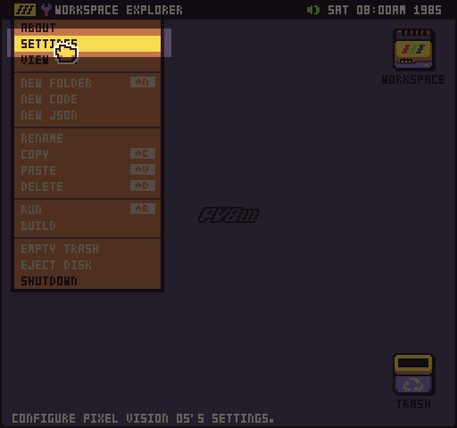
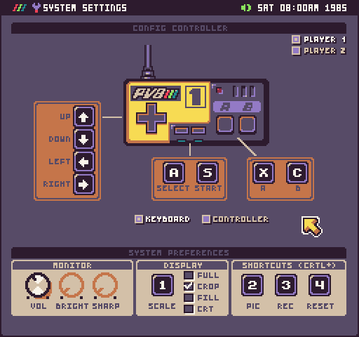

The System Setting Tool allows you to configure the global settings of Pixel Vision OS in one place. The Settings Tool is available from the Workspace Explorer’s drop-down menu.


## Volume
The first panel of the settings tool allows you to modify the system volume. This will not only affect the currently loaded game, but all sounds played by Pixel Vision 8.  


You can also mute all sounds if you prefer to work in silence. Pixel Vision 8 saves the mute and volume values in the `user-bios.json`.

## Display
The next setting panel controls Pixel Vision 8’s resolution. Changes made to these settings are applied immediately. The first option is changing the scale of Pixel Vision 8’s window.


When in windowed mode, Pixel Vision 8’s native resolution is 512 x 480. Games are scaled up to fit inside of that resolution. Since Pixel Vision OS’s resolution is set to 256 x 240, it will be scaled x2 to fit inside of the window. This allows Pixel Vision 8 to support game resolution of up to 512 x 480.

### Scale
There are 4 scale options to chose if you want to change the size of Pixel Vision 8 in window mode. Scale mode 1 sets the resolution to 512 x 480. Increasing the scale to 2 changes the window size to 1024 x 960. You can not resize the window manually. This scale system ensures that games always look pixel-perfect at the correct resolution.  

Be careful not to change the scale to something larger than your monitor can support or you’ll need to restart Pixel Vision 8 and hold down the 1 key while the boot animation is playing to reset the scale back to its default value.

One thing to note, when creating games at resolutions that are not 256 x 240, is that black bars are displayed based on the game's suggested aspect ratio.


### Crop

You can remove the black bars in window mode by checking the crop setting.


When crop is on, Pixel Vision 8 will scale the game up to fit in the vertical height of 480 pixels. From there, the window chrome is resized horizontally to fit perfectly around the game at its newly upscaled resolution.


Pixel Vision 8 will always prioritize maintaining perfectly square pixels when upscaling games of any resolution. You may find some resolutions work better than others so keep these settings in mind when designing your game’s resolution.


### Full Screen

The last option is fullscreen, which allows Pixel Vision 8 to completely take over the entire screen. When going into fullscreen mode, the Game Creator automatically adjusts the scale mode based on your monitor’s maximum vertical resolution. Since most monitors are 16:9, there will always be black bars on the sides of the game. You can use the full-screen option to stretch the image and remove the bars.


As you can see, this will stretch the image horizontally and Pixel Vision 8 will not be able to maintain perfectly square pixels.


If you run into an issue with fullscreen or scale mode, you can manually change the values in the user’s bios file. Simply search for `FullScreen `Or `Scale`:


If you change these values and restart Pixel Vision 8, it should adjust the display accordingly. Just be sure to only change user bios settings when Pixel Vision 8 is shut down or your changes may be overwritten when quitting.

### CRT

The last resolution option is CRT mode. Checking this will apply a CRT shader filter to the entire screen.


When this mode is activated, you will see scanlines and the edges of the display will be slightly warped as if PV8 was being viewed on a CRT monitor.


You may need to restart Pixel Vision 8 in order to see the CRT filter correctly the first time you apply it. Also in CRT mode, you will have access to adjusting the brightness and sharpness of the CRT monitor.


> 
> The CRT filter is not applied to any screenshots or recordings done while a game is running. This effect can only be seen on the Pixel Vision 8 window itself.
>

## Shortcuts

Finally, the last panel allows you to change the shortcut keys for taking screenshots and animated gifs in Pixel Vision 8.


You can change the shortcuts to any number from 0-9 on your keyboard as long as it does not conflict with another keyboard shortcut.

## Controllers

Pixel Vision OS supports configuring game controllers in addition to mapping the keyboard to buttons. You can access this from the Settings Tool in the drop-down menu. As of now, controller support and remapping keys are still experimental.



You can toggle between the controller and keyboard mapping for each player.



Pressing a button on the keyboard or controller will display on the screen to verify that it is capturing the input correctly.


## Bios

Pixel Vision 8 uses a special `user-bios.json` file to store any changes made to the system by the user when running. When you shutdown PV8, it automatically updates the `user-bios.json` file to save any new changes. The built-in Settings Tool will give you access to the most common properties.

If you need to manually make changes, you’ll need to open this file in an external editor from your computer’s file system. This file is not accessible from the Workspace Explorer. After opening the json file, you’ll find any user-specific properties the Pixel Vision 8 Runner references when booting up. The `user-bios.json` file is located in the following location based on your computer’s OS:

| Version | Path                                                                |
|---------|---------------------------------------------------------------------|
| Windows | C:\\Users\\UserName\\AppData\\Local\\PixelVision8\\user\-bios\.json |
| MacOS   | /Users/UserName/\.local/share/PixelVision8/user\-bios\.json         |
| Linux   | /Users/UserName/\.local/share/PixelVision8/user\-bios\.json         |

On bootup, the `bios.json` file sets the default values. After that is loaded, the `user-bios.json` file is loaded and any duplicated properties are overwritten by the user’s own preferences. That means that you may not see all of the available options inside of the `user-bios.json` file. Here is a list of each of the bios settings that you can define, their value, and a description of what they do.

| Property            | Value                                                                                                                               | Description                                                                                                                                               |
|---------------------|-------------------------------------------------------------------------------------------------------------------------------------|-----------------------------------------------------------------------------------------------------------------------------------------------------------|
| AutoRun             | /PixelVisionOS/Tools/WorkspaceTool/                                                                                                 | Path to game or tool that will load after booting is complete\.                                                                                           |
| BackKey             | 27                                                                                                                                  | This is mapped to the Esc key by default                                                                                                                  |
| BaseDir             | PixelVision8                                                                                                                        | The name of the folder used on the file system to store the Workspace and Tmp directories\.                                                               |
| BootTool            | /PixelVisionOS/System/Tools/BootTool/                                                                                               | The path to the default boot tool\.                                                                                                                       |
| Brightness          | 100                                                                                                                                 | A value used to calculate brightness when the CRT filter is enabled\.                                                                                     |
| CropScreen          | True                                                                                                                                | A boolean flag if the screen should be cropped or show black bars\.                                                                                       |
| CRT                 | False                                                                                                                               | A boolean if the CRT filter should be used or not\.                                                                                                       |
| DebugTime           | False                                                                                                                               | A boolean that when set to true will force the time to always display as Saturday at 8:00am\.                                                             |
| Disk0               | none                                                                                                                                | A local file system path to a \.pv8 disk or folder to load on the desktop\.                                                                               |
| Disk1               | none                                                                                                                                | A local file system path to a \.pv8 disk or folder to load on the desktop\.                                                                               |
| ErrorTool           | /PixelVisionOS/System/Tools/ErrorTool/                                                                                              | Path to the default Error Tool that is loaded when an exception is thrown by PV8\.                                                                        |
| Exception           | @\{error\}\\nPress Ctrl \+ 4 to reload the current game\.                                                                           | Message template to display when an exception is thrown and displayed in the Error Tool\.                                                                 |
| FileDiskMounting    | True                                                                                                                                | A boolean flag that enables or disables dragging \.pv8 disks onto the PV8 runner window\.                                                                 |
| FullScreen          | False                                                                                                                               | A boolean flag that forces PV8 to load in full\-screen mode when starting up\.                                                                            |
| LoadError           | There was an issue loading from '@\{path\}'\.                                                                                       | Message template to display when there is an issue loading a game from a specific path\.                                                                  |
| LoadTool            | /PixelVisionOS/System/Tools/LoadTool/                                                                                               | Path to the default Load Tool that is used to display the loading progress of a game that is about to be played\.                                         |
| Mute                | False                                                                                                                               | A boolean value that determines if the sound will play or be muted regardless of the volume's value\.                                                     |
| NoAutoRun           | Could not find an OS to boot\. Insert a disk or restart in 'safe mode' by holding down the Shift key to reinstall Pixel Vision OS\. | Message template to display when the default autorun path can not be loaded\.                                                                             |
| NoDefaultTool       | Could not find a default tool to load\.                                                                                             | Message template to display when no default tool path has been found when trying to exit a game\.                                                         |
| Player1AButton      | 4                                                                                                                                   | Controller key mapping                                                                                                                                    |
| Player1AKey         | 88                                                                                                                                  | Controller key mapping                                                                                                                                    |
| Player1BButton      | 5                                                                                                                                   | Controller key mapping                                                                                                                                    |
| Player1BKey         | 67                                                                                                                                  | Controller key mapping                                                                                                                                    |
| Player1DownButton   | 1                                                                                                                                   | Controller key mapping                                                                                                                                    |
| Player1DownKey      | 40                                                                                                                                  | Controller key mapping                                                                                                                                    |
| Player1LeftButton   | 2                                                                                                                                   | Controller key mapping                                                                                                                                    |
| Player1LeftKey      | 37                                                                                                                                  | Controller key mapping                                                                                                                                    |
| Player1RightButton  | 3                                                                                                                                   | Controller key mapping                                                                                                                                    |
| Player1RightKey     | 39                                                                                                                                  | Controller key mapping                                                                                                                                    |
| Player1SelectButton | 6                                                                                                                                   | Controller key mapping                                                                                                                                    |
| Player1SelectKey    | 65                                                                                                                                  | Controller key mapping                                                                                                                                    |
| Player1StartButton  | 7                                                                                                                                   | Controller key mapping                                                                                                                                    |
| Player1StartKey     | 83                                                                                                                                  | Controller key mapping                                                                                                                                    |
| Player1UpButton     | 0                                                                                                                                   | Controller key mapping                                                                                                                                    |
| Player1UpKey        | 38                                                                                                                                  | Controller key mapping                                                                                                                                    |
| Player2AButton      | 4                                                                                                                                   | Controller key mapping                                                                                                                                    |
| Player2AKey         | 13                                                                                                                                  | Controller key mapping                                                                                                                                    |
| Player2BButton      | 5                                                                                                                                   | Controller key mapping                                                                                                                                    |
| Player2BKey         | 161                                                                                                                                 | Controller key mapping                                                                                                                                    |
| Player2DownButton   | 1                                                                                                                                   | Controller key mapping                                                                                                                                    |
| Player2DownKey      | 75                                                                                                                                  | Controller key mapping                                                                                                                                    |
| Player2LeftButton   | 2                                                                                                                                   | Controller key mapping                                                                                                                                    |
| Player2LeftKey      | 74                                                                                                                                  | Controller key mapping                                                                                                                                    |
| Player2RightButton  | 3                                                                                                                                   | Controller key mapping                                                                                                                                    |
| Player2RightKey     | 76                                                                                                                                  | Controller key mapping                                                                                                                                    |
| Player2SelectButton | 6                                                                                                                                   | Controller key mapping                                                                                                                                    |
| Player2SelectKey    | 186                                                                                                                                 | Controller key mapping                                                                                                                                    |
| Player2StartButton  | 7                                                                                                                                   | Controller key mapping                                                                                                                                    |
| Player2StartKey     | 188                                                                                                                                 | Controller key mapping                                                                                                                                    |
| Player2UpButton     | 0                                                                                                                                   | Controller key mapping                                                                                                                                    |
| Player2UpKey        | 73                                                                                                                                  | Controller key mapping                                                                                                                                    |
| RecordKey           | 51                                                                                                                                  | The default key to use to toggle recording when the Ctrl key is pressed at the same time\.                                                                |
| Resolution          | 512x480                                                                                                                             | The default resolution for PV8's window\. Games will be scaled up to fill this value and changing the scale value will multiply this resolution\.         |
| RestartKey          | 52                                                                                                                                  | The default key to use to restart the currently running game when the Ctrl key is pressed at the same time\.                                              |
| Scale               | 1                                                                                                                                   | A value between 0 and 4 that is multiplied by PV8's window resolution to make the display larger or smaller\.                                             |
| ScreenShotKey       | 50                                                                                                                                  | The default key to use for capturing screenshots when the Ctrl key is pressed at the same time\.                                                          |
| Sharpness           | \-6                                                                                                                                 | This is a value between \-10 and 10 that defines the sharpness value if the CRT filter is enabled\. Negative numbers are sharper\.                        |
| StretchScreen       | False                                                                                                                               | A boolean flag that enables or disables stretching the game's display to match the resolution of the screen instead of maintaining its own aspect ratio\. |
| SystemName          | Pixel Vision 8                                                                                                                      | The name of the specific version of PV8\. This can change between different versions and will enable or disable features in the OS\.                      |
| SystemVersion       | v0\.9\.6                                                                                                                            | This is the current version number of the PV8 Runner\.                                                                                                    |
| Volume              | 40                                                                                                                                  | A value between 0 and 100 that represents the volume for PV8\.                                                                                            |
| Warning             | @\{error\}                                                                                                                          | The error message template that is displayed when a system warning is thrown\.                                                                            |

You can call `ReadBiosData()` and `WriteBiosData()` to make changes to the bios at any time in your game. This is helpful when creating tools or if you want to store system-wide settings between sessions when you plan on creating stand-alone games.

Call `ReadBiosData()` in order to retrieve a bios string value. You can pass an optional default value that will be returned if the key is not found

```csharp
ReadBiosData(key, defaultValue)
```

Call `WriteBiosData()` to save a string value to a supplied key. If the key exists in the bios, it will be overwritten by the new value

```csharp
WriteBiosData(key, value)
```

It’s important to note that bios values are saved and retrieved as strings. You’ll need to do additional parsing or conversion if the value is expected to be a bool or a number.

