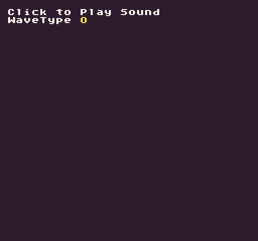

The `Sound()` API allows you to read raw sound data from the `SoundChip`. You need to provide a sound effect ID. If you supply the optional data argument, which is a comma-delimited string of sound effect property values, you’ll be able to update the sound effect.

## Usage

`Sound ( id, data )`

## Arguments

<table>
  <tr>
    <td>Name</td>
    <td>Value</td>
    <td>Description</td>
  </tr>
  <tr>
    <td>id</td>
    <td>int</td>
    <td>The sound effect’s ID.</td>
  </tr>
  <tr>
    <td>data</td>
    <td>string</td>
    <td>An optional sound property string to update the sound at the supplied ID.</td>
  </tr>
</table>

## Returns

<table>
  <tr>
    <td>Value</td>
    <td>Description</td>
  </tr>
  <tr>
    <td>string</td>
    <td>A string representing all of the sound data properties</td>
  </tr>
</table>

## Sound Effect Properties

Each sound effect is stored as a 24 value comma-delimited string: 

`"0,.05,,.2,,.2,.3,.1266,,,,,,,,,,,,,,,,,,1,,,,,,"`

Here is a mapping of each sound property.

<table>
  <tr>
    <td>Order</td>
    <td>Property</td>
    <td>Notes</td>
  </tr>
  <tr>
    <td>1</td>
    <td>waveType</td>
    <td>Supports: Square (0), Saw (1), Sine (2), Noise (3), Triangle (4), Sample (5)</td>
  </tr>
  <tr>
    <td>2</td>
    <td>attackTime</td>
    <td>Range 0 to 1</td>
  </tr>
  <tr>
    <td>3</td>
    <td>sustainTime</td>
    <td>Range 0 to 1</td>
  </tr>
  <tr>
    <td>4</td>
    <td>sustainPunch</td>
    <td>Range 0 to 1</td>
  </tr>
  <tr>
    <td>5</td>
    <td>decayTime</td>
    <td>Range 0 to 1</td>
  </tr>
  <tr>
    <td>6</td>
    <td>startFrequency</td>
    <td>Range 0 to 1</td>
  </tr>
  <tr>
    <td>7</td>
    <td>minFrequency</td>
    <td>Range 0 to 1</td>
  </tr>
  <tr>
    <td>8</td>
    <td>slide</td>
    <td>Range -1 to 1</td>
  </tr>
  <tr>
    <td>9</td>
    <td>deltaSlide</td>
    <td>Range -1 to 1</td>
  </tr>
  <tr>
    <td>10</td>
    <td>vibratoDepth</td>
    <td>Range 0 to 1</td>
  </tr>
  <tr>
    <td>11</td>
    <td>vibratoSpeed</td>
    <td>Range 0 to 1</td>
  </tr>
  <tr>
    <td>12</td>
    <td>changeAmount</td>
    <td>Range -1 to 1</td>
  </tr>
  <tr>
    <td>13</td>
    <td>changeSpeed</td>
    <td>Range 0 to 1</td>
  </tr>
  <tr>
    <td>14</td>
    <td>squareDuty</td>
    <td>Range 0 to 1</td>
  </tr>
  <tr>
    <td>15</td>
    <td>dutySweep</td>
    <td>Range -1 to 1</td>
  </tr>
  <tr>
    <td>16</td>
    <td>repeatSpeed</td>
    <td>Range 0 to 1</td>
  </tr>
  <tr>
    <td>17</td>
    <td>phaserOffset</td>
    <td>Range -1 to 1</td>
  </tr>
  <tr>
    <td>18</td>
    <td>phaserSweep</td>
    <td>Range -1 to 1</td>
  </tr>
  <tr>
    <td>19</td>
    <td>lpFilterCutoff</td>
    <td>Range 0 to 1</td>
  </tr>
  <tr>
    <td>20</td>
    <td>lpFilterCutoffSweep</td>
    <td>Range -1 to 1</td>
  </tr>
  <tr>
    <td>21</td>
    <td>lpFilterResonance</td>
    <td>Range 0 to 1</td>
  </tr>
  <tr>
    <td>22</td>
    <td>hpFilterCutoff</td>
    <td>Range 0 to 1</td>
  </tr>
  <tr>
    <td>23</td>
    <td>hpFilterCutoffSweep</td>
    <td>Range -1 to 1</td>
  </tr>
  <tr>
    <td>24</td>
    <td>masterVolume</td>
    <td>Range 0 to 1</td>
  </tr>
</table>

## Example

In this example, we’ll read a sound’s properties, modify the `waveType`, then save it back to the sound chip before playing it. To do this, we’ll also need to parse the sound data string by hand since Lua doesn’t include a built-in way to easily split a string by a delimiter:

    class SoundExample : GameChip
    {
        
        // Stores the current wave type
        private int waveType;

        // Stores all the sound effect properties
        List&lt;string&gt; soundProps = new List&lt;string&gt;();

        public override void Init()
        { 
          
            // Add label text
            DrawText("Click to Play Sound", 1, 1, DrawMode.Tile, "large", 15);
            DrawText("WaveType", 1, 2, DrawMode.Tile, "large", 15);

            // Read first sound effect
            var soundData = Sound(0);
            
            // Create a temp value for the parser
            var tmpValue = "";

            // Loop through all the of the characters in the soundData string
            for (int i = 0; i &lt; soundData.Length; i++)
            {
                
                // Get a single character from the soundData string
                var c = soundData.Substring(i, 1);
                
                // If the character is a comma
                if (c == ",")
                {

                    // Add the current string of characters to the next table position
                    soundProps.Add(tmpValue);

                    // Reset the tmpValue
                    tmpValue = "";

                } else { 

                    // Concatenate the current character with the previous ones in the tmpValue
                    tmpValue += c;

                }
            }

            // Always add the last value since it doesn't } in a comma
            soundProps.Add(tmpValue);

        }

        public override void Update(int timeDelta)
        { 
            
            // Test to see if the mouse button was released and the sound is not playing
            if(MouseButton(0, InputState.Released) && IsChannelPlaying(0) == false)
            { 

                // Update the waveType value
                waveType = Repeat(waveType+1, 5);
                soundProps[0] = waveType.ToString();

                // Save the new sound data
                Sound(0, string.Join(",", soundProps));

                // Play the first sound on channel 0
                PlaySound(0);

            }
        }

        public override void Draw()
        { 
            // Redraw the display
            RedrawDisplay();

            // Draw the wavetype ID
            DrawText(waveType.ToString(), 80, 16, DrawMode.Sprite, "large", 14);

        }
    }

Running this code will output the following:


