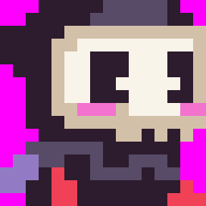
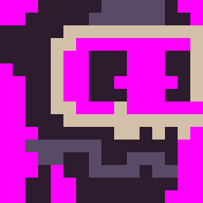

When the `SpriteChip` imports each sprite, it analyzes the total number of colors and compares this to what the chip can display. An 8 x 8 pixel sprite can have a maximum of 64 unique colors, but older 8-bit systems are unable to display that many colors at once. To simulate this, the `SpriteChip` has a property that represents the total colors per sprite, or CPS for short. While this value can be increased or decreased based on your needs, the reduced number of sprite colors is a hallmark of classic 8-bit systems and their memory limitations which impacted how they draw sprites to the display. 

While processing sprites, the importer calculates if each one contains more colors that are allowed. When this happens, additional colors are converted to the default mask color in order to force the sprite to adhere to the CPS limitation. Here is an example of how this works with the four sprites that make up the Reaper Boy character:

If we reduce the CPS to 3, you begin losing pixel data:

Understanding how CPS works is critical to sprites into your PV8 game.


