The Sprite Editor Tool allows you to preview and edit sprites in memory. This tool is critical to see all of the sprites that are imported into the game and verifying that they are displayed correctly. Let's take a look at the Sprite Editor Tool's default layout.

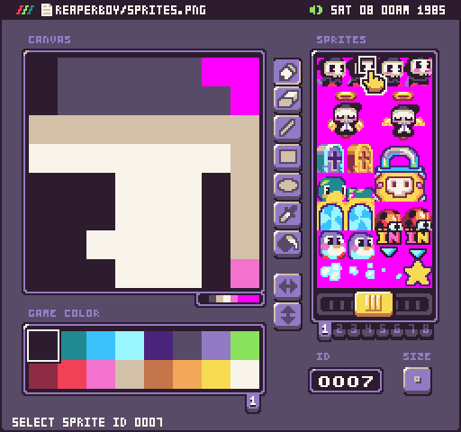

The tool is broken down into 3 parts: the sprite editor, the sprite picker, and the color picker. Let’s get started by talking about the picker. This tool is rather straightforward. Simply select a sprite you would like to edit and it will load up on the canvas. Use the tools to modify it, and once saved, the sprites.png file will be updated with the changes.

## Keyboard Shortcuts

The Sprite Tool has the following keyboard shortcuts based on what actions are available.

| Name  | Shortcut  | Description                                                                     |
|-------|-----------|---------------------------------------------------------------------------------|
| Clear | Ctrl \+ D | Clear all of the pixel data in the currently selected sprite\.                  |
| Save  | Ctrl \+ S | Save the changes to the sprites\.png file\.                                     |
| Undo  | Ctrl \+ Z | Undo the last sprite pixel data change\.                                        |
| Redo  | Ctrl \+ Y | Redo the last sprite pixel data change\.                                        |
| Copy  | Ctrl \+ C | Copy the currently selected sprite\.                                            |
| Paste | Ctrl \+ V | Paste the previously copied sprite data over to the currently selected sprite\. |
| Quit  | Ctrl \+ Q | Quit the current tool\.                                                         |

##  Sprite Pages

The picker displays a single page of sprites. Each page contains 256 sprites. You can have up to 8 pages of sprites in memory. You can change the total number of sprites in the Chip Editor or by hand in the `data.json` file.

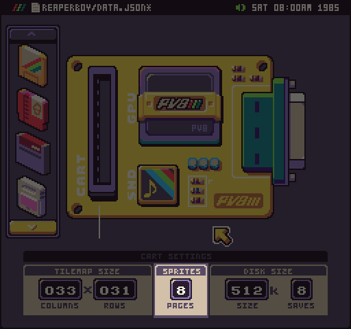

When you modify the number of sprite pages, new page tabs will show up under the sprite picker. It is important to note that the transparent color is represented by magenta (#FF00FF). If a sprite’s data contains no pixel data, the engine ignores it and consider the sprite empty.

When you select a sprite, the tool displays its Sprite ID. If you type a value here, the picker selects the correct sprite. Sprites IDs begin at 0 and go up to the maximum number allowed by the total pages. If there are 4 pages, the last sprite is 1023. It is important to know the sprite ID to draw them to the display. 

## Drawing Tools

Let’s talk a little more about the sprite editor window. In addition to previewing a selected sprite, you can also make changes to it by selecting any of the tool icons on the right-hand side. 

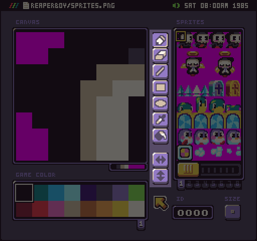

The sprite editor includes a pen, eraser, line, square, circle, eyedropper, and bucket tool. You can also access these tools via their respective keyboard shortcuts.

| Name        | Shortcut |
|-------------|----------|
| Pen         | p        |
| Eraser      | e        |
| Line        | l        |
| Rectangle   | b        |
| Circle      | c        |
| Eye Dropper | i        |
| Fill        | f        |

In addition, you can use the two flip buttons to change the orientation of the sprite.

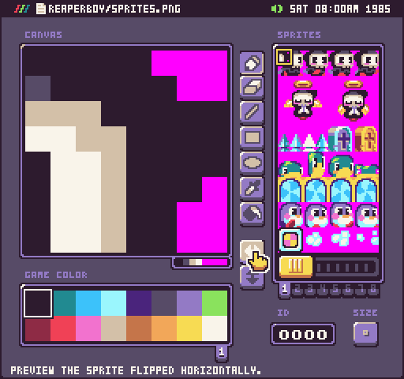

It’s important to note that these changes are permanent when you select another sprite or save. Remember you can mirror sprites so try to limit the number of duplicate horizontal and vertical mirrored sprites to save space in sprite memory.

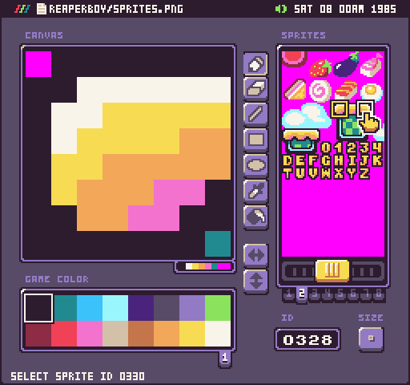

For example, the two platforms could be reduced to just the left size sprites and the right edges could be horizontally flipped at runtime.


## Previewing Sizes

By default, Pixel Vision 8 renders a single sprite as an 8 x 8 block of pixel data. The Sprite tool allows you to change the size of sprites while you edit them to make it easier to work with. You can cycle through the three different sizes by clicking on the size button below the sprite picker. By default, the sprite size will be 8 x 8.

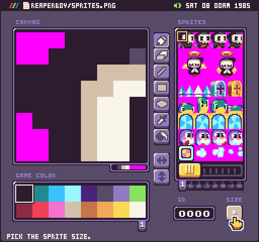

The next size is 16 x 16

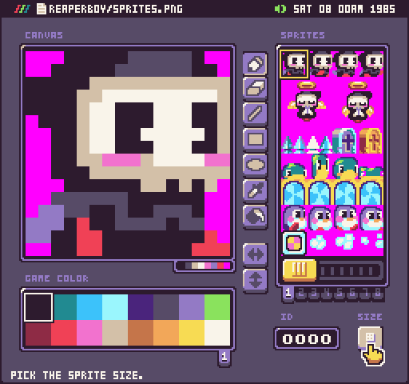

And the final size is 32 x 32.

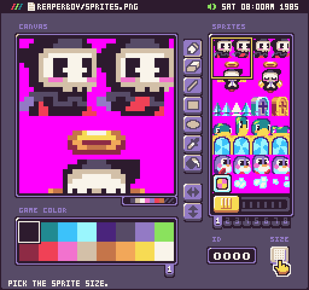

It’s important to note that changing the size only affects what you see in the Sprite Tool. Sprite will continue to be parsed as 8 x 8 sections. Changing the size of the sprite in the Sprite Tool makes it easier to work on larger sprites that are comprised of several smaller 8 x 8 ones.

While the Sprite Tool’s size button doesn’t change the default size of sprites in the game, you can use it to help preview how the `DrawSpriteBlock()` API will work. You’ll notice that as you cycle through the different sizes, the sprite’s ID is always fixed to the upper left-hand sprite. 

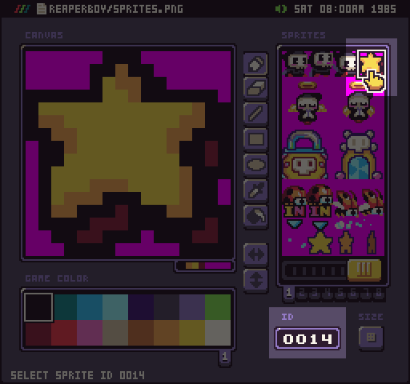

So if you want to draw a 16 x 16 sprite, simply call:

```lua
DrawSpriteBlock(14, 8, 8, 2, 2)
```

The DrawSpriteBlock() API accepts the sprite’s size in columns and rows. So this call will draw a grid a 2 by 2 grid of sprites, starting with the first ID as the top left corner.


The X and Y position will also be fixed to the top left corner as well so you’ll need to account for that in your game as well.

## CPS Preview

The Sprite Editor’s drawing tools will also enforce the colors per sprite limitation you set in the data.json file. If you attempt to select a color and the sprite currently has the maximum colors it can display, you’ll see a warning at the bottom of the screen and the sprite editor will be disabled until you delete a color from the sprite.

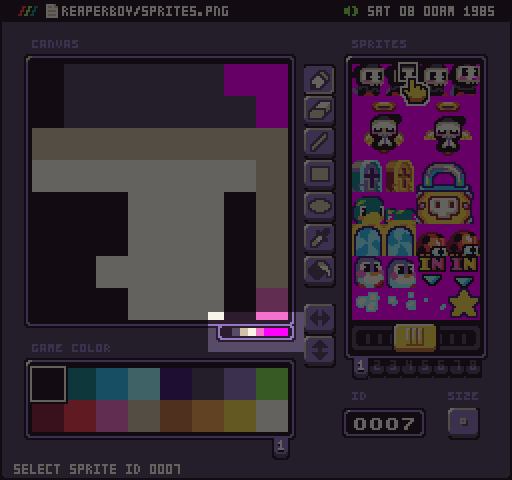

If you select a sprite that has more colors than are supported, the CPS preview are will expand but additional colors will be greyed out.

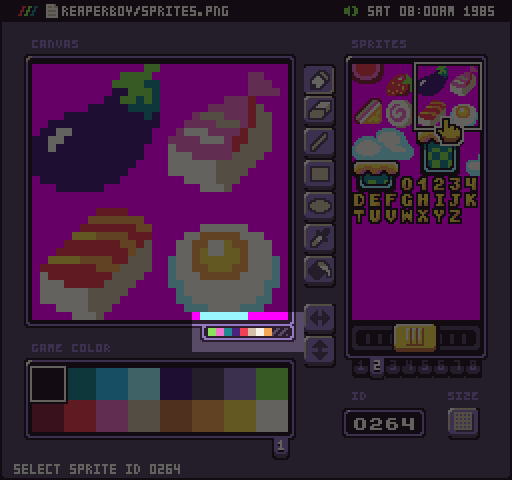

While this preview is useful for seeing how many colors are in a sprite, it may not be accurate at runtime. Also, when you change the size of the sprite selection, the CPS preview will treat the entire group of sprites as one.

Some classic game systems limited you to a set number of colors per 8 x 8 sprite, there were times where background tiles may have been limited to the same color per sprite count as an 8 x 8 sprite for every 16 x 16 tiles. The NES, for example, has this limitation where only a single background palette could be applied to a 16 x 16 set of tile sprites.

You can modify the CPS Chip Editor Tool by selecting the GPU chip and looking at the renderer panel. 

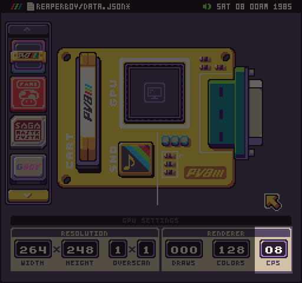

Changing this value forces the importer to parse the `sprite.png` with the new CPS value. This doesn’t immediately change the actual file itself. This allows you to go back into the Sprite Tool a preview the changes on each sprite. Here is an example of what happens when you change the CPS value from  8 to 4.

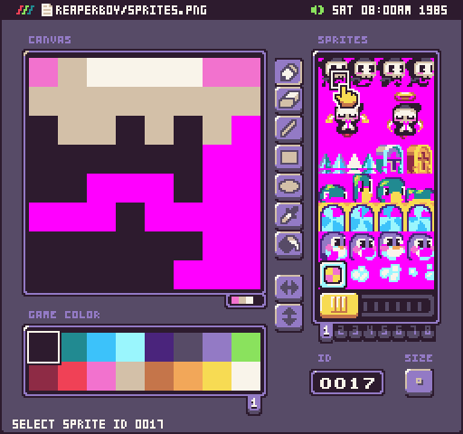

As you can see, the player’s feet are no longer displayed. The importer keeps track of each color as it parses a sprite from the `sprite.png` file and ignores additional colors beyond the CPS cap. Any color over the CPS value is made transparent. This setting could have drastic effects on how Pixel Vision 8 imports your sprites. If you make any changes in the Color or Sprite Tools, the `sprites.png` file will be saved using the current project’s CPS value, overwriting any previous versions.


## BG Color Preview

Sometimes you’ll want to preview the background color while working with a sprite. This is critical on more restrictive systems where you are limited to a set amount of colors and need to use the background color as an extra color. Or when you just want to see what a sprite will look like with the transparent mask color removed. You can toggle this from the drop-down menu or by pressing Ctrl + B.

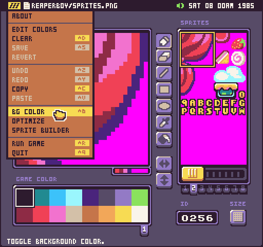

After enabling the BG color to show through, the mask colors (`#FF00FF`) will be replaced. The sprite picker window will not be affected by this change so you can keep track of which sprites are transparent even while working with the BG color enabled.

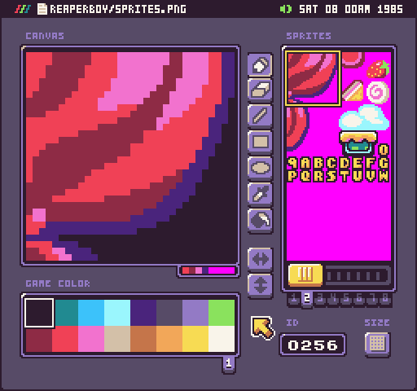

You can change the default background color by switching over to the Color Tool. There is a short cut for this in the drop-down menu.

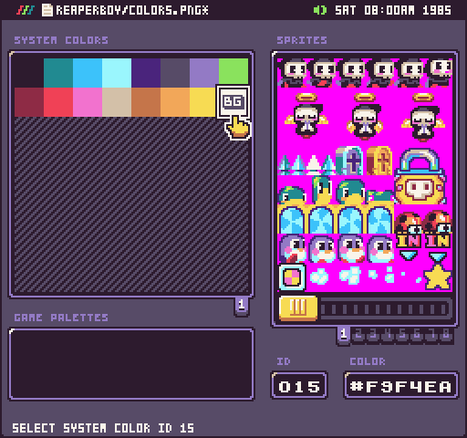

Once you’ve saved the change and go back into the Sprite Tool, you will see the new BG color.

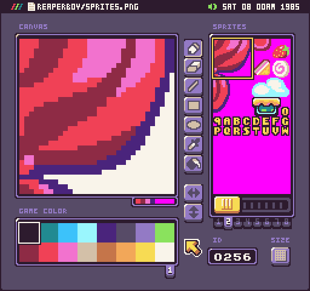