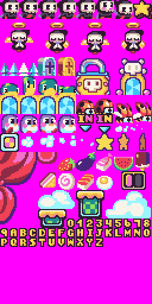
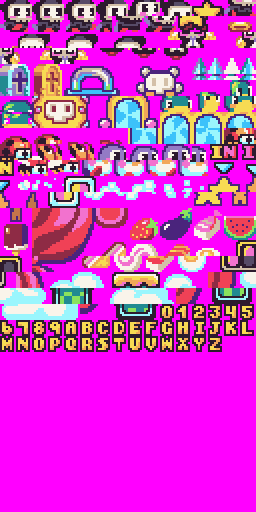

# Importing Sprites

In addition to processing the `sprite.png` image and converting it to indexed color data, the `SpriteChip` also optimizes the data by only storing unique sprites. Let’s take a look at a sample `sprite.png` file from the Reaper Boy art pack.

Here you can see we have all of Reaper Boy’s sprites laid out next to each other as a 512 x 512 pixel `sprite.png` image. If the Sprite Chip imports all of the sprites as is, we end up 4,096 sprites. The maximum sprites Pixel Vision 8’s SpriteChip can actually store in memory is 2,048. So we’ll want to optimize this.

Since PV8 only supports 8 x 8 pixel sprites, the importer moves through the `sprite.png` file, starting in the upper left-hand corner, converting each 8 x 8 pixel block of data into a format the `SpriteChip` can store. By default, all sprites are added to the `SpriteChip` memory, until space runs out. There is also an option to remove repeating sprites to optimize the amount of space the `SpriteChip` has left. Here is an example of how the above `sprite.png` file would be optimized:

The importer can automatically optimize the `sprites.png` leaving us with 350 sprites, which is a 6% reduction. It is also important to note that transparent pixel data is ignored and converted to the system’s default mask color which is magenta (#FF00FF). PV8 does not store transparent colors. Any colors not available to the system, including one that contains any transparency, is simply not drawn to the display. However, you can use transparent colors when importing sprites from PNGs and the importer will automatically convert them to the default mask color.


