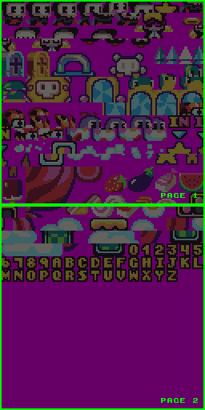
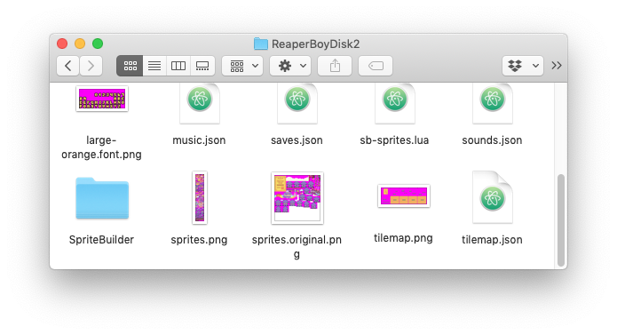

# Sprite Memory Pages

Keep in mind that the Pixel Vision 8 also places limits on the number of sprites it can store in memory. While technically the engine can support any PNG file that is horizontally and vertically divisible by eight, it helps to optimize your art based on sprite pages, which is how the internal system stores and calculates the total sprites available.

A single sprite page is 128x128 pixels, which contains 256 sprites. When you are configuring the system, you can define how many pages of memory the `SpriteChip` supports. The maximum number of pages is eight for a potential total of 2,048 sprites. Here is a breakdown of how many sprites are available as you increase the number of pages:

<table>
  <tr>
    <td>Pages</td>
    <td>Total Sprites</td>
  </tr>
  <tr>
    <td>1</td>
    <td>256</td>
  </tr>
  <tr>
    <td>2</td>
    <td>512</td>
  </tr>
  <tr>
    <td>3</td>
    <td>768</td>
  </tr>
  <tr>
    <td>4</td>
    <td>1,024</td>
  </tr>
  <tr>
    <td>5</td>
    <td>1,280</td>
  </tr>
  <tr>
    <td>6</td>
    <td>1,536</td>
  </tr>
  <tr>
    <td>7</td>
    <td>1,792</td>
  </tr>
  <tr>
    <td>8</td>
    <td>2,048</td>
  </tr>
</table>

One way to help optimize your sprites is to store them in page blocks before importing. Let's look back at the earlier example of the Reaper Boy sprites. If we were to export the sprites from the Sprite Chip, we would end up with a 256 x 768 image: 

Here you can see how each page of sprites is organized. Since the importer reads from the top left of the `sprite.png` to the right as it traverses each row of pixels, organizing your PNG file like this will help speed-up loading sprites at run-time.

When building a game, don't focus on optimizing your `sprite.png` at first. While you may see slower load times, simply work on your sprites in a way that makes sense to you. Before sharing the game, simply set the optimize sprite flag and let the engine do it for you. Here is an example of how I organize the sprites inside the Reaper Boy game folder:

As you can see, I keep two sprite files. The first is the `sprites.original.png` which is ignored by the importer but allows me to still work with sprites in my image editor of choice. For running the game, I use the optimized file as the main `sprite.png`.


