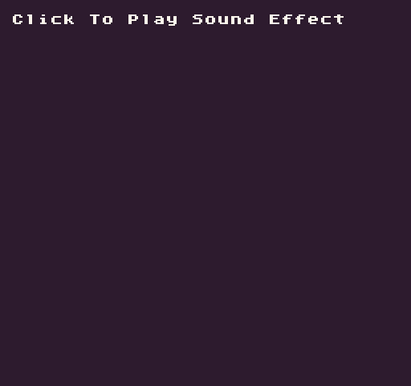

# StopSound

Use `StopSound()` to stop any sound playing on a specific channel.

## Usage

`StopSound ( channel )`

## Arguments

<table>
  <tr>
    <td>Name</td>
    <td>Value</td>
    <td>Description</td>
  </tr>
  <tr>
    <td>channel</td>
    <td>int</td>
    <td>The channel ID to stop a sound on.</td>
  </tr>
</table>

## Example

In this example, we toggle between playing and stopping a sound effect based on the mouse button being released:

    class StopSongExample : GameChip
    {
        public override void Init()
        { 
            // Draw the song data label
            DrawText("Song Data:", 1, 1, DrawMode.Tile, "large", 15);

        // Start playing the song on a loop
        PlaySong(0, true);

        }

        public override void Update(int timeDelta)
        { 

            // Test for the left mouse button to be released
            if(MouseButton(0, InputState.Released))
            { 

                // Stop the song when the mouse button is released
                StopSong();

            }

        }

        public override void Draw()
        { 

            // Redraw display
            RedrawDisplay();

            // Reset the next row value so we know where to draw the first line of text
            var nextRow = 2;

            // Display the song's metadata
            foreach (var data in SongData())
            {

                //Draw the key value pair from the song data table
                DrawText(data.Key + ":", 8, nextRow * 8, DrawMode.Sprite, "large", 6);
                DrawText(data.Value.ToString(), 16 + (data.Key.Length * 8), nextRow * 8, DrawMode.Sprite, "large", 14);

                //Increment the row by 1 for the next loop

                nextRow = nextRow + 1;

            }
        }
    }

Running this code will output the following:


