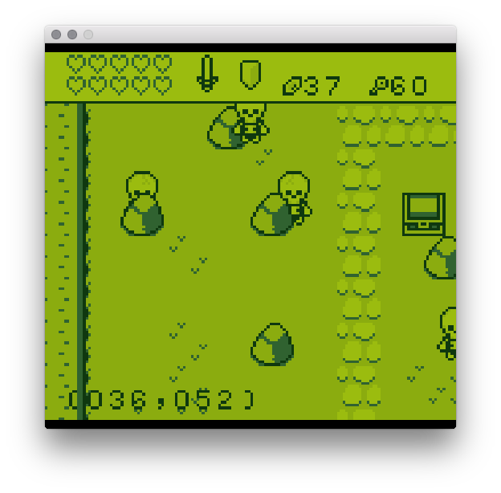

Pixel Vision 8’s window is considered the screen. If the game is running in fullscreen mode, the computer’s resolution will be used. However, in window mode, the screen’s resolution is `512` x `480` which is defined in the bios. When in window mode, you can apply a screen multiplier from `1x` to `4x`. Pixel Vision 8 will not let you set a scale larger than the computer’s resolution can display. This means if you set the screen scale to `2x`, the window will be `1024 `x `960.`

All games, no matter what their resolution is set to in the `data.json` file, will be upscaled to fill Pixel Vision 8’s screen. If the game is scaled up, it will be done in a way that preserves square pixels to avoid distorting or stretching. That means if your game’s resolution is set to `160 `x `144`, which is the native resolution of a Game Boy, black bars appear at the top and bottom of the screen.

It’s important to note that the game is still being rendered at 160 x 144, even though it will appear larger as it’s upscaled to fill the screen. The screen and the game’s resolution are independent. Changing the game’s resolution will not be perfectly reflected since the game will automatically be upscaled to fill the screen.

Older consoles usually worked in smaller resolutions and were upscaled to fit the TV. Pixel Vision 8 games are rendered at `256 `x `280`. That means the game will effectively be upscaled by `2x` in order to fit the screen. Likewise if you set your game to its maximum resolution of `512 `x `480`, it will be scaled at `1x`.


