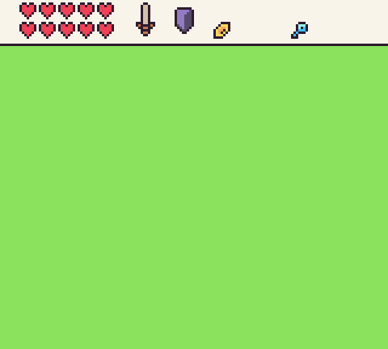
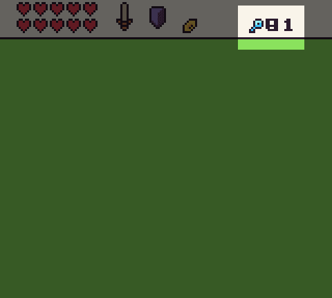
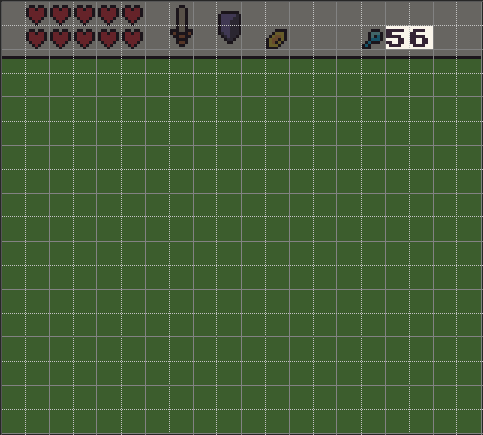

# The Tilemap Cache

The tilemap cache layer has some additional advantages than just optimizing rendering the tilemap to the screen. You can also use the tilemap cache layer as an additional canvas in your game. Let’s take a look at how this works.

One way to take advantage of the tilemap cache layer is to draw text on top of the tilemap. You may not want to display each text character as a single sprite, especially if the text is dynamic meaning you wouldn’t want it set as tiles. To get around this, you can use any Draw API that accepts a DrawMode to render text on top of the tilemap cache layer. Once drawn, the pixel data will not change unless you update any tiles underneath it or rebuild the entire tilemap cache.

To illustrate how this works, if we render a HUD to the screen, by manually calling `DrawTilemap()` it will become the background of the display as it renders.

Now if we want to display a score or some other text value that doesn’t change frequently, we can render it on top of the tilemap cache. To draw pixel data to the tilemap cache, you simply supply `DrawMode.TilemapCache` to any of the supported Draw APIs. In this case, we’ll use `DrawText()`:

`DrawText(ReadFPS(), 128, 8, DrawMode.TilemapCache, "large")`

One thing you should pay attention to is pixel data with transparency when drawing to the tilemap cache. Any transparent pixel data will show whatever pixel data exists under it. So in this case, the font is going to draw on top of itself every time we draw to the tilemap cache. If this value changes from frame to frame, you’ll start seeing it become unreadable.

There are two ways to clear the pixel data on the tilemap cache. You can update the tiles below the text which will force the tilemap chip to recache their pixel data or you can use the `DrawRect()` API to paint a solid color on top before rendering the text again in the next frame. Here is an example of updating the tiles in code:

`UpdateTiles(16, 1, 2, {36, 36})`

Now on each frame, the tiles will redraw to the tilemap cache, then we draw the text on top of the tiles to get the following:

You draw anything into the tilemap cache, not just text. Sprites work great and since `DrawMode.TilemapCache` works on an X, Y coordinate system verses the `Tile()` API’s column, row position, you can position the pixel data anywhere you want. Just keep in mind that there is a performance penalty to drawing to the tilemap cache. While you can use it to overcome the draw call limitation, it will incur additional overhead as the pixel data still needs to be manually copied from memory to the tilemap cache layer. Also, any changes to the tilemap will force it to redraw so you can lose any pixel data you have drawn in a previous frame. Finally, you can clear the entire tilemap cache layer and revert it back to the default tilemap by calling `RebuildTilemap()`. 


