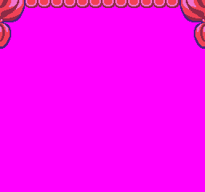

The `Tile()` API allows you to get the current sprite, color offset and flag values associated with a given tile ID. You can optionally supply your own values if you want to update the tile. Changing a tile's sprite ID or color offset will force the tilemap to redraw the layer cache on the next frame. If you are drawing raw pixel data into the tilemap cache in the same position, it will be overwritten with the new tile's pixel data.

## Usage

`Tile ( column, row, spriteID, colorOffset, flag, flipH, flipV )`

## Arguments

<table>
  <tr>
    <td>Name</td>
    <td>Value</td>
    <td>Description</td>
  </tr>
  <tr>
    <td>column</td>
    <td>int</td>
    <td>The X position of the tile in the tilemap. The 0 position is on the far left of the tilemap.</td>
  </tr>
  <tr>
    <td>row</td>
    <td>int</td>
    <td>The Y position of the tile in the tilemap. The 0 position is on the top of the tilemap.</td>
  </tr>
  <tr>
    <td>spriteID</td>
    <td>int</td>
    <td>An optional sprite ID to use for the tile.</td>
  </tr>
  <tr>
    <td>colorOffset</td>
    <td>int</td>
    <td>An optional value to shift the color IDs in the tile’s sprite data.</td>
  </tr>
  <tr>
    <td>flag</td>
    <td>int</td>
    <td>An optional int value between -1 and 15 used for collision detection.</td>
  </tr>
  <tr>
    <td>flipH</td>
    <td>bool</td>
    <td>Optional flag for horizontally flipping the tile. This is not currently implemented.</td>
  </tr>
  <tr>
    <td>flipV</td>
    <td>bool</td>
    <td>Optional flag for vertically flipping the tile. This is not currently implemented.</td>
  </tr>
</table>

## Returns

<table>
  <tr>
    <td>Value</td>
    <td>Description</td>
  </tr>
  <tr>
    <td>TileData</td>
    <td>Returns a TileData object containing the spriteID, colorOffset, and flag for an individual tile.</td>
  </tr>
</table>

## Tile Data

The TileData object contains all of the values that make up a single tile. You can use this to learn more about what flags and values are set:

<table>
  <tr>
    <td>Property</td>
    <td>Value</td>
    <td>Description</td>
  </tr>
  <tr>
    <td>index</td>
    <td>int</td>
    <td>The ID of the tile in the tilemap.</td>
  </tr>
  <tr>
    <td>spriteID</td>
    <td>int</td>
    <td>The sprite ID to display for the tile.</td>
  </tr>
  <tr>
    <td>colorOffset</td>
    <td>int</td>
    <td>The color offset to be used when drawing the tile.</td>
  </tr>
  <tr>
    <td>flag</td>
    <td>int</td>
    <td>The flag value of the tile.</td>
  </tr>
  <tr>
    <td>flipH</td>
    <td>bool</td>
    <td>A flag to flip the tile horizontally when drawing to the display.</td>
  </tr>
  <tr>
    <td>flipV</td>
    <td>bool</td>
    <td>A flag to flip the tile vertically when drawing to the display.</td>
  </tr>
</table>

## Example

In this example, we are going to read all of the tiles and see which ones have sprites assigned to them. We’ll be using the following Tilemap:

Next, we’ll set up 4 palettes to apply to each of these tiles:

Finally, we’ll change each tile’s `colorOffset` value over several frames to give the impression that the background is fading up and down:

    class TileExample : GameChip
    {
        // Set up a time and delay
        private int time;
        private int delay = 800;

        // This will be the direction value for the transition
        private int dir = 1;

        // Total number of palettes for transition
        private int max = 3;

        // Current palette ID
        private int paletteID;

        // Store the tilemap dimensions
        private Point mapSize;
        private int totalTiles;

        public override void Init()
        {

            // Set the tilemap dimensions
            mapSize = TilemapSize();
            totalTiles = mapSize.X * mapSize.Y;

        }

        public override void Update(int timeDelta)
        {
            // Increase the time on each frame and test if it is greater than the delay
            time = time + timeDelta;

            if (time &gt; delay)
            {

                // Update the palette ID based on the direction
                paletteID += dir;

                // Test if the palette ID is too small or too large and reverse the direction
                if (paletteID &gt;= max)
                {
                    dir = -1;
                }
                else if (paletteID &lt;= 0)
                {
                    dir = 1;
                }

                // Reset the time value
                time = 0;

                // Loop through all of the tiles in the tilemap
                for (int i = 0; i &lt; totalTiles; i++)
                {

                    // Convert the loop index to a column,row position
                    var pos = CalculatePosition((i - 1), mapSize.X);

                    // Get the TileData based on the new position
                    var tmpTile = Tile(pos.X, pos.Y);

                    // Check to see if the tile has a sprite
                    if (tmpTile.spriteID &gt; -1)
                    {

                        // Update the tile by reassigning the same spriteID but calculating a new color offset
                        Tile(pos.X, pos.Y, tmpTile.spriteID, PaletteOffset(paletteID));

                    }
                }
            }
        }

        public override void Draw()
        {
            // Redraw the display
            RedrawDisplay();

            // Draw the text for the palette and color ID
            DrawText("Palette " + paletteID, 32, 16, DrawMode.Sprite, "large", 15);

        }
    }

One thing to note is that while this demo shows how to modify individual tiles at run-time, it’s important to point out that this approach may have bad performance impacts. If you need to modify large groups of tiles, try indexing them in the tilemap during startup and only iterate over tiles you know you need to update.

Running this code will output the following:


