# Tilemap Tool

The Pixel Vision 8 has a built-in tilemap editor which is designed to help you build levels, splash screens, and backgrounds for your games.

The tilemap editor is broken up into 4 main parts: the sprite picker, the color/flag picker, the tools, and the tilemap editor. In addition to the tilemap editor, you can use the Tilemap Tool to create collision flags by switching over to the flag picker.

## Keyboard Shortcuts

The Tilemap Tool has the following keyboard shortcuts based on what actions are available.

| Name     | Shortcut  | Description                                                                             |
|----------|-----------|-----------------------------------------------------------------------------------------|
| Save     | Ctrl \+ S | Save the changes to the tilemap\.json file\.                                            |
| Clear    | Ctrl \+ D | Clear the currently selected tile or flag\.                                             |
| Undo     | Ctrl \+ Z | Undo the last tile or flag change\.                                                     |
| Redo     | Ctrl \+ Y | Redo the tile or flag data change\.                                                     |
| Copy     | Ctrl \+ C | Copy the currently selected tile or flag\.                                              |
| Paste    | Ctrl \+ V | Paste the previously copied tile or flag over to the currently selected tile location\. |
| BG Color | Ctrl \+ B | Toggle between showing and hiding the background color\.                                |
| Flip H   | Ctrl \+ H | Flip the currently selected tile horizontally\.                                         |
| Flip V   | Ctrl \+ G | Flip the currently selected tile vertically\.                                           |
| Quit     | Ctrl \+ Q | Quit the current tool\.                                                                 |

## Editing Tilemaps

When you open an empty tilemap for the first time, the Tilemap Tool will need to render the layer. This may take a few seconds based on the side of the tilemap and the speed of your computer. While the tilemap is being rendered you will not be able to interact with any of the tools or pickers. You can, however, scroll while rendering is taking place.

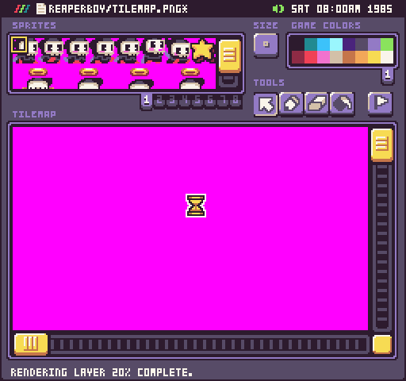

When rendering is complete, you will have access to the tools used for creating tilemaps. The default tool is the picker.

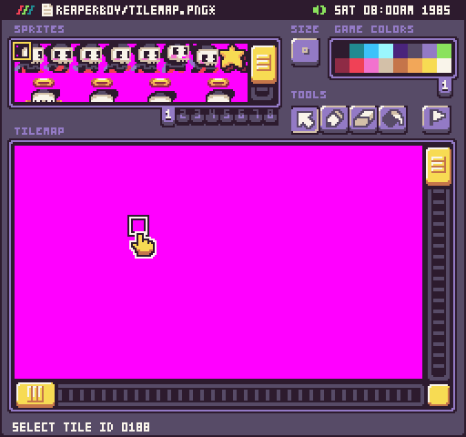

This allows you to select tiles, move them, and preview their tile id, x, and y position. To move a tile, simply select it and drag it to a new position.

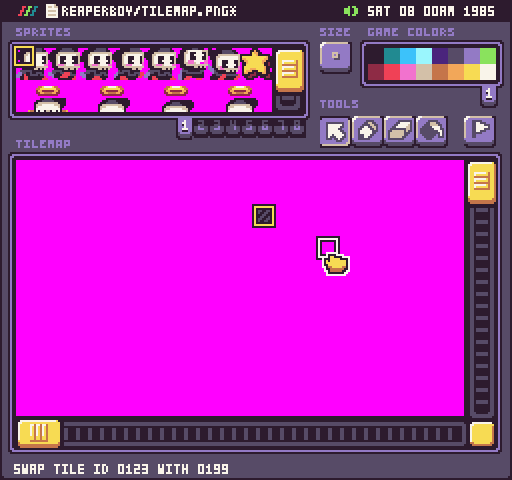

Before you can draw new tiles, you’ll want to select the sprite to use.

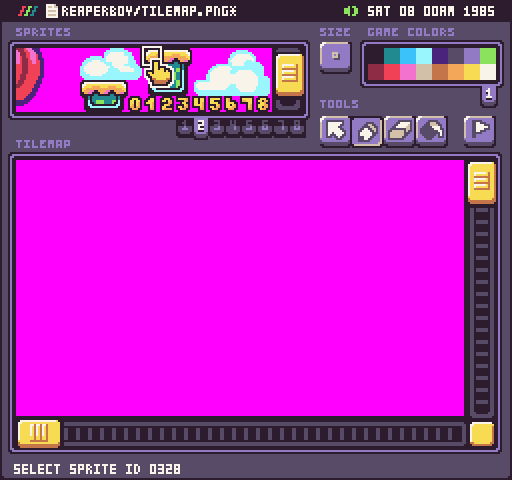

The pen tool allows you to paint sprites as tiles on the map. By default, you’ll be able to work with 8 x 8 tiles.

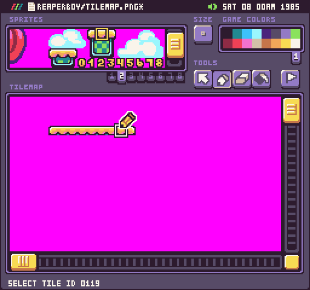

You can always switch the size of the tile by cycling through the size button. Just like in the Sprite Tool, you’ll have access to 16 x 16 and 32 x 32 tiles.

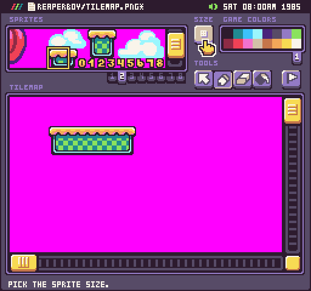

You may want to mix and match different tile sizes as you add detail to your map. Just remember that Pixel Vision 8’s default tile size will be 8 x 8 so even though you can switch between different sizes to make painting larger areas easier, you can always go back and modify individual tiles one at a time.

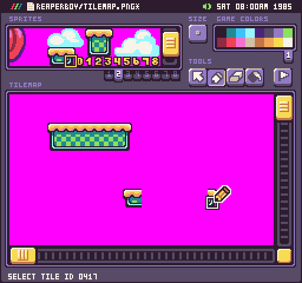

Due to the Tilemap Tool’s ability to paint with 32 x 32 tiles, it will validate that the tilemap is divisible by the largest tile size when loading up. You may see the following warning.

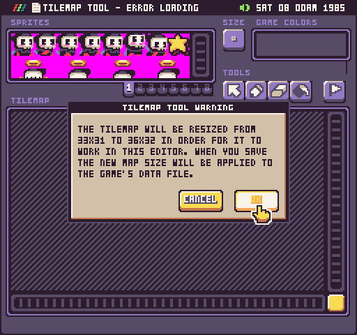

The Tilemap Tool will automatically attempt to resize a tilemap that is loaded into the tool in order to align tiles to the grid correctly. While this is not a limitation of Pixel Vision 8 itself, it’s something you should consider when creating tilemaps with the built-in tool.

In addition to the pointer and pen, there are 2 other tools the eraser and the fill tool.

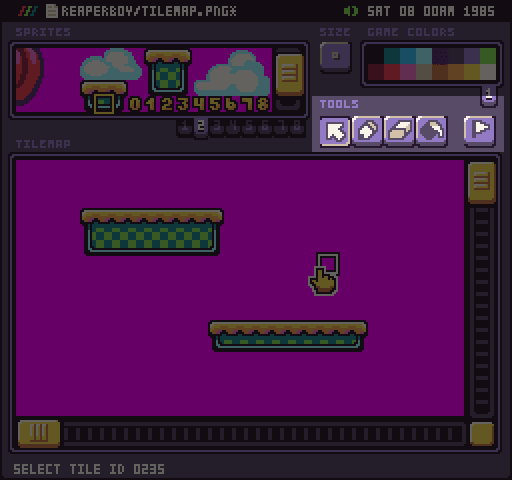

You can easily switch between each tool via their keyboard shortcuts.

| Name    | Shortcut |
|---------|----------|
| Pointer | v        |
| Pen     | p        |
| Eraser  | e        |
| Fill    | f        |

## Editing Collision Flags

To access the collision flag layer in the Tilemap Editor, press the flag button on the far right above the tilemap canvas.

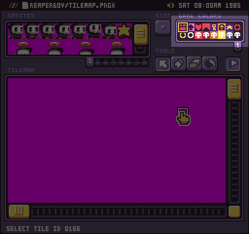

Drawing collision flags is similar to how you would draw tiles. The same tools are available, the only difference is that you will need to select a flag instead of a sprite. When you roll over each flag, you will see the value at the bottom of the tool.

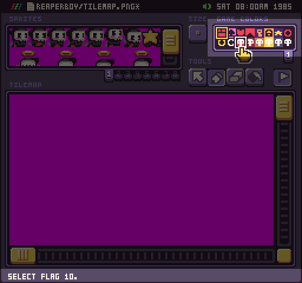

You can use this ID in the game to determine the tile’s collision flag value. While painting tiles, you can quickly switch between the tile and collision flag layer by pressing Ctrl + F. This will make it easier to line up where to draw your collision flags over their tiles since you can only preview one layer at a time.

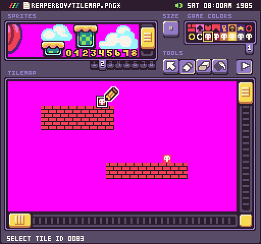

While the Tilemap Tool uses default icons for each flag, you can use them any way that you want in your game. All you need to do is keep track of the actual flag ID and what it will correspond to in your actual game.

It’s important to note that if you move tiles the tilemap flags will not move with them.

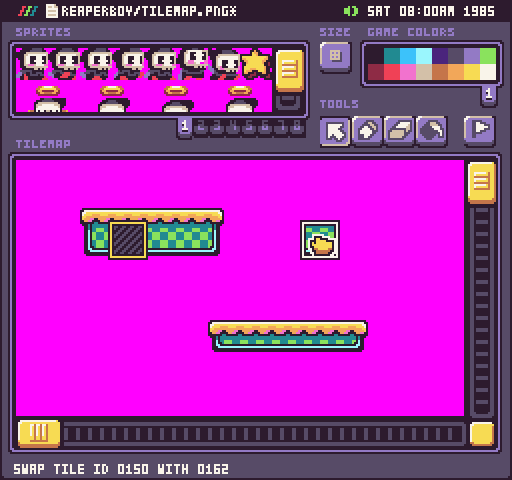

Keep in mind that these two layers are independent of each other. The tool is designed to be generic and flexible but if you are building very complicated tilemaps, you may want to consider simply creating a tile layer and parsing the tiles at runtime based on their sprite ID instead of their flag ID. While this adds more overhead to the game, it allows you to focus on using the Tilemap Tool to layout tilemaps independent of the collision flags.

## Tile Palettes

Just like in the Color and Sprite Tools, you’ll have access to switching between different palettes when you are in palette mode. When it comes to the Tile Map tools palette preview picker, it not only allows you to paint tile with a specific palette but you can also use it to change tiles on the map. To get started, select the palette you want to use and you’ll see that the sprite picker will update to show the new colors.

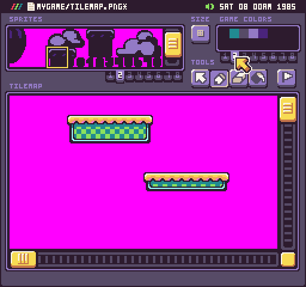

At this point, you can begin painting with the new palette just like you would with any sprites.

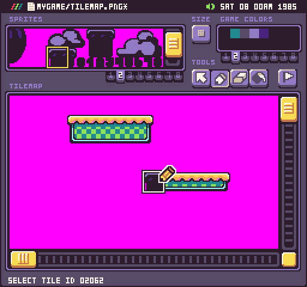

However, if you have tiles already in the tilemap you’d like to change, you can use the selection tool to change them by hand without having to repaint them. Simply select the tiles you want to recolor.

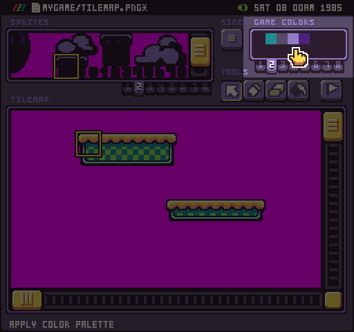

Once you have the tiles you want to recolor selected in the tilemap panel, roll over the color picker and you’ll see the hand cursor. Clicking on the palette’s colors will change the color offset of the selected tiles.

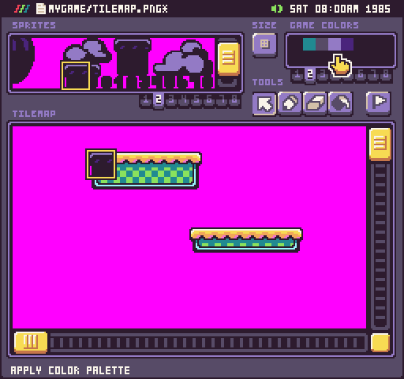

You can switch between any of the 8 palettes as you recolor the tiles in your tilemap.

## Tilemap BG Color

Your tilemap may require the background color to help fill in large areas with color or to add an additional color to your tiles on systems that have strict color per sprite limitations. To preview the BG Color, select the option from the drop-down menu.

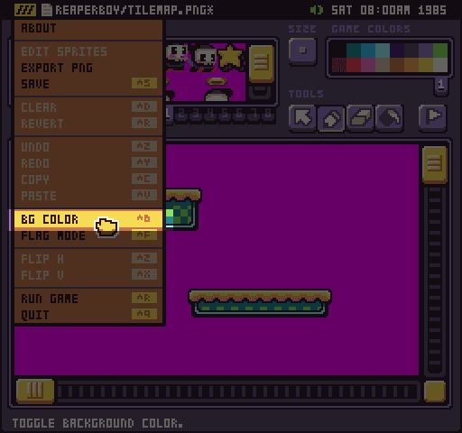

After toggling the BG Color, the mask color will be replaced by whatever color is set to the default BG Color on the Color Chip.

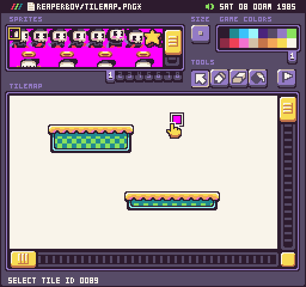

It’s important to keep in mind that this is just a way to preview what the final background will look like in your game and will not be included when you export a png.
