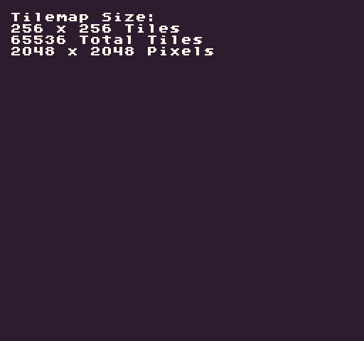

# TilemapSize

The `TilemapSize()` API returns a `Point `representing the size of the tilemap in `columns `(`X`) and `rows` (`Y`). To find the size in pixels, you will need to multiply the returned `Point`’s `X` and `Y` values by the sprite size's `X` and `Y`. This method also allows you to resize the tilemap by passing in an optional new `Width` and `Height`. Resizing the tilemap is non-destructive, so if you make the tilemap smaller, the remaining tiles will still exist. Making the tilemap larger will add empty tiles. You can supply an optional flag to clear the tilemap when resizing if you want to completely reset all of the tile values.

## Usage

`TilemapSize ( width, height, clear )`

## Arguments

<table>
  <tr>
    <td>Name</td>
    <td>Value</td>
    <td>Description</td>
  </tr>
  <tr>
    <td>width</td>
    <td>int</td>
    <td>An optional parameter for the width in tiles of the map.</td>
  </tr>
  <tr>
    <td>height</td>
    <td>int</td>
    <td>An optional parameter for the height in tiles of the map.</td>
  </tr>
  <tr>
    <td>clear</td>
    <td>bool</td>
    <td>An option flag to clear all of the tiles in the tilemap.</td>
  </tr>
</table>

## Returns

<table>
  <tr>
    <td>Value</td>
    <td>Description</td>
  </tr>
  <tr>
    <td>Point</td>
    <td>Returns a Point representing the tilemap’s size in tiles where X and Y are the columns and rows of the tilemap.</td>
  </tr>
</table>

## Example

In this example, we are going to calculate the size of the tilemap and display it to the screen:

    class TilemapSizeExample : GameChip
    {
        public override void Init()
        {
            //Get the tilemap size and sprite size
            var mapSize = TilemapSize();
            var tileSize = SpriteSize();

            // Display the tilemap size in tiels and pixels to the screen
            DrawText("Tilemap Size:", 1, 1, DrawMode.Tile, "large", 15);
            DrawText("Tiles " + mapSize.X + " x " + mapSize.Y, 1, 2, DrawMode.Tile, "large", 15);
            DrawText("Total Tiles " + (mapSize.X * mapSize.Y), 1, 3, DrawMode.Tile, "large", 15);
            DrawText("Pixels " + (mapSize.X * tileSize.X) + " x " + (mapSize.Y * tileSize.Y), 1, 4, DrawMode.Tile, "large", 15);

        }

        public override void Draw()
        { 
                // Redraw the display
                RedrawDisplay();
        }
    }

Running this code will output the following:


