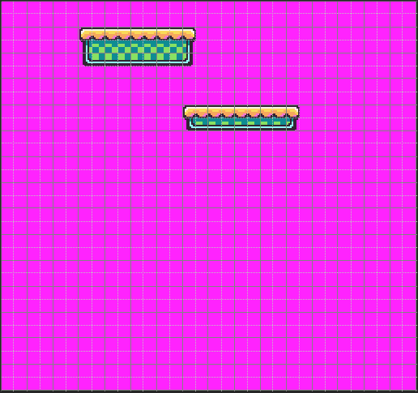

There are two ways to import tilemaps into your game. The easiest way is to provide a `tilemap.png` file that works similar to the `sprite.png`. Since tilemaps are simply compressed data structures representing sprite IDs in a grid, the tilemap PNG file is cut up into 8 x 8 sprites and that pixel data is compared to existing sprites in memory. 

By default, Pixel Vision 8 as a resolution of 256 x 240 pixels, which equates to 32 sprites horizontally and 30 sprites vertically. This means you can display a total of 960 sprites on the screen at one time. Here is an example `tilemap.png`:

The tilemap can actually be larger than the visible screen. However, there are limits on the number of columns and rows some games can store in memory. These limitations are stored in the `TilemapChip`. Make sure to pay attention to those dimensions when creating new games. Tilemaps can be any size within those boundaries. Tilemap data can also be set at run-time to allow you to display larger maps than memory can store.

When a `tilemap.png` is loaded up into memory, it is cut up into 8 x 8 pixel sprites just like the `sprites.png`. The first position 0,0 is located at the upper left-hand corner of the map. The tilemap does not support negative tile ID positions. Each tile is analyzed and, when a matching sprite is found, the sprite ID is stored in the tile’s position. This allows you to create large maps that easily compress based on the number of repeating tiles used. 

Finally, the `TilemapChip` has a setting that allows your game to automatically import missing sprites. If a tile’s sprite is not defined in sprite memory, it will be added to the next available empty sprite ID, assuming there is still room to store it. This allows you to separate artwork between the `sprites.png` and `tilemap.png` if that makes organizing assets easier. Since they are all combined into sprite memory in the end, the game won’t know the difference.


