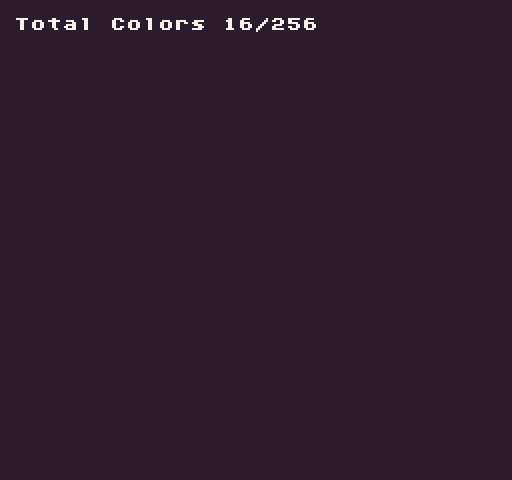

The `TotalColors()` API returns the total number of colors in the `ColorChip`. By default, it returns all of the available colors from the ColorChip. By supplying `true `for the `ignoreEmpty `argument, it returns only colors that are not transparent (`#FF00FF`).

## Usage

`TotalColors ( ignoreEmpty )`

## Arguments

<table>
  <tr>
    <td>Name</td>
    <td>Value</td>
    <td>Description</td>
  </tr>
  <tr>
    <td>ignoreEmpty</td>
    <td>bool</td>
    <td>This is an optional parameter that defaults to false to get all available colors from the ColorChip or supply true for all non-transparent (#FF00FF) colors.</td>
  </tr>
</table>

## Returns

<table>
  <tr>
    <td>Value</td>
    <td>Description</td>
  </tr>
  <tr>
    <td>int</td>
    <td>This method returns the total number of colors in the color chip based on the ignoreEmpty argument's value.</td>
  </tr>
</table>

## Example

In this example, we are going to display the total color values:

    class TotalColorsExample : GameChip
    {
        public override void Init()
        {
            // Get total colors values
            var totalColors = TotalColors();
            var usedColors = TotalColors(true);

            // Display the used vs total colors on the screen
            DrawText("Total Colors " + usedColors + "/" + totalColors, 1, 1, DrawMode.Tile, "large", 15);
        }

        public override void Draw()
        {
            // Redraw the display
            RedrawDisplay();
        }
    }

Running this code will output the following:


