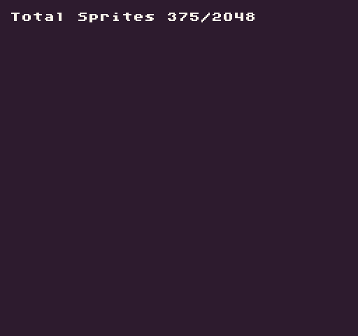

# TotalSprites

The `TotalSprites()` API returns the total number of sprites in the `SpriteChip`. By supplying `true `for the `ignoreEmpty `parameter, it will only return sprites that contain pixel data. If all of the values of a sprite’s pixel data are set to `-1`, it will be considered empty by the `SpriteChip`.

## Usage

`TotalSprites ( ignoreEmpty )`

## Arguments

<table>
  <tr>
    <td>Name</td>
    <td>Value</td>
    <td>Description</td>
  </tr>
  <tr>
    <td>ignoreEmpty</td>
    <td>bool</td>
    <td>This is an optional value that defaults to true. When set to true, the SpriteChip returns the total number of sprites that are not empty (where all the pixel data is set to -1). Set this value to false if you want to get all of the available color slots in the ColorChip regardless if they are empty or not.</td>
  </tr>
</table>

## Returns

<table>
  <tr>
    <td>Value</td>
    <td>Description</td>
  </tr>
  <tr>
    <td>int</td>
    <td>This method returns the total number of sprites in the color chip based on the ignoreEmpty argument's value.</td>
  </tr>
</table>

## Example

In this example, we are going to display the total sprite values:

    class TotalSpritesExample : GameChip
    {
        public override void Init()
        {
            // Get total colors values
            var totalSprites = TotalSprites();
            var usedSprites = TotalSprites(true);

            // Display the used vs total colors on the screen
            DrawText("Total Sprites " + usedSprites + "/" + totalSprites, 1, 1, DrawMode.Tile, "large", 15);

        }

        public override void Draw()
        {
            // Redraw the display
            RedrawDisplay();
        }
    }

Running this code will output the following:


