Pixel Vision OS displays a special drive on your desktop called Workspace. This drive is automatically created as a folder on your computer’s filesystem.

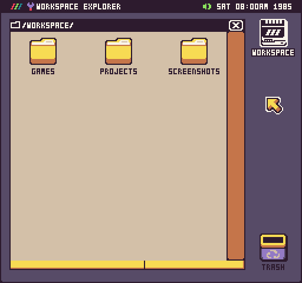

## Location

You can see the workspace path on your computer from the drop-down menu by selecting About.

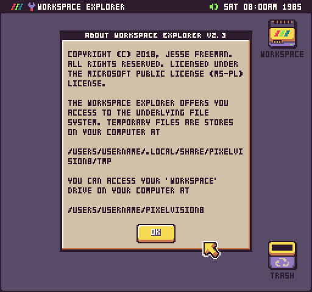

Here are the paths to the Workspace Folder based on the OS you are running Pixel Vision 8.

| Version | Path                                                      |
|---------|-----------------------------------------------------------|
| Windows | C:\\Users\\UserName\\Documents\\PixelVision8\\Workspace\\ |
| MacOS   | /Users/UserName/PixelVision8/PixelVision8/Workspace/      |
| Linux   | /Users/UserName/PixelVision8/PixelVision8/Workspace/      |


You can use Pixel Vision OS or your computer’s file system to create folders, add PV8 games or create files in the Workspace folder. Any changes you make on you’re computer will show up in Pixel Vision OS’s Workspace drive.

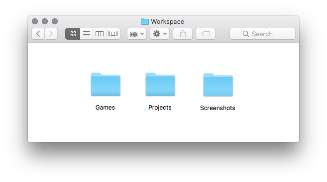

If you have a PV8 game in your workspace, which is just a zip file ending in `.pv8`, it will show up as a disk image.

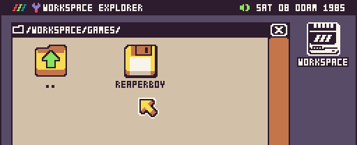

To run the game or make changes to it, double click on the disk and it will be mounted on the desktop. From here, you can play the game by double-clicking on the Run icon, edit any of the files, or copy it to the Workspace to work on it without having to remount the disk.

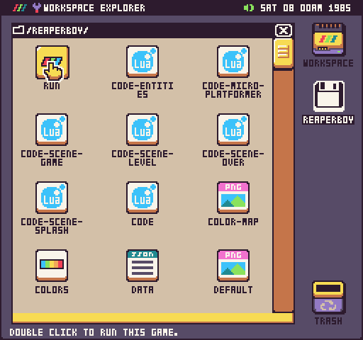

One of the advantages of the Workspace is allowing you the option to use external text and image editors when making PV8 games. Changes you make on your computer can be reloaded while running a game or tool by pressing `Ctrl + 4`. Feel free to use whatever tools you are comfortable with when creating PV8 games. The workflow was designed to be open so you can be as productive as possible.

## Folders

Pixel Vision OS allows you to organize files inside of folders on the Workspace drive and on disks. Folders can also be nested inside of other folders to create a folder hierarchy on in your Workspace. You can create a new folder from the Workspace drop-down menu.


When you create a new folder, you’ll get an option to name it.


While you can name your folder anything you like, there are three reserved folder names: System, Libs, and Tools. If Pixel Vision OS detects a System folder on the root of the Workspace or a disk, it will give it a special icon.


This icon means that Pixel Vision OS will treat this as a system folder. If you have a Libs or Tools folder inside, they will be analyzed for any special functionality that will enhance the Workspace Explorer.


You can place any custom tools you build inside of the Tools folder. Any Lua files in the Libs folder will be made avaiable when your game loads up.

## Files

You can use the Workspace Explorer’s drop-down menu to create new files. The vanilla version of Pixel Vision OS includes the ability to create new `.json` and `.lua` files.


Depending on the way the Workspace Explorer is configured, you may have more file options. This could include the ability to create `colors.png`, `sprite.png`, `*.font.png`, `tilemap.json`, `sound.json` and `music.json` files.


In projects where you can only have one type of file, for example, sprites.png, the file creation options will be greyed out from the drop-down menu.


It’s also important to note, that some files can not be renamed when they are created. You’ll see the filename is greyed out but you are still presented with the file creation pop-up in case you want to cancel the action.


Finally, when you create a new file, it is actually copied from a project template folder that exists inside of the Workspace Tool Folder. You can preview this template by going to `/Workspace/System/Tools/WorkspaceTool/ProjectTemplate/`.


You can modify the files in this folder if you want to have default sprites or sound effects in your games. Keep in mind that any changes to files in this folder will affect what is included in the projects. Also, updating Pixel Vision OS will override the changes you make so you may want to back this folder up before installing a newer Workspace Tool.

## Actions

Pixel Vision OS’s Workspace Explorer offers the ability to rename, move, and copy files. All of these file actions are available from the drop-down menu.

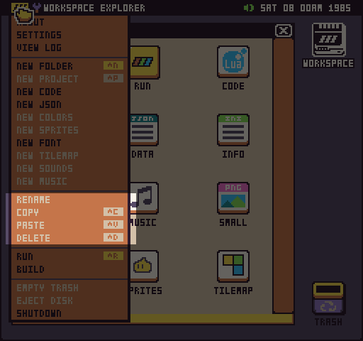

These file actions are contextual and are only enabled when they can be used. To rename, copy, delete a file or folder, you’ll need to select it first.

### Rename

For example, you can rename a file once selected from the drop-down. You’ll see it has been enabled on files you can rename.

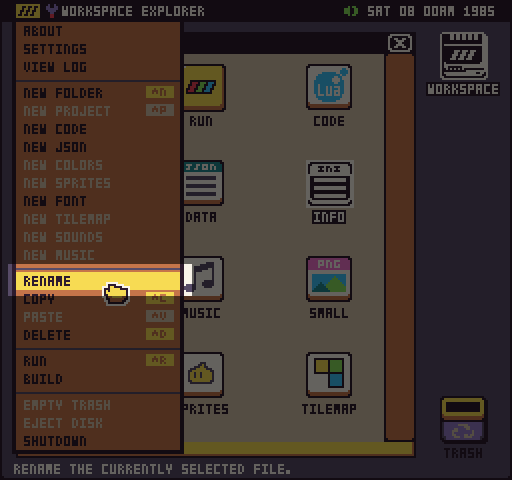

When you rename a file, you will be presented with an input field allowing you to provide a new file name.

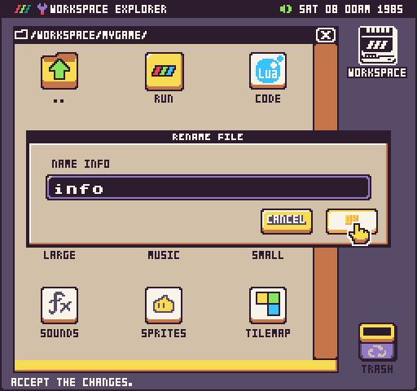

:::info

It’s important to note that you can’t change the extension of a file. So renaming a file will still retain its PV8 file type. You can manually change the file extension on your computer file system outside of Pixel Vision OS.

:::

### Copy

You can copy and move files and folders as well between folders and disks. 

:::info

Pixel Vision 8 does not allow copying and pasting from your computer or between tools currently. This will eventually be added in a future release.

:::

To make a copy, select the file or folder and select copy from the drop-down menu or press `Ctrl + c` for the keyboard shortcut.

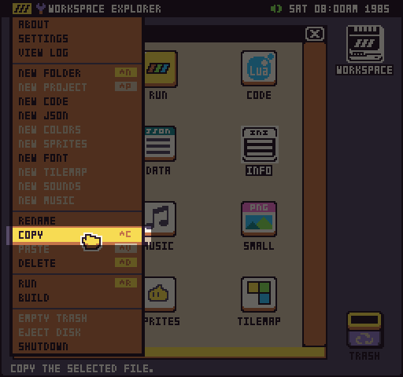

### Paste

Once a file or folder has been copied into memory, you can paste it into a different folder by selecting paste from the drop-down menu or by pressing `Ctrl + p.`

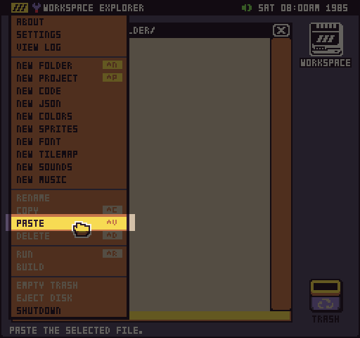

Before a file is copied, you will be asked to confirm the action.

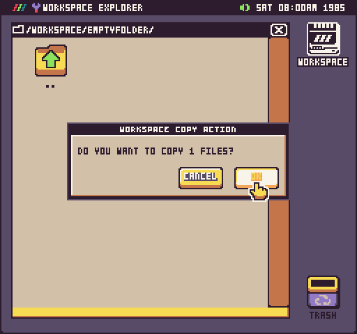

If there is a file with a similar name, you will be asked to create a duplicate of the file and the new copy will be renamed with a number to avoid any conflicts.


You will see the same warning if you copy and paste a file in the same folder. This will allow you to make a duplicate copy.


### Moving

You can move files between directories by dragging them to the desired location. To go up a directory, simply drag the file or folder to the parent folder icon.

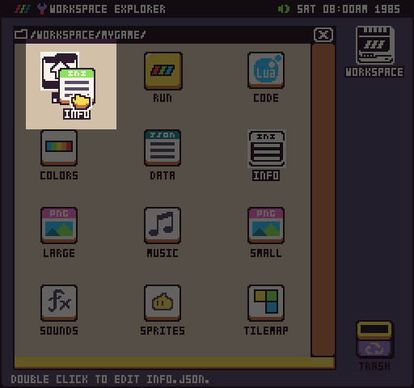

Sometimes it’s easier to just copy and paste the file to a new directory and delete the original. You can always move a file or folder to the root of the Workspace drive by dragging it onto the Workspace icon. You can also drag any file or folder to a disk.


Moving a file or folder over to a disk will change the file action to copy. You can only move files on the same drive or disk path. When performing a move between volumes, you’ll be presented with the copy confirmation action.

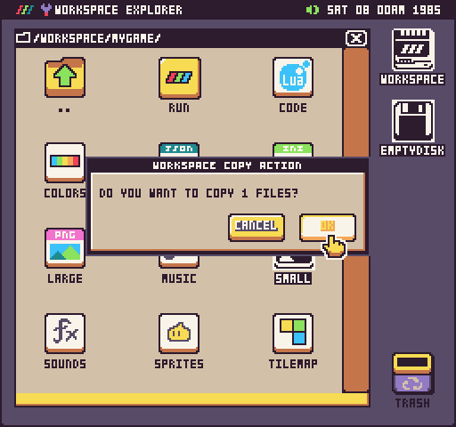

### Deleting

There are two ways to delete files or folders. The first option selecting the item you’d like to move to the trash and select delete from the drop-down menu. You can also the keyboard shortcut, `Ctrl + D`.

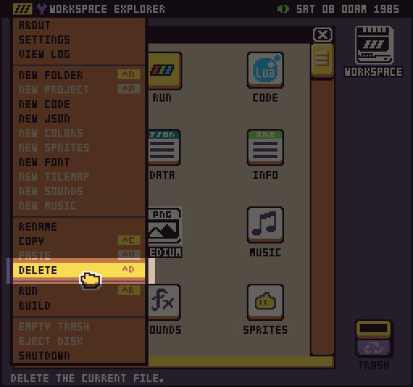

The second option is to simply drag the file or folder to the trash.

## The Trash

The Workspace Explorer has trash which you can use to temporarily store files you’d like to delete. You can find the trash on the lower right-hand corner of the desktop.

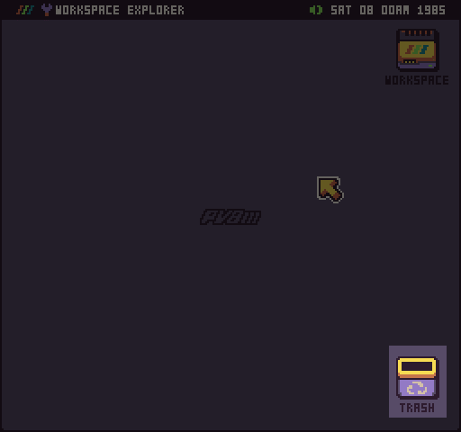


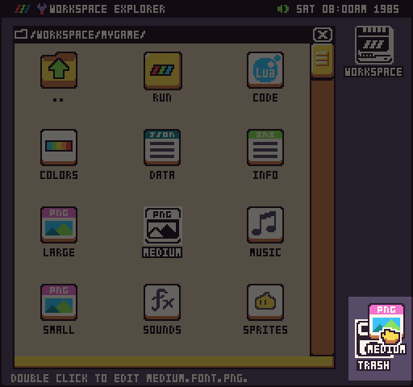

Before a file is moved to the trash, you’ll have an option to confirm the action.

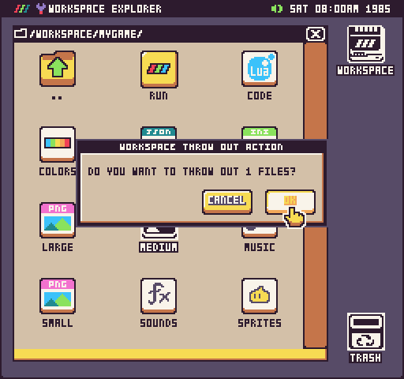

After something is added to the trash, the icon will change to let you know there are files ready to be deleted.

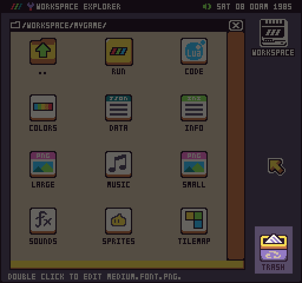

If you open up the trash, you can see any files that have been added to it by double-clicking on the trash icon. Also, it’s important to note that if two files have a similar name, a number will be appended to the second file to avoid any naming conflicts between them.

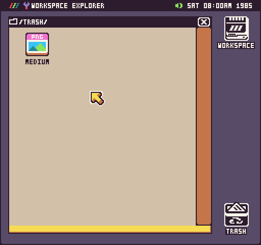

From here, you can restore any file by dragging back into the workspace drive and moving to where you want it via any of the standard file actions. To permanently delete all the files in the trash, select the empty trash option from the drop-down menu.

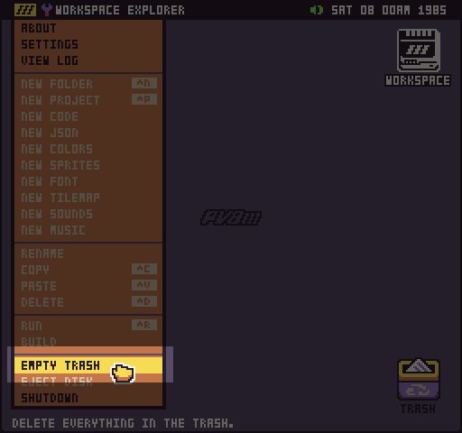

Before emptying the trash, you’ll be asked to confirm the action. Once the trash is deleted, there is no way to restore the files that have been deleted.

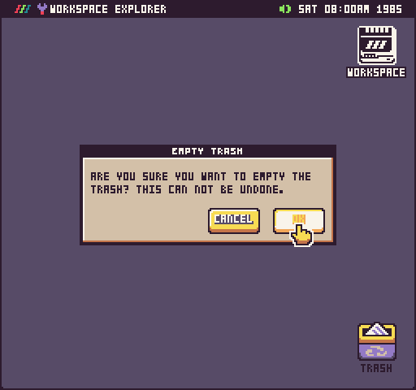

You can also access the trash on your computer’s file system by navigating to the Tmp directory. This location is different based on the OS you are running Pixel Vision 8 on.

| Platform         | Path                                                                         |
| ---------------- | -----------------------------------------------------------------------------|
| Windows          | C:\Users\UserName\AppData\Local\PixelVision8\Tmp\Trash\                      |
| MacOS            | /Users/UserName/.local/share/PixelVision8/Tmp/Trash/                         |
| Linux            | /Users/UserName/.local/share/PixelVision8/Tmp/Trash/                         |

The last thing to note is that the trash is automatically emptied when Pixel Vision 8 shutdown or closes. So it’s important to make sure you recover any files in the trash you’d like to keep before closing PV8.

## Disks

Disks are useful to work in if you want to have a self-contained space to work on a new game project.

### Creating

You can easily create empty PV8 disks on your computer’s file system. Simply create a new folder on your computer called `EmptyDisk`. Inside of the `EmptyDisk` folder, add an `info.json` file. For now, this file can be empty. Pixel Vision OS simply looks for this file to validate it can mount the disk and save special metadata.

Once created, drag the entire folder onto Pixel Vision OS’s desktop like any other PV8 disk.

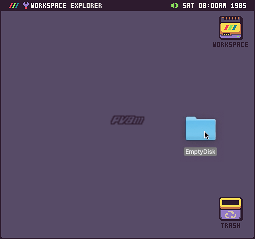

After the disk is loaded, it will show up on the desktop and you can work inside of it like other Pixel Vision 8 disk.

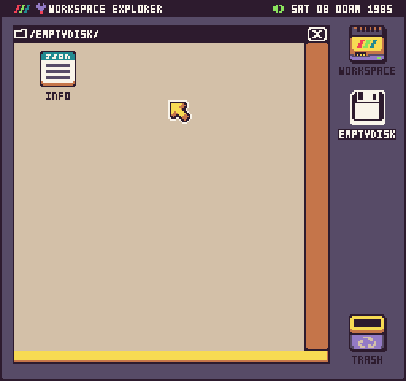

You can convert any disk folder into a PV8 disk by zipping its contents and renaming the extension to `.pv8`. In order for a disk to work, you’ll need all the files, including `info.json,` at the root of the zip file. The name of the PV8 disk or folder will be automatically used when displayed on the desktop. Only mount disks with unique names or the previously loaded disk with the same name will be unmounted and replaced by the new disk.

### Mounting

When you boot up into Pixel Vision OS you will be presented with the Workspace Explorer’s desktop. Here you can see any drives or disks mounted in Pixel Vision 8. 

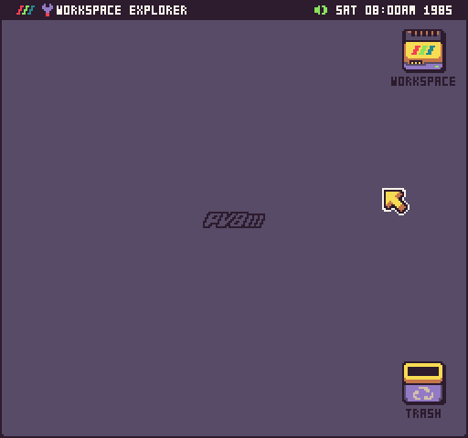

To mount a PV8 disk or folder by dragging it from your computer onto Pixel Vision OS’s desktop.

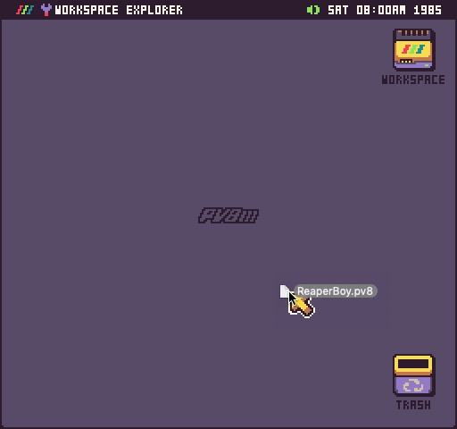

If the disk was correctly mounted, it will appear on the desktop.

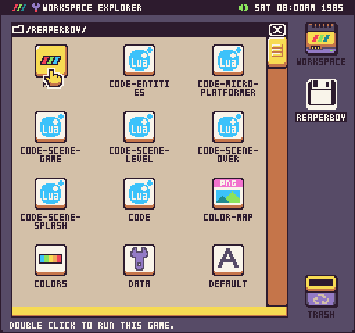

Once a disk is mounted, you will have to manually run it.

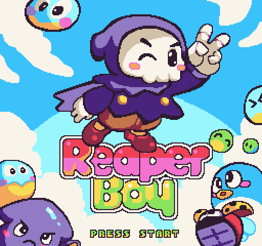

You can unload a game disk at any time by hitting `Esc` on your keyboard. You can eject a disk at any time by clicking on it and selecting Eject Disk from the menu.

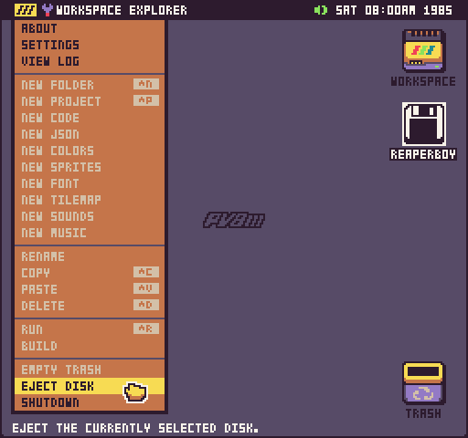

If you are not running Pixel Vision OS from the Workspace drive, PV8 will attempt to load the next disk or display an error screen asking to insert a bootable disk or reinstall Pixel Vision OS in safe mode.

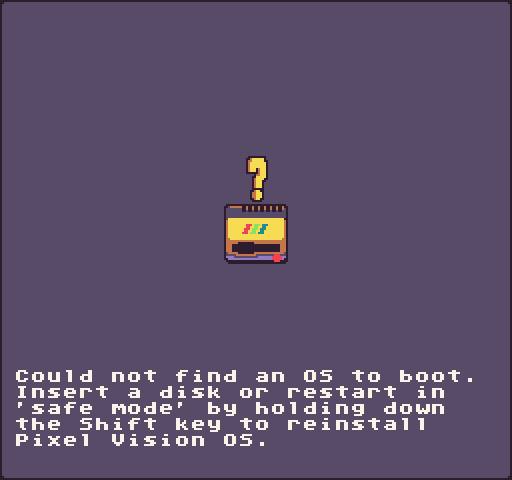

##  Running Games

If you have Pixel Vision OS installed, you can run any PV8 game project that has a Run icon in the root of its folder.


You can also press `Ctrl + R` in any game folder to run it. If a game folder contains a data.json and info.json file, the Workspace Explorer will automatically assume it is a game and display the Run icon for you. You can also run any PV8 game by clicking on it in the Workspace Explorer.

Disks can also contain multiple games that can be linked together to make a larger experience. For example, Pixel Vision OS itself is simply a collection of games, each one being a specific tool, and the Workspace Explorer is the default game that runs from the Pixel Vision OS.

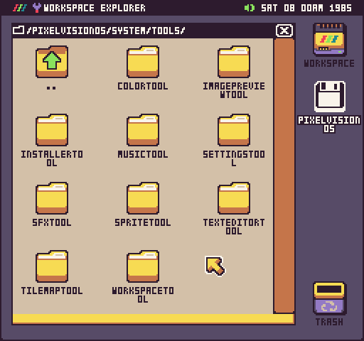

All disks need an info.json file. This file normally contains metadata about a game but for disks, it can be configured to tell Pixel Vision 8 which game to load first. Let’s take a look at the root of the Pixel Vision OS disk. 

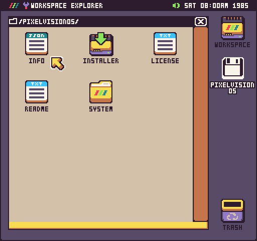

As you can see, in the root of the Pixel Vision OS disk is an info.json file. You can view the contents of this file with the built-in Text Editor.

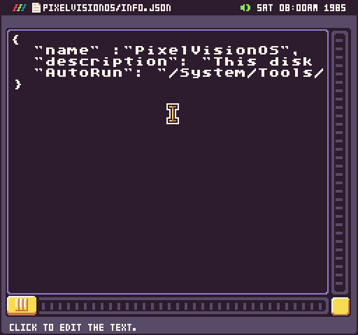

Inside the `info.json` file are three properties: `name`, `description`, and `AutoRun`. The AutoRun property is set to:

```json
"AutoRun": "/System/Tools/WorkspaceTool/"
```

When you drag this disk onto the Pixel Vision 8 Runner window, it will read the path to the FilePickerTool and load that. If you try to run a disk while Pixel Vision OS is loaded, it will simply mount on the desktop and you’ll need to manually find the game you want to run and launch it by hand. The autorun feature is automatically disabled when a game is running.


## Shutting Down

When you are done running Pixel Vision OS, be sure to select Shutdown from the menu before quitting.


While this isn’t critical, since you can quit Pixel Vision 8 at any time, it does ensure that Pixel Vision OS saves any changes to the user’s bios file making it save to quit.


You’ll know its safe to quit Pixel Vision 8 when you see the following screen.
