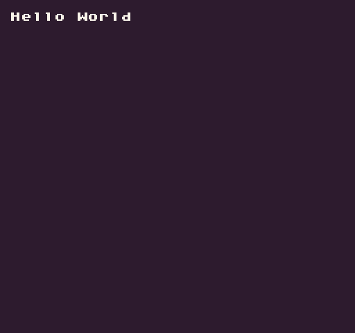

The `AddScript()` API allows you to add a new Lua script at runtime from a string. This could be useful for dynamically generating code such as level data or other custom Lua objects from strings or text files. Simply give the script a name and pass in a string with valid Lua code. If a script with the same name exists, it will be overwritten. Make sure to call `LoadScript()` after to parse it.


## Usage

```csharp
AddScript ( name, text )
```

## Arguments

| Name | Value  | Description                                                      |
|------|--------|------------------------------------------------------------------|
| name | string | Name of the script\. You don’t have to add the \.lua extension\. |
| text | string | The string representing the Lua script text\.                    |


## Example

In this example, we will add a simple script that prints "Hello World" to the display. It uses `AddScript()` and `LoadScript()` to work:

## Lua

```lua
-- Create Lua code as a string
local textFile =

[===[
function test()
  DrawText("Hello World", 1, 1, DrawMode.Tile, "large", 15)
end
]===]

-- Register the text file as a script
AddScript("textFile", textFile)

-- Load the new script
LoadScript("textFile")

function Init()
  -- Call the text method
  test()
end

function Draw()
  -- Redraw the display
  RedrawDisplay()
end
```


Running this code will output the following:




## C#

> This API is only availble to Lua games. Code files written in C# will automatically be loaded and compiled.
>


