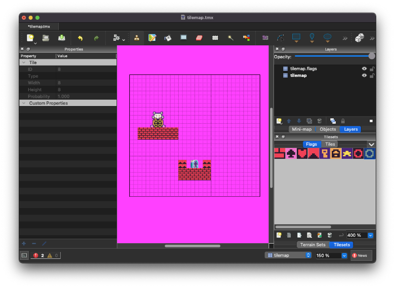
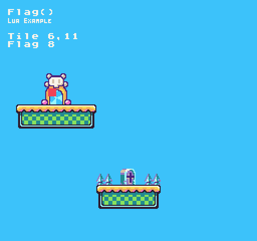

The `Flag()` API allows you to quickly access just the flag value of a tile. This is useful when trying to calculate collision on the tilemap. By default, you can call this method with just a `column `and `row `position to return the flag value at that tile. If you supply a new value, it will be overridden on the tile. Changing a tile's flag value does not force the tile to be redrawn to the tilemap cache. Flags can be set registered via a `*.flags.png` that corresponds to the tilemap or manually at run-time.



By default, Pixel Vision 8 has 16 flag values starting a `0` and ending at `15`. The engine uses these custom sprites for each flag value to make it easier to keep track of different flag types but the assigned value is arbitrary and can represent anything you want it to in your own game.

## Usage

```csharp
Flag ( column, row, value )
```

## Arguments

| Name   | Value | Description                                                                                    |
|--------|-------|------------------------------------------------------------------------------------------------|
| column | int   | The X position of the tile in the tilemap\. The 0 position is on the far left of the tilemap\. |
| row    | int   | The Y position of the tile in the tilemap\. The 0 position is on the top of the tilemap\.      |
| value  | int   | The new value for the flag\. Setting the flag to \-1 means no collision\.                      |


## Returns

| Value | Description                                           |
|-------|-------------------------------------------------------|
| int   | A flag value between 0 and 15 with \-1 being no value |


## Example

In this example, we are going to use the mouse position to find a tile and get its flag ID. Running this code will output the following:



## Lua

```lua
-- This point will store the current tile's position
local tilePosition = NewPoint()

-- This will store the current flag ID
local flagID = -1

function Init()
    -- Example Title
    DrawText("Flag()", 8, 8, DrawMode.TilemapCache, "large", 15)
    DrawText("Lua Example", 8, 16, DrawMode.TilemapCache, "medium", 15, -4)

    -- Change bg color
    BackgroundColor(2)    
end

function Update(timeDelta)

  -- Get the current mouse position
  tilePosition = MousePosition()

  -- Check to see if the mouse is out of bounds
  if(tilePosition.X < 0 or tilePosition.X > Display().X or tilePosition.Y < 0 or tilePosition.Y >= Display().Y) then

      -- Set all of the values to -1
      tilePosition.X = -1;
      tilePosition.Y = -1;
      flagID = -1;

      -- Return before the position and flag are calculated
      return

  end

  -- Convert the mouse position to the tilemap's correct column and row
  tilePosition.x = math.floor(tilePosition.x / 8)
  tilePosition.y = math.floor(tilePosition.y / 8)

  -- Get the flag value of the current tile
  flagID = Flag(tilePosition.x, tilePosition.y)

end

function Draw()

  -- Redraws the display
  RedrawDisplay()

  -- Display the tile and flag text on the screen
  DrawText("Tile " .. tilePosition.x .. ",".. tilePosition.y, 8, 32, DrawMode.Sprite, "large", 15)
  DrawText("Flag " .. flagID, 8, 40, DrawMode.Sprite, "large", 15)

  -- Draw a rect to represent which tile the mouse is over and set the color to match the flag ID plus 1
  DrawRect(tilePosition.x * 8, tilePosition.y * 8, 8, 8, flagID + 1, DrawMode.Sprite)

end
```


## C#

```csharp
using System;

namespace PixelVision8.Player
{
    class FlagExampleGame : GameChip
    {
        // This point will store the current tile's position
        private Point tilePosition;

        // This will store the current flag ID
        private int flagID = -1;

        public override void Init()
        {
            // Example Title
            DrawText("Flag()", 8, 8, DrawMode.TilemapCache, "large", 15);
            DrawText("C Sharp Example", 8, 16, DrawMode.TilemapCache, "medium", 15, -4);
            
            // Change bg color
            BackgroundColor(2);
        }

        public override void Update(int timeDelta)
        {
            // Get the current mouse position
            tilePosition = MousePosition();

            // Check to see if the mouse is out of bounds
            if(tilePosition.X < 0 || tilePosition.X > Display().X || tilePosition.Y < 0 || tilePosition.Y >= Display().Y)
            {

                // Set all of the values to -1
                tilePosition.X = -1;
                tilePosition.Y = -1;
                flagID = -1;

                // Return before the position and flag are calculated
                return;
            }
                
            // Convert the mouse position to the tilemap's correct column and row
            tilePosition.X = (int)Math.Floor(tilePosition.X / 8f);
            tilePosition.Y = (int)Math.Floor(tilePosition.Y / 8f);

            // Get the flag value of the current tile
            flagID = Flag(tilePosition.X, tilePosition.Y);

        }

        public override void Draw()
        {

            // Redraws the display
            RedrawDisplay();

            // Display the tile and flag text on the screen
            DrawText("Tile " + tilePosition.X + "," + tilePosition.Y, 8, 32, DrawMode.Sprite, "large", 15);
            DrawText("Flag " + flagID, 8, 40, DrawMode.Sprite, "large", 15);

            // Draw a rect to represent which tile the mouse is over and set the color to match the flag ID plus 1
            DrawRect(tilePosition.X * 8, tilePosition.Y * 8, 8, 8, flagID + 1, DrawMode.Sprite);

        }
    }
}
```

