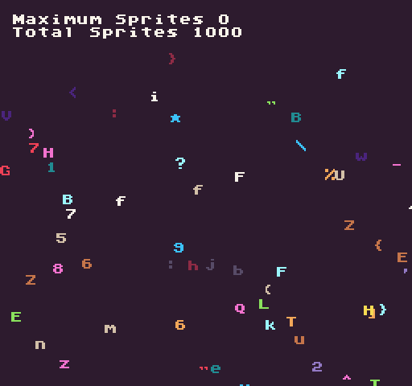

The `MaxSpriteCount()` API returns a value representing the total number of sprites the `SpriteChip` can render in a single frame. You can use this value to alternate showing and hiding sprites based on hitting the total sprite count similar to the flicker effect you’d see in early 8-bit systems that tried to show more sprites than were allowed per frame. This is a read-only property at runtime.

## Usage

```csharp
MaxSpriteCount ( )
```

## Returns

| Value | Description                                                                     |
|-------|---------------------------------------------------------------------------------|
| int   | Returns an int representing the total number of sprites on the screen at once\. |

## Example

In this example, we will display the maximum number of sprites and attempt to draw more sprites to the screen. For this example, the `SpriteChip`’s `maxSpriteCount` property was changed to `64` in the `data.json`. Running this code will output the following:



## Lua

```lua
-- Store random integers for drawing a random character to the screen
local char, x, y, colorID = 0

-- Reference for the size of the display
local display = Display()

-- Total number of sprites to draw each frame
local sprites = 500

function Init()

  -- Display the text for the maximum and total number of sprites
  DrawText("Maximum Sprites " .. MaxSpriteCount(), 1, 1, DrawMode.Tile, "large", 15)
  DrawText("Total Sprites ", 1, 2, DrawMode.Tile, "large", 15)

end

function Draw()

  -- Redraw the display
  RedrawDisplay()

  -- Perform the next block of code 10 times
  for i = 1, sprites do

    -- Assign random values to each of these variable
    char = math.random(32, 126)
    x = math.random(0, display.x)
    y = math.random(32, display.y)
    colorID = math.random(1, 15)

    -- Draw a random character at a random position on the screen with a random color
    DrawText( string.char(char), x, y, DrawMode.Sprite, "large", colorID)

  end

  -- Draw the total number sprite on the display
  DrawText(ReadTotalSprites(), 15, 2, DrawMode.Tile, "large", 15)

end
```


## C#

```csharp
using System;

namespace PixelVision8.Player
{
    class MaxSpriteCountExample : GameChip
    {

        Random random = new Random();

        // Store random integers for drawing a random character to the screen
        private int charID, x, y, colorID = 0;

        // Reference for the size of the display
        private Point display;

        // Total number of sprites to draw each frame
        private int sprites = 500;

        public override void Init()
        {

            // Get the display size when the game loads up
            display = Display();

            // Display the text for the maximum and total number of sprites
            DrawText("Maximum Sprites " + MaxSpriteCount(), 1, 1, DrawMode.Tile, "large", 15);
            DrawText("Total Sprites ", 1, 2, DrawMode.Tile, "large", 15);

        }

        public override void Draw()
        {
            // Redraw the display
            RedrawDisplay();

            // Perform the next block of code 10 times
            for (int i = 0; i < sprites; i++)
            {

                // Assign random values to each of these variable
                charID = random.Next(32, 126);
                x = random.Next(0, display.X);
                y = random.Next(32, display.Y);
                colorID = random.Next(1, 15);

                // Draw a random character at a random position on the screen with a random color
                DrawText(Convert.ToChar(charID).ToString(), x, y, DrawMode.Sprite, "large", colorID);

            }

            // Draw the total number sprite on the display
            DrawText(CurrentSprites.ToString(), 15, 2, DrawMode.Tile, "large", 15);

        }

    }
}
```

