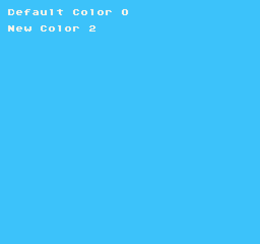

# BackgroundColor()

The background color is used to fill the screen when clearing the display. You can use this method to read or update the background color at runtime. When calling `BackgroundColor()` without an argument, it returns the current background color as an `int`. You can pass in an optional `int `to update the background color by calling `BackgroundColor(0),` where `0` is any valid system color ID.

Passing in a value such as `-1`, or one that is out of range will default to the first system color unless the `ColorChip`’s` debugColor` property is set to true. In debug color mode, any out of bounds color IDs will display Magenta (`#ff00ff`), which is the engine's default transparent color.

## Usage

```csharp
BackgroundColor ( id )
```

## Arguments

| Name | Value | Description                                                                               |
|------|-------|-------------------------------------------------------------------------------------------|
| id   | int   | This argument is optional\. Supply an int to update the existing background color value\. |


## Returns

| Value | Description                                                                                                              |
|-------|--------------------------------------------------------------------------------------------------------------------------|
| int   | This method returns the current background color ID\. If no color exists, it returns \-1 which is magenta \(\#FF00FF\)\. |


## Example

In this example, we will display the default background color on the display, then change it, and redraw the new value below it:

## Lua

```lua
function Init()

-- Get the current background color
local defaultColor = BackgroundColor()

-- Draw the default background color ID to the display
DrawText("Default Color " .. defaultColor, 1, 1, DrawMode.Tile, "large", 15)

-- Here we are manually changing the background color
local newColor = BackgroundColor(2)

-- Draw the new color ID to the display
DrawText("New Color " .. newColor, 1, 3, DrawMode.Tile, "large", 15)

end

function Draw()
-- Redraw the display
RedrawDisplay()
end
```


## C#

```csharp
class BackgroundColorExample : GameChip
  {
    public override void Init()
    {
    //  Get the current background color
    var defaultColor = BackgroundColor();

    // Draw the default background color ID to the display
    DrawText("Default Color " + defaultColor, 1, 1, DrawMode.Tile, "large", 15);

    //  Here we are manually changing the background color
    var newColor = BackgroundColor(2);

    //  Draw the new color ID to the display
    DrawText("New Color " + newColor, 1, 3, DrawMode.Tile, "large", 15);
    }

    public override void Draw()
    {
    //Redraw the display
    RedrawDisplay();
  }
}
```


Running this code will output the following:




