# The Chip Tool

Under the hood, the Pixel Vision 8 engine is broken down into several "chips" that control how the engine behaves. The Chip Editor allows you to make changes to each of these chips and define the system limitations for each game.  After opening the `data.json` file, you’ll be presented with a graphical representation of the system’s chips.

## Chip Specs
The specs panel underneath the chips represents a summary of a system template’s limitations. 

It is broken down into six aspects that map over to Pixel Vision 8’s built-in chips. Here are the main chips groups that make up a working system: resolution, colors, sprites, tilemap, sounds, and music. Together these limitations help define what you can and can’t do when making PV8 games and tools.

Here is a breakdown of each property: 

#### Resolution

| Prop | Name  | Description  |
|---|--------|-----------------------------------------|
| W | Width  | The width of the screen’s resolution\.  |
| H | Height | The height of the screen’s resolution\. |

#### Colors

| Prop | Name  | Description  |
|---|--------|-----------------------------------------|
| T  | Total             | The total number of colors the system supports\. |
| PS | Colors Per Sprite | Total colors per sprite\.                        |

#### Sprites

| Prop | Name  | Description  |
|---|--------|-----------------------------------------|
| T   | Total Sprites   | The total number of sprites allowed in memory\.                          |
| Max | Maximum Sprites | The maximum number of sprites the display can render in a single frame\. |

#### Tilemap

| Prop | Name  | Description  |
|---|--------|-----------------------------------------|
| W | Width  | The width \(in tiles\) of the tilemap\.  |
| H | Height | The height \(in tiles\) of the tilemap\. |

#### Sound

| Prop | Name  | Description  |
|---|--------|-----------------------------------------|
| CH | Channels | The total number of channels on which the system can play sounds\.     |
| T  | Total    | The total number of sound effects the system can store in its memory\. |

#### Music

| Prop | Name  | Description  |
|---|--------|-----------------------------------------|
| TR | Tracks | The total number of tracks the music chip can use to playback sounds\. |
| T  | Total  | The total amount of music data the system can store in its memory\.    |

Finally, if you want to access some of the more advanced options, simply edit the `data.json` file directly. In the Chip Editor, you can access this option via the drop-down menu.

Each chip has its own properties. Changes here will directly impact how a Pixel Vision 8 game runs so be careful when editing these settings by hand.

## System Templates

After you create a new project, you can open up the Chip Editor to make more granular changes to a game’s `data.json` file. Each chip can be clicked on and manually configured.

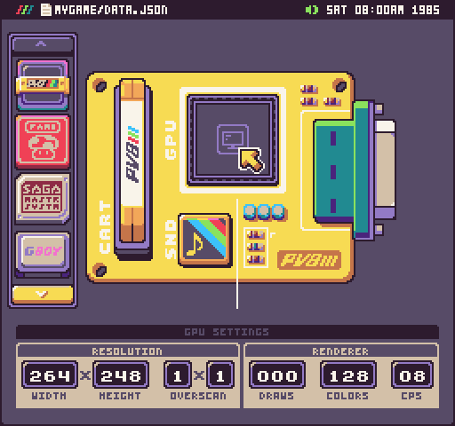

You can change the values of the chip or use a template from the tray on the left for pre-configured systems.

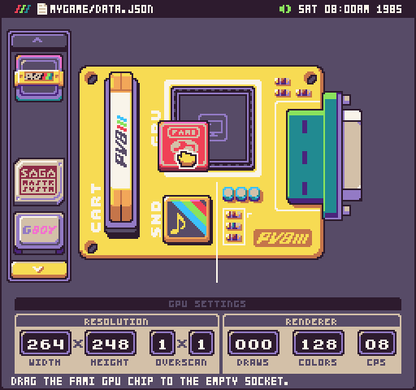

When you drag a new chip template over, you’ll be asked to apply the new values.

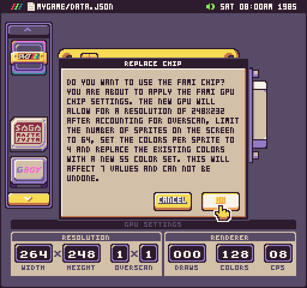

Once you select a new template chip, it will be visible on the board.

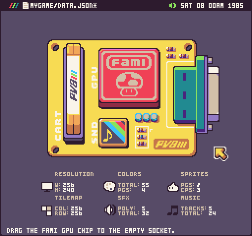

You can mix and match chips from different pre-configured systems or build something completely new from scratch. If you modify an existing template, the chip will show a custom icon indicating it has is something different.

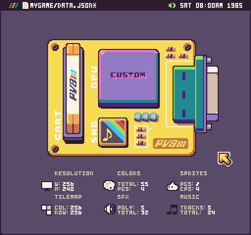

Once you are done changing the chip values, don’t forget to hit save to write the changes back to the `data.json` file.

### Storage

Here is an overview of each chip and its properties. Let’s start with the cartridge chip. This controls the amount of data you can store in your game’s disk. The first panel controls the Tilemap Chip. This allows you to change the width and height of the tilemap for your game.

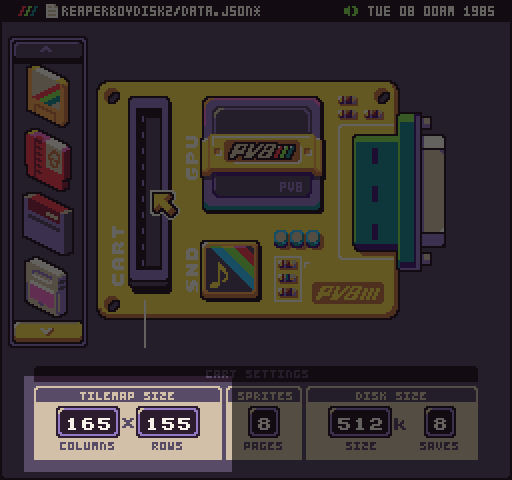

The columns (width) and rows (height) are based on sprites. So a tilemap of 256 columns would be 2048 pixels wide. The tilemap can only be as small as the resolution allows. There is a maximum of 256 columns and 256 rows.

The second panel manages the number of sprites you can save on the disk. Each page contains 256 sprites. You can have a maximum of 8 pages for a total of 2048 sprites.

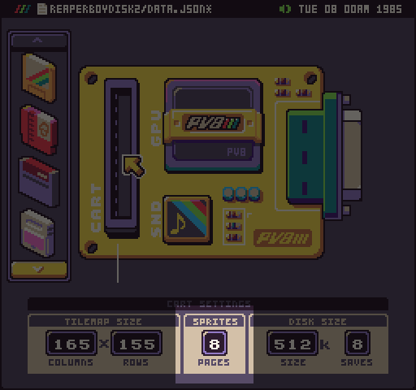

The last panel handles the disk size and the number of save slots you can have.

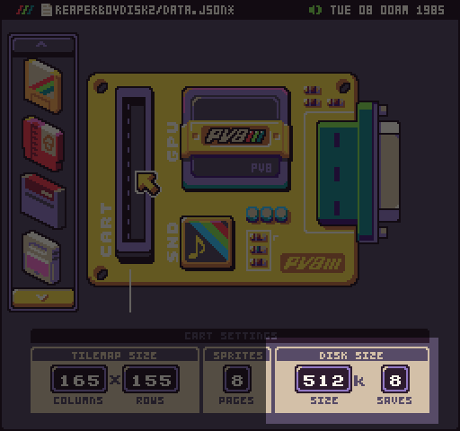

Changing the maximum disk size affects how big your game can be when it is exported as a .pv8 disk. If your game’s assets are too big you will not be able to create a PV8 disk. You can still work in any game project regardless of its size so you can still work to get it under the size limit or increase it based on your game’s requirements. Finally, you can define the number of save slots your game can have. This is part of the GameChip’s API and will limit the number of data slots available to the game at runtime for saving state data between play sessions.

### Graphics

Now it’s time to look at the GPU chip. This handles all of the display and rendering options for PV8 games. The first panel allows you to modify the game’s resolution.

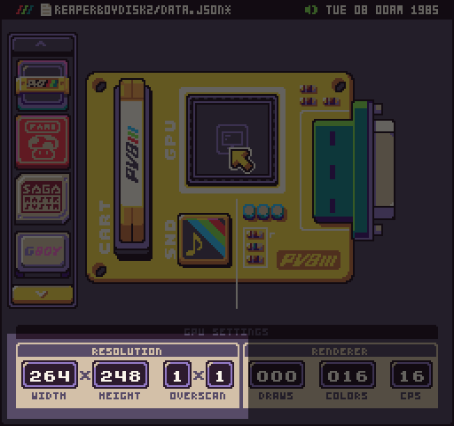

The maximum resolution of a game can be is 512 x 480 pixels. When changing the resolution, the Game Creator will run at the default aspect ratio of 256 x 240 so your game will be scaled to fill the area and may have black bars. The last option on the Display Chip is the overscan. Overscan represents the area of the display that was cut off by old CRT televisions. Overscan was used in old 8-bit games to hide sprites off the screen until they were ready to be displayed. Setting this value will remove a single column and row of tiles (the width or height of a single sprite) from the display’s visible resolution. If you are resolution was 256 x 240, and you set the overscan to 1x1 the visible resolution would be 248 x 232.

The next panel manages Pixel Vision 8’s renderer. It has three properties: draws, colors, and cps (colors per sprite).

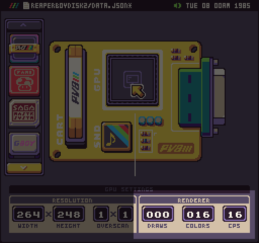

Draws represents the total number of sprites that can be on screen at any given time. Capping the draw calls can help optimize a game by caching the number of sprite draw requests the display expects to render on a given frame. You can remove the sprite cap by setting it to zero.

Next, you can set the total number of supported colors for the `ColorChip` here. This value will manage the maximum system colors you can have direct color or palette color mode. The last option manages the colors per sprite which instruct the sprite importer how many colors to include for each 8x8 sprite graphic. You can set the CPS to 2 all the way up to 16. 

### Sounds

The last chip panel of the Chip Editor Tool manages audio for your game. 

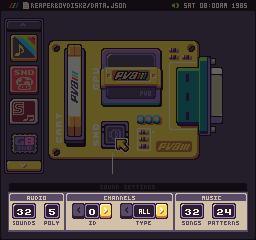

While these two chips are independent of each other, the music chip depends on some of the sound chips settings. The channel value dictates how many active sounds can be played at once. The music chip can have a maximum of 4 tracks, but if the number of channels is lower, it will cap this value. 

Also, it is important to note that if you play a sound effect on the same channel that a loop is using for its track, the new sound will be played instead. If you want to have a dedicated channel just for sound effects, set the channels to 5 and play sound effects on the 5th channel, so it does not interfere with any music being played.

Finally, each channel can have its own dedicated way type. You can assign these in the Channels panel by cycling through each channel ID and picking the wave type you want. There are 6 options: all, square, saw, noise, triangle, wav.

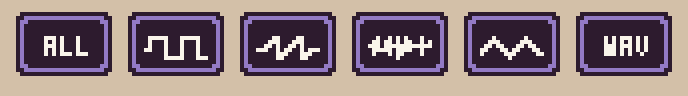

When you assign a wave type to a channel, any sound that is played will override the sound effect’s wave type. When setting a channel to "all" will use the sound effect’s default wave type. Setting a channel to wav will enable sample mode. This allows you to play a .wav file from the game folder. Wav files need to match the name of the sound effect. You can learn more about this feature in the Sound Tool’s documentation.

## Locking System Data

The Chip Editor includes the ability to lock the specs in a game’s `data.json` file. You may want to do this if you are afraid of accidentally changing the system specs if you are sharing the template with someone else. This is a great feature for Game Jams if you want to add an extra layer of challenge by not being able to make changes to the data.json file. To enable the lock, selected the toggle option from the drop-down menu.

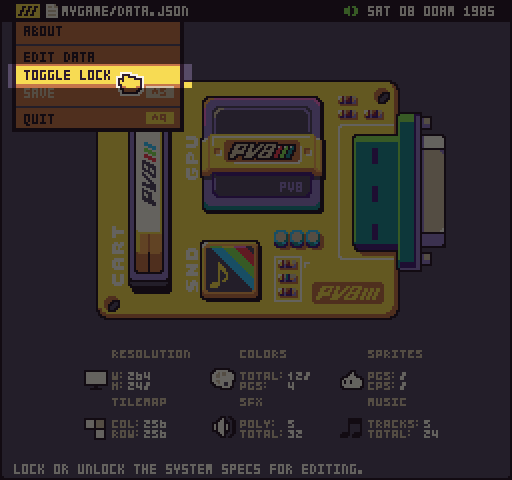

You’ll be given the option to lock the specs.

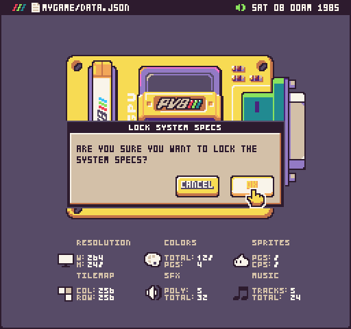

Once the `data.json` file is locked, clicking on any chip will show the following warning.

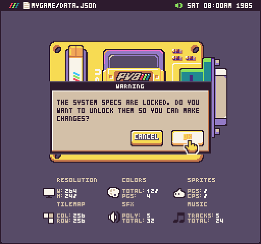

If you hit OK, it will unlock the data.json file but if you hit cancel the warning will go away and you’ll be able to preview the system specs without being able to make changes.

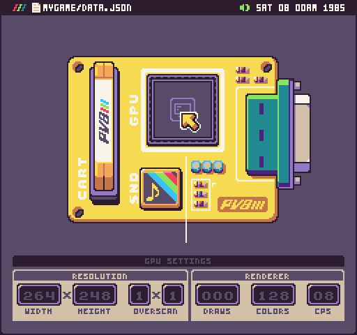

Finally, the last thing to note is that locking the data.json file is only supported in the Chip Editor. If you open the `data.json` file directly, you will be able to make any changes you’d like.

