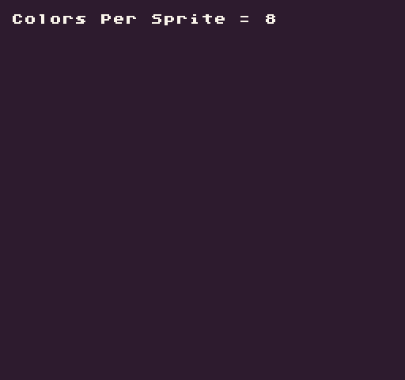

# ColorsPerSprite()

Pixel Vision 8 sprites have limits around how many colors they can display at once. This is called **CPS** which stands for Colors Per Sprite. The `ColorsPerSprite()` API returns this value from the `SpriteChip`. Since this value is read-only, it is best to get a reference to it when the game starts up and store it in a variable your game can access.

## Usage

```csharp
ColorsPerSprite ( )
```

## Returns

| Value | Description                             |
|-------|-----------------------------------------|
| int   | The total colors each sprite can have\. |


## Example

In this example, we display the color per sprite value:


## Lua

```lua
-- Get the colors per sprite value
local cps = ColorsPerSprite()

function Draw()

  -- Clear the display
  Clear()

  -- Draw the cps value to the display
  DrawText("Colors Per Sprite = "..cps, 8, 8, DrawMode.Sprite, "large", 15)

end
```


## C#

```csharp
class ColorsPerSpriteExample : GameChip
{

    // Store the CPS value
    private int cps;

    public override void Init()
    {
        // Get the colors per sprite value
        cps = ColorsPerSprite();
    }

    public override void Draw()
    {
        // Clear the display
        Clear();

        // Draw the cps value to the display
        DrawText("Colors Per Sprite = " + cps, 8, 8, DrawMode.Sprite, "large", 15);

    }
}
```


Running this code will output the following:




