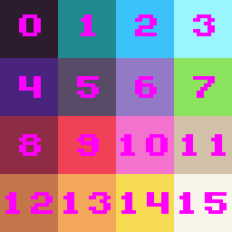
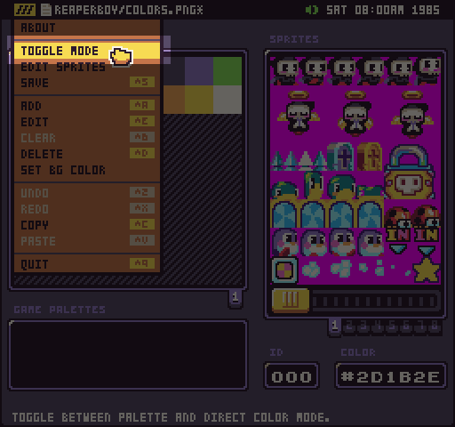
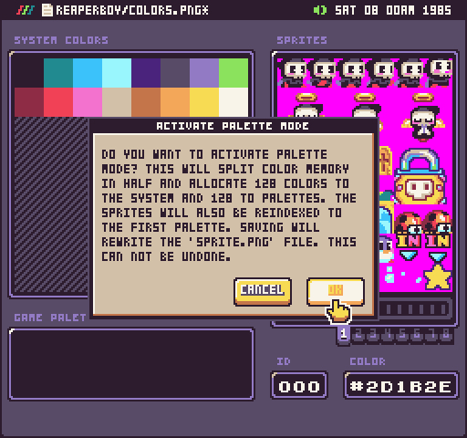
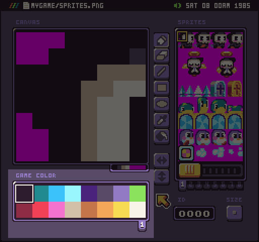
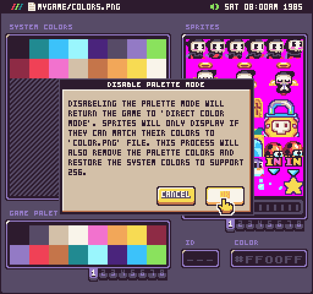
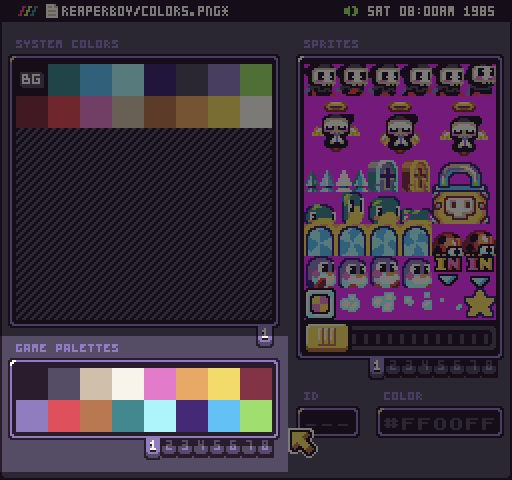

The default game template included a `colors.png` file. This file represents all of the colors available at runtime and contains one color per pixel. The Pixel Vision 8 reads through each color and loads it into the `ColorChip` when a game is loaded into memory. These colors represent the available system colors and their corresponding IDs in memory. If no `color.png` file is provided, Pixel Vision 8’s default color palette will be used.

## System Colors

The color importer scans the PNG’s color data a pixel at a time, starting in the upper-left corner and ending in the bottom right. As it does this, each color is saved into memory with a unique ID until reaching the total color limit of 256 system colors.

To create your `color.png` file by hand, simply make a single line of pixels or lay them out in a grid. Here is an example of how the color importer traverses a grid of pixels inside of a small 4x4 pixel `color.png` file:

Any colors over the `maxColors `value in the `data.json` file will be ignored. The order of the colors in the PNG will match how they are stored in memory. Once you know their ID, you can reference them as needed in your game.

One important thing to note about a game’s colors is that they are used to parse the sprite and tilemap PNG files. If a color does not exist in the system before importing these graphics files, it may be missing when the sprite data is saved to memory. Missing color data also impacts how sprites load, their ID in memory and if they even show up. It is critical that you always provide a complete set of system colors used by your game's artwork for it to load and display as expected.

## Modes

Pixel Vision 8 supports two color modes: direct and palette. Direct color mode is probably the easiest mode to work in. This allows you to define all of the colors and it even supports multiple instances of the same color. When in direct color mode, PV8 will index the sprites based on the first color it finds as it goes through the sprite’s pixel data. For more advanced users, you’ll want to switch over to palette mode. You can do this at any time from the drop-down menu by selecting the Toggle Mode option.

When switching between color modes, the Color Tool needs to modify the system colors. You’ll see the following warning when switching to palette mode.

You can learn more about palettes in the Palette Mode section of this documentation.

### Direct Color

By default, Pixel Vision 8 will load in direct color mode. In this mode, the sprite parser will attempt to match up every color in the `sprite.png` file to a color in the colors.png file. If the color exists, it will get a unique ID and is displayed when drawing the sprite to the screen. If the color is not found, it will default to the mask color making it transparent when drawn to the screen.

If you are in direct color mode, the Color, Sprite, and Tilemap tools will display all of the system colors. You won’t be able to shift the colors in the tools since they will be fixed to their exact value based on the order they were parsed when loading up.

In direct color mode, you’ll be able to see all of the system colors but will not be able to change them. In order to do that, you’ll need to manually change the color in the Color Tool. Just keep in mind that after changing a system color, the sprites.png file will need to be regenerated. If you are using a tilemap.png file, it may not be able to match the tiles to sprites and you’ll run the risk of corrupting the tilemap. That why it’s important to not change colors in the middle of a game’s development unless you are ready to go back through all of the references and update them. In the case of a tilemap.json file, each tile will still map to the same sprites since it references the ID and not the pixel data.

You can always switch back to direct color mode from the Color Tool and return to having the full 256 system colors available. 

Just keep in mind that switching back to direct color mode will delete the `color-map.png` file in your project and update the `sprite.png` file with the system colors so they can load correctly in your game.

### Palette Color

Pixel Vision 8’s tool supports a palette mode. This forces the tools to split the color memory in half. The first 128 colors are reserved for unique system colors and the other 128 colors will be split up into 8 palettes of 16 colors each. It also activates a new game palette panel in these tools which allows you to preview swapping sprites.

If you want to create a more authentic 8-bit experience while making your game, you may want to consider using palette mode which also opens up the ability to take advantage of palette swapping at runtime.