# Compiling Pixel Vision 8

The core of Pixel Vision 8 is open source. You can download the project from the [Pixel Vision 8 Github repo](http://github.com/PixelVision8/pixelVision8/). This project contains everything you need to build a bare-bones C# and Lua runner, as well as a Game Runner and the full version of Pixel Vision 8. You’ll need a tool that can compile Mono such as Visual Studio ([Win](https://visualstudio.microsoft.com/vs/)/[Mac](https://visualstudio.microsoft.com/vs/mac/)) or [Jetbrains’ Rider](https://www.jetbrains.com/rider/).

## Cloning From Github

Before you clone from Github, let’s talk about how the repo is structured, and which branch or tag you should clone. While you can simply check out the master branch, each stable build is tagged based on its version.

Each tag is considered "stable" and will no longer get updated. The master branch will always represent the lastest stable codebase and is updated after each new version is released. That means you’ll need to do a pull to get updates after each release.

Finally, for those looking for nightly builds or patches to bugs as they are closed, the branches offer the most up-to-date fixes. Simply find the latest version if you are looking for patches to issues recently closed.

There is an up-to-date list of issues currently being worked on and each issue is tagged to the version they will be fixed. Feel free to log bugs or submit fixes and we’ll figure out how to handle them.

## Runners

A Pixel Vision 8 Runner is any code wrapper that bridges the gap between the core engine and the host OS. The Runner performs the following tasks:

* Facilitates rendering the `DisplayChip`’s pixel data on the screen.

* It provides a native application wrapper so PV8 can run as a self-contained executable.

* Calls the `GameChip`’s `Init()`method on startup as well as the `Update()` and `Draw()` methods during each frame.

* Feeds the engine input data such as the mouse, keyboard and any connected controllers.

* It provides a way to play audio.

* Manages the loading and playing of games plus their associated files.

Pixel Vision 8 Runners are relatively easy to build with Visual Studio or Rider. Once you’ve cloned or downloaded the repo, you’ll find two Runner solutions.

The `MonoGameRunner.sln` solution will launch a project with a simple C# and Lua Runner on top of MonoGame. The `PixelVision8Runner.sln` solution will launch a project with two Pixel Vision 8 branded runners using a custom build of MonoGame called MonoVision. The MonoGame Runner will boot directly into a game while the Pixel Vision 8 Runner contains a full file system and can be used to run Pixel Vision OS.

## MonoGame Runners

MonoGame Runners are bare bone wrappers for Pixel Vision 8 games. There are two runners, one for C# games and the other for Lua. Each runner helps bridge the gap between the Pixel Vision 8’s C# code and the native operating system. Both runners have the same basic functionality, so you’ll need to figure out the one that best suits your needs base on the programming language you prefer to use. The two MonoGame Runners are inside of the `MonoGameRunners.snl` solution at the root of the project folder.

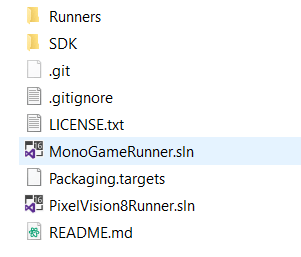

First up, let’s take a look at the MonoGame C# runner. This is the most basic type of Pixel Vision 8 Runner you can build. Let’s take a look at how the runner is structured.

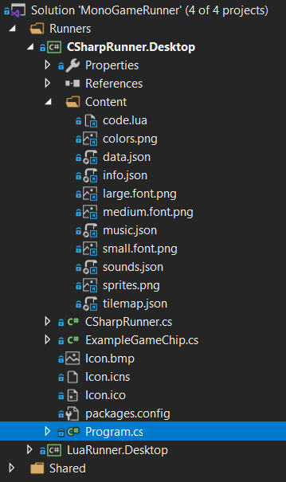

Here you’ll find a` Progame.cs` file that launches the application. Next is the `CSharpRunner.cs` file which configured Pixel Vision 8, loads the content files, and runs the default game which is located in the `ExampleGameChip.cs` file. Finally, the game contents are located in the Content folder. This is referenced from the project default Pixel Vision 8 template which is located in the Disk folder at the root of the project’s directory.

Make sure you select the correct runner from the build menu.

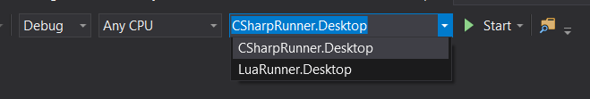

From here you can start the build and you will end up with the following game.

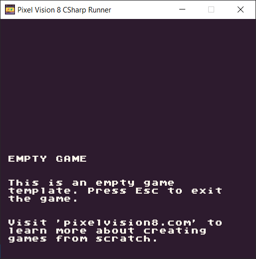 

For the C# Runner, you can modify the game by making changes in the `ExampleGameChip.cs` file. If you are looking to build a pure C# Pixel Vision 8 game, you’ll want to start with this project.

If you have an existing PV8 game that was written in Lua, or you want to create a bare-bones Lua game directly on top of C#, you can use the LuaRunner project. This is set up similar to the C# Runner with a Program.cs file, a Content directory, but this project uses the Pixel Vision 8’s LuaRunner which is located in the `Shared/PixelVision8.Lua/` project folder.

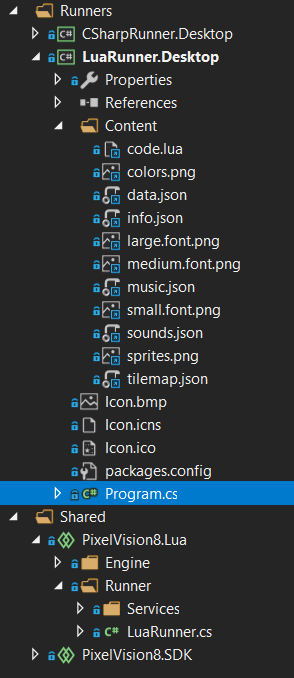

When you compile the LuaRunner, you’ll see the same empty PV8 project that the C# Runner uses.

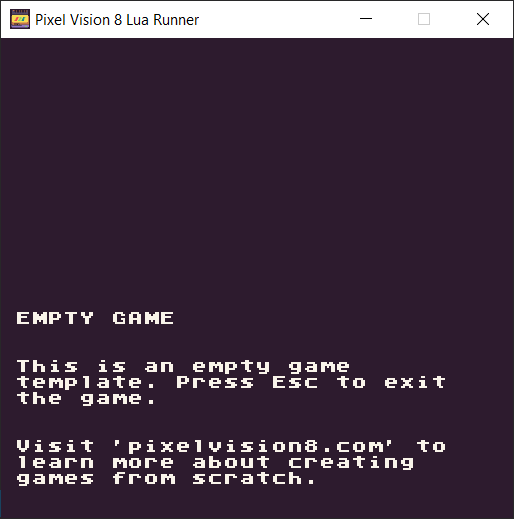

The only difference here is that the code for the project is located in `Contents/code.lua` file. If you’d like to compile your own PV8 game written in Lua, simply copy over all of the project files to the root of the Content directory and recompile. Even better, you can continue to make changes to your Lua game without having to recompile by pressing `Ctrl + 4`. Just remember that it will reload the files located in the build’s `Contents` folder and not the ones located in the solution since they are copied over on each new build.

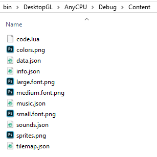

Any chances you make here will be overwritten if you recompile in Visual Studio so be sure to copy these back over to your projects Contents folder.

Finally, it’s important to point out that both projects have dependencies on MonoGame. 

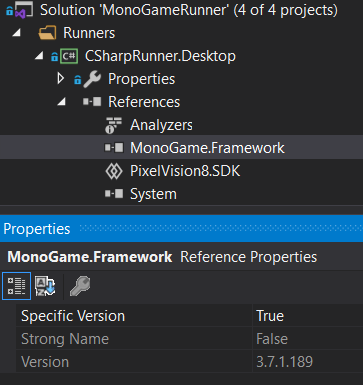

The Lua Runner requires a reference to [MoonSharp](https://www.nuget.org/packages/MoonSharp) which is the Lua Interpritore Pixel Vision 8 uses.

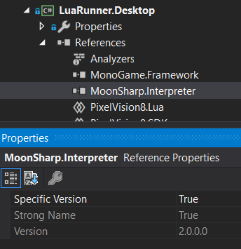

These NuGet projects are not included in the git repo so you may need to force the project to reimport them or install them by hand.

## Pixel Vision 8 Runners

There are two Pixel Vision 8 Runners you can explore by opening the `PixelVision8Runner.sln`. 

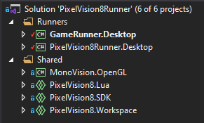

The first project, `GameRunner.Desktop`, is a stripped-down version of Pixel Vision 8 designed specifically for wrapping a single PV8 game. It’s similar to the MonoGame Lua Runner but includes the Workspace VFS as well as the ability to configure the system via a `bios.json` file. 

The second Runner, in the `PixelVision8.Desktop` project is the full build of Pixel Vision 8. This includes logic to boot, load games from disks, and a virtual file system (VFS) to manage the workspace. This is project represents the full source code for Pixel Vision 8 that you can download from the [main website](https://www.pixelvision8.com) with the exception of a built-in OS installer. If you want to use [Pixel Vision OS](https://github.com/PixelVision8/PixelVisionOS), you’ll need to manually install it.

Both Runners use a stripped-down version of MonoGame called MonoVision which is located in the Shared folder. You’ll need to build this project first since both runners are dependant on it.

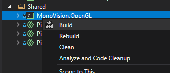

While both of these projects work with MonoGame, this custom version strips out all of the logic that is not critical to running Pixel Vision 8; all the way down to the bare SDL2 wrapper. It’s important to note that no APIs have been changed in MonoVision since the goal is to keep Pixel Vision 8 compatible with any future versions of MonoGame.

You’ll also want to make sure that the NuGet references are downloaded since these are not included in the repo. Pixel Vision 8 requires [SharpZipLib](https://www.nuget.org/packages/SharpZipLib/) and [MoonSharp](https://www.nuget.org/packages/MoonSharp) in order to compile. 

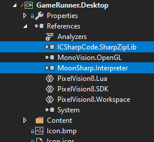

Once you have all the project reference set up correctly, you should be able to start with the `GameRunner.Desktop` project. This gives you the bare bone functionally needed to load a game. If you look in the `Content` folder, you’ll see references to the three core tools in order to boot, load games, and display errors. 

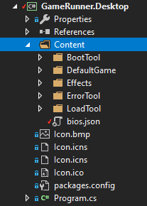

There is also an `Effects` folder that allows you to enable Pixel Vision 8’s CRT shader which we’ll talk about later. Finally, the` DefaultGame` folder contains an empty game project. This is where you’ll want to place your Lua PV8 game files in order to run them. If you compile the `GameRunner.Desktop` project, you’ll see the Runner boot and load the contents of the `DefaultGame` folder.

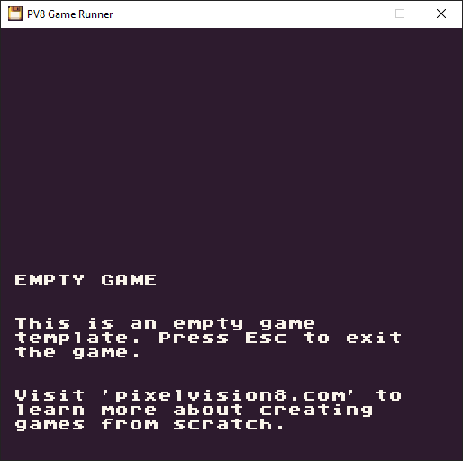

Finally, the `bios.json` file allows you to configure the Runner as it boots up. You’ll want to change the project name and can even update the paths to a custom boot, error or load tool if you want to customize the look and feel of your game’s Runner.

The `PixelVision8Runner.Desktop` project works in a similar way. The biggest change here is the creation of a `Workspace` folder when the Runner boots up. By default this will be created on your computer in one of these paths based on the OS you are running it on:

| Version | Path                                                      |
|---------|-----------------------------------------------------------|
| Windows | C:\\Users\\UserName\\Documents\\PixelVision8\\Workspace\\ |
| MacOS   | /Users/UserName/PixelVision8/PixelVision8/Workspace/      |
| Linux   | /Users/UserName/PixelVision8/PixelVision8/Workspace/      |

The Workspace directory allows you to install Pixel Vision OS and work on PV8 projects. The `PixelVision8Runner.Desktop` project does not contain a copy of Pixel Vision OS. So after it boots, you’ll be presented with the following screen.

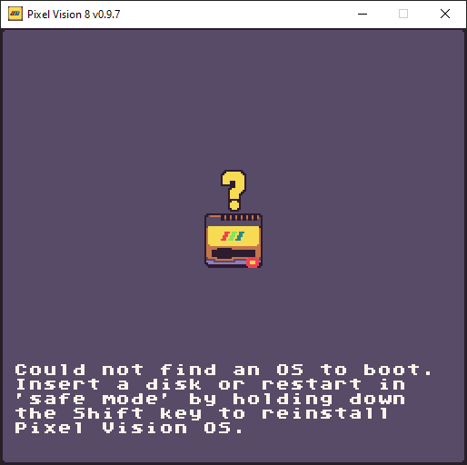

At this point, you can drop any `.pv8` disk or folder onto the Runner’s window and it will attempt to load it up. The `PixelVision8Runner.Desktop` project has a different structure inside of the `Content` folder than the Game Runner. Here you’ll find a `PixelVisionOS` folder that contains the same boot, load, and error tools the other Runner uses.

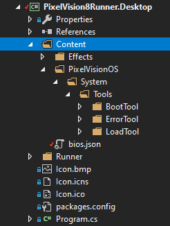

The big difference here is that the PixelVision8 Runner creates a mount point for the OS folder which you can access internally at `/PixelVisionOS/`. For example, you could place the contents of the Pixel Vision OS in this directory and change the `bio.json` file to load the Workspace Tool by default, and the Runner will boot right into the Workspace Explorer desktop. This is how the self-contained builds of [Pixel Vision 8 Draw](https://www.pixelvision8.com/draw) and [Tune](https://www.pixelvision8.com/tune) work. They have all the tools needed to run independently of installing the OS.

If your game needs access to a VFS, requires the `GameEditor`, or the ability to export and save files, you can customize the `PixelVision8Runner.Desktop` project to your own needs.

## Booting From A Disk

When you build Pixel Vision 8 from the source code it will not have a default OS installed. You’ll see the following screen after you compile it.

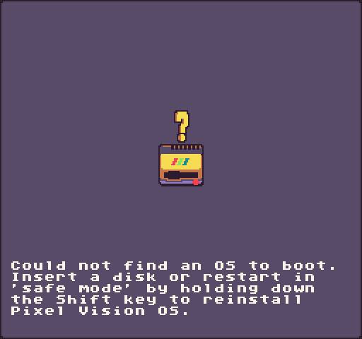

You can boot into Pixel Vision OS directly by dragging the OS disk folder onto the PV8 window.

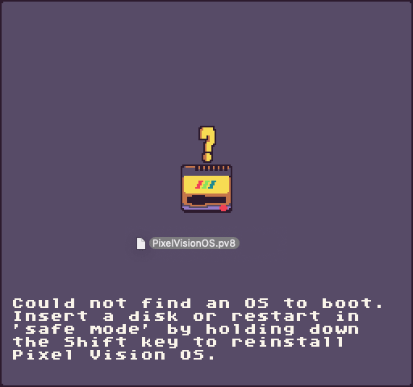

You can find the `PixelVisionOS `folder inside of the `/PixelVision8/Disks/` directory. After the OS is loaded it will boot up and load the Workspace Tool. The next time you compile Pixel Vision 8, it will automatically load the last disk path that was saved to the `bios.json` file.

If you run into any issues when booting up, you can boot into Safe Mode by holding down the `Shift Key` when Pixel Vision 8 loads up.

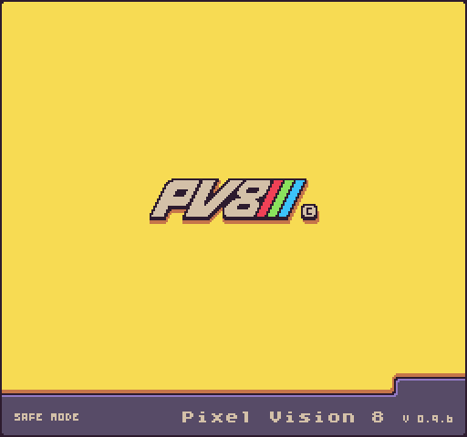

This will ignore the user’s bios settings and display the missing OS screen again allowing you to reload the Pixel Vision OS or any other PV8 disk.