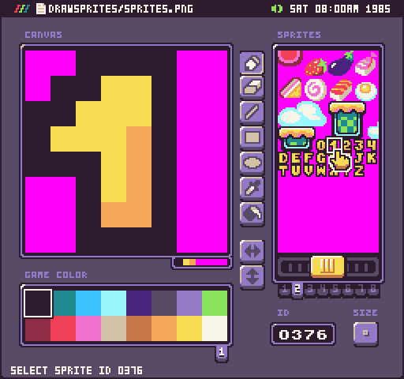
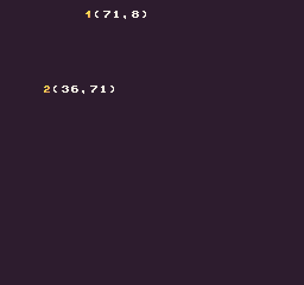

The `DrawSprite()` API allows you to draw a single sprite to the display. Sprites represent individual collections of 8 x 8 blocks of pixel data. Each sprite is cached by the `SpriteChip `making sprite draw requests very fast. The display also has a limitation on how many sprites that can be on the screen at the same time. Each time you call `DrawSprite()`, the sprite counts against the total amount the display can render. If you attempt to draw more sprites than the display can handle, the call is ignored. One thing to keep in mind when drawing sprites is that their `X` and `Y` positions wrap if they reach the right or bottom border of the screen. You can use the display’s overscan to hide sprites offscreen until they are needed.

Using the `DrawSprite()` API also allows you to flip the pixel data horizontally or vertically as well as change the color ID values. To conserve the `SpriteChip`’s memory, you can use these three pre-render flags to optimize your sprites.

## Usage

```csharp
DrawSprite ( id, x, y, flipH, flipV, drawMode, colorOffset )
```

## Arguments

| Name        | Value    | Description                                                                                                                                                                                          |
|-------------|----------|------------------------------------------------------------------------------------------------------------------------------------------------------------------------------------------------------|
| id          | int      | The unique ID of the sprite to use in the SpriteChip\.                                                                                                                                               |
| x           | int      | An int value representing the X position to place sprite on the display\. If set to 0, it renders on the far left\-hand side of the screen\.                                                         |
| y           | int      | An int value representing the Y position to place the sprite on the display\. If set to 0, it renders on the top of the screen\.                                                                     |
| flipH       | bool     | This is an optional argument which accepts a bool\. The default value is set to false but passing in true flips the pixel data horizontally\.                                                        |
| flipV       | bool     | This is an optional argument which accepts a bool\. The default value is set to false but passing in true flips the pixel data vertically\.                                                          |
| drawMode    | DrawMode | This argument accepts the DrawMode enum\. You can use Sprite, SpriteBelow, and TilemapCache to change where the pixel data is drawn to\. By default, this value is DrawMode\.Sprite\.                |
| colorOffset | int      | This optional argument accepts an int that offsets all the color IDs in the pixel data array\. This value is added to each int, in the pixel data array, allowing you to simulate palette shifting\. |

## Draw Modes

The `DrawSprite()` API supports the following draw modes:

| DrawMode     | Layer ID | Supported |
|--------------|----------|-----------|
| TilemapCache | \-1      | Yes       |
| Background   | 0        | No        |
| SpriteBelow  | 1        | Yes       |
| Tile         | 2        | Yes       |
| Sprite       | 3        | Yes       |
| UI           | 4        | Yes       |
| SpriteAbove  | 5        | Yes       |


Attempting to use an unsupported draw mode will cancel the draw request. When using `DrawMode.TilemapCache` or `DrawMode.Tile`, the tilemap’s coordinate space will be used. In the case of `DrawMode.Tile`, the `X` and `Y` values will become `Column` and `Row`. For `DrawMode.TilemapCache` you can use `X` and `Y` to place the sprite on the tilemap itself. That means that wrapping for the sprite’s coordinates will switch from the screen boundaries to the tilemap itself.

## Example

For this example, we are going to render a sprite to the display. To do this, we need the sprite’s ID which you can find in Pixel Vision OS’s Sprite Tool.



To calculate a sprite’s ID by hand, you can find the first sprite at the top left part of the `sprites.png` file. Once we have the sprite’s ID we can use the following code example to draw it:


## Lua

```lua
local speed = 5
local nextPos = 0

function Update(timeDelta)

  -- Calculate the next position
  nextPos = nextPos + (speed * (timeDelta / 100))

end

function Draw()

  -- Redraw the display
  RedrawDisplay()

  -- Draw sprite moving horizontally
  DrawSprite(376, nextPos, 8)

  -- Draw sprite moving vertically
  DrawSprite(377, 36, nextPos)

  -- Draw the x,y position of each sprite
  DrawText("("..math.floor(nextPos)..",8)", nextPos + 8, 8, DrawMode.Sprite, "large", 15)
  DrawText("(36,"..math.floor(nextPos)..")", 44, nextPos, DrawMode.Sprite, "large", 15)

end
```


## C#

```csharp
class DrawSprite : GameChip
{
    // Use floats to store the subpixel position
    private float speed = 5;
    private float nextPos;

    // Use this point to position the  sprites
    private Point pos;

    public override void Update(int timeDelta)
    { 
        // Calculate the next position
        nextPos = nextPos + (speed * (timeDelta / 100f));

        // Need to convert the nextPoint to an int, so we'll save it in a point
        pos.X = (int)nextPos;
        pos.Y = (int)nextPos;
    }

    public override void Draw()
    { 
        // Redraw the display
        RedrawDisplay();

        // Draw sprite moving horizontally
        DrawSprite(376, pos.X, 8);

        // Draw sprite moving vertically
        DrawSprite(377, 36, pos.Y);

        // Draw the x,y position of each sprite
        DrawText("("+MathUtil.FloorToInt(nextPos)+",8)", pos.X + 8, 8, DrawMode.Sprite, "large", 15);
        DrawText("(36,"+ MathUtil.FloorToInt(nextPos)+")", 44, pos.Y, DrawMode.Sprite, "large", 15);

    }
}
```


Running this code will output the following:




