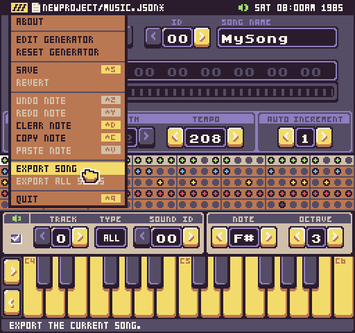
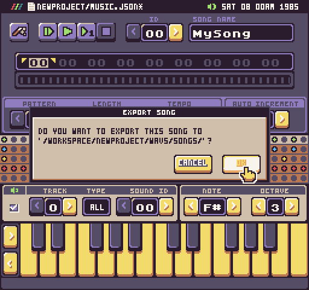

# Exporting Songs

The Music Tool offers an option to export individual patterns and songs as WAV files. You can do this by selecting the Export option from the drop-down menu. This feature is only available in Tune. 

The first option is to export the currently loaded song. This will export all of the song’s patterns and combine them into a single WAV file. The second option allows you to export all of the songs in the project as individual WAV files (coming soon).

When you export from the Music Tool, the file is saved inside of the project in a folder called Music. Inside you’ll find a folder for Patterns and for Songs.

You can preview any WAV file in the Workspace Explorer by double clicking on it.

