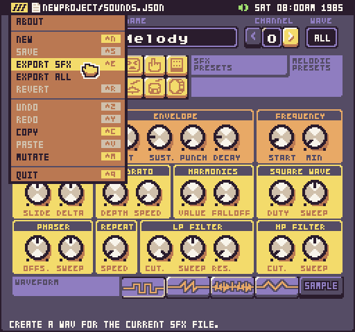
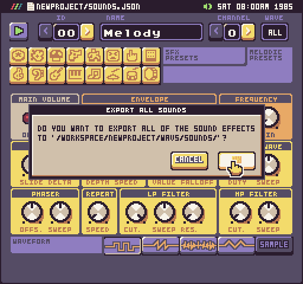
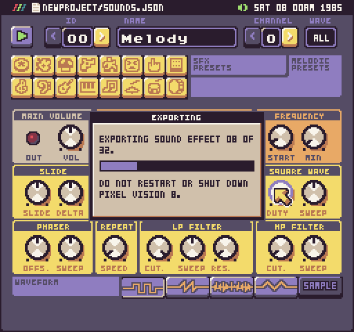

# Exporting Sound Effects

The Sound Tool allows you to export individual sound effects as WAV files. You can do this by going into the Sound Tool and selecting an export option from the drop-down menu.

You can export all of the sound effects at once by selecting Export All from the drop-down menu. All sound effects will be saved to a "Waves/Sounds/" folder in the current project.

If you are exporting multiple sound effects, you’ll see a progress bar since this action may take a while depending on how many sound effects are in the game and the speed of your computer.

It’s important to note that exporting songs with similar names, will overwrite them inside of the project’s Sounds folder. Once you export the sound effects you want to use in your own games, you can find open the Workspace folder on your computer and copy over the files you need.

