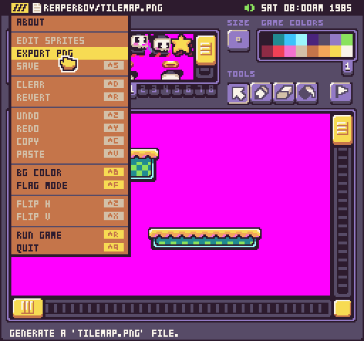
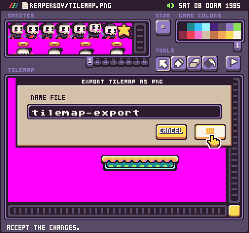
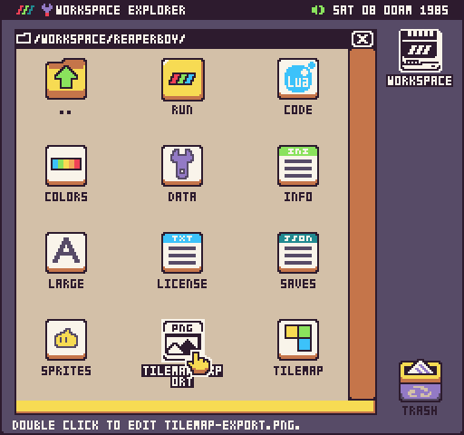
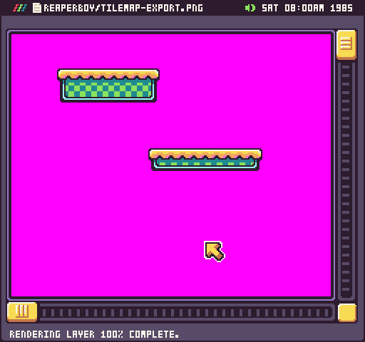

# Exporting Tilemaps

If you are working on a tilemap in the Tilemap Tool but want to save a png file, you can select the Export PNG option from the drop-down menu.

This take the tile layer and export it to a png file in your project. You’ll be able to give the file a unique name.

Once the tilemap.png file has been exported, you’ll see it in your project folder.

If the file is not named tilemap.png, you can open it in the image previewer to make sure everything was exported as expected.

While saving a tilemap.png file is a great way to archive the visuals of your tilemap, you may find it helpful when making changes to the sprites and need to regenerate a new tilemap.json file. Keep in mind that the tilemap.json file only stores references to sprite IDs, so if you move sprites around which can happen after optimizing, they will not be correctly updated in the tilemap.json file.

You can instead use the tilemap.png file to recreate the new tilemap.json file based on the new order of the sprites in memory. Likewise, the limitation of the tilemap.png file is that it doesn’t store information on each tile’s collision flag or color offset so there is a trade-off for working with each tilemap file type.

