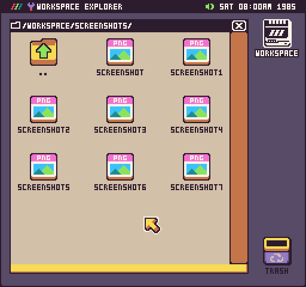
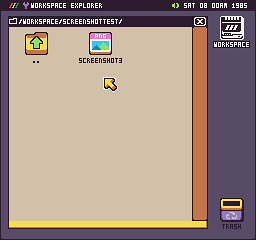
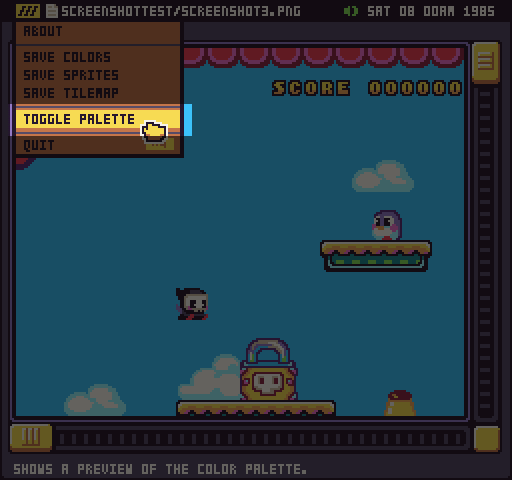
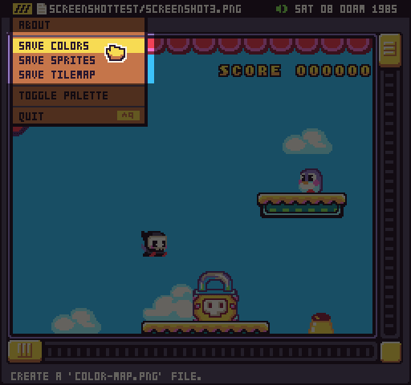
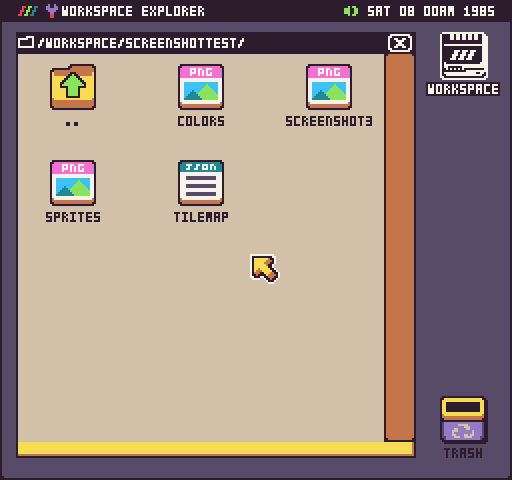
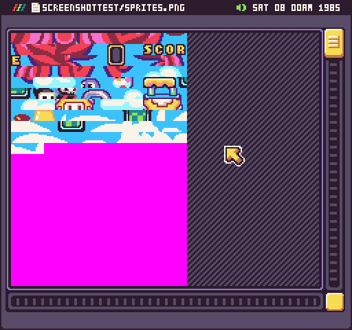
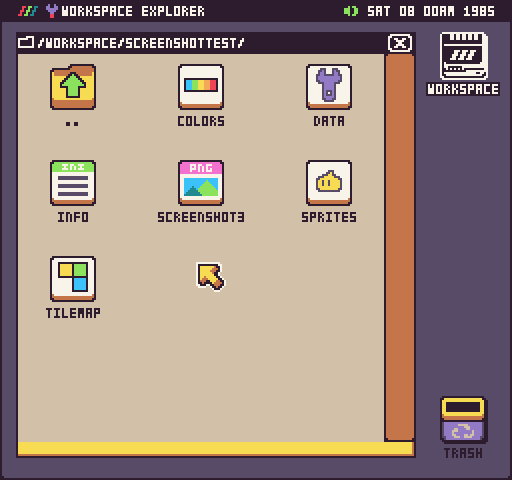
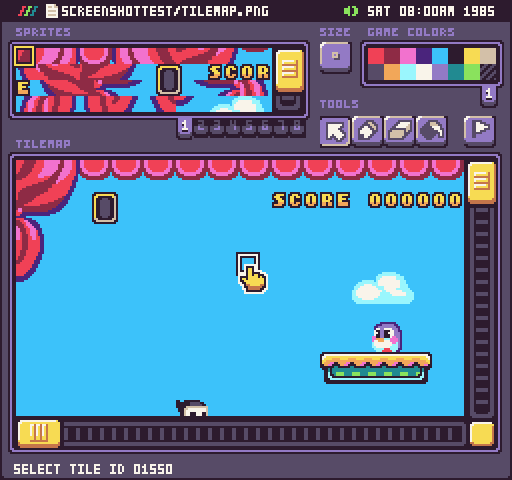

Pixel Vision OS has a built-in image viewer. You can use it to open any `.png` file that is not associated with an editor. You can tell a file will be opened by the Image Tool if it has the generic PNG icon. 

## Previewing

After double-clicking on a file ending in `.png`, the Image Tool will display it. If the image is larger than the preview window, you’ll be able to scroll horizontally or vertically via the scroll bars on the right and bottom of the tool.

It’s important to note that special image files such as the `colors.png`, `sprite.png` and `tilemap.png` file will be opened with their respective editors if they are inside of a game project folder.

## Extras
The Image Tool has some extra functionality outside of just displaying `.png` files. You can use it to generate` color.png`, `sprite.png`, `tilemaps.json` files from the currently displayed image. To illustrate how this works, copy a screenshot to a new empty folder. You can take a screenshot at any time by pressing `Ctrl + 2`. Once a screenshot is taken, it is saved to the `/Workspace/Screenshots/` folder.

### Color
After you open up the image, you’ll be able to preview the PNG’s colors by selecting Toggle Palette from the drop-down menu.

When to toggle the palette, the Image Tool will overlay a copy of the 256 color palette it is using to render the current image. Any transparent colors will be displayed as magenta (`#FF00FF`) which is the default mask color. The preview will hover above the upper left-hand corner of the scrolling window.

### Exporting

In addition to previewing the PNG’s color palette, you can use the Image Tool to export a color.png, sprite.png, and tilemap.json file from the current image. These options are also available in the drop-down menu.

When you select either of these options, the exported file will appear in the same directory as the PNG file you are previewing.

 By default, exporting each of these files in an empty directory will create PNG files you can open in the Image Tool. For example, if you open up the sprites.png file, you’ll see all of the unique sprites from the source image.

In order to open these files in their associated editor, you’ll need to add an `info.json` and `data.json` file. These two files tell Pixel Vision OS that this is a game folder and to remap the files to their respective editors. To verify that this a game project, the icons will change for each of the files.

Once the folder is converted into a game project, you’ll be able to open the `tilemap.jso`n file with the Tilemap Tool.

It’s important to note that generating out the sprite.png file from an image is dependant on exporting the `color.png` file first. In turn, the tilemap.json file is dependant on the sprites.png file and will reference each sprite ID. When used correctly, the Image Tool can help convert a PNG into sprites and tilemaps you can use to help speed up your game development.
