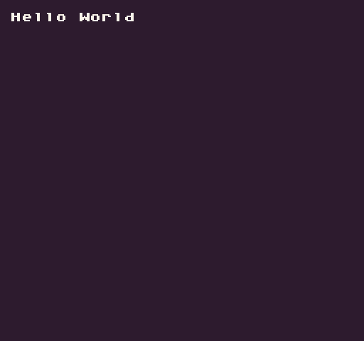

The `LoadScript()` API allows you to parse a new Lua script at runtime from memory. You can use the` AddScript()` API to manually load text into memory or add additional Lua files to your game project. Also, any Lua files located in a `System/Libs/` folder, whether at the root of the Workspace drive or on a disk, will be available to load.

Simply supply the name of the script, without an extension, and if it exists, the Lua interpreter will immediately parse it.

## Usage

```csharp
LoadScript ( name )
```

## Arguments

| Name | Value  | Description                                                      |
|------|--------|------------------------------------------------------------------|
| name | string | Name of the script\. You don’t have to add the \.lua extension\. |

## Example

In this example, we will add a simple script that prints "Hello World" to the display. It uses `AddScript()` and `LoadScript()` to work:


## Lua

```lua
-- Create Lua code as a string
local textFile =

[===[
function test()
  DrawText("Hello World", 1, 1, DrawMode.Tile, "large", 15)
end
]===]

-- Register the text file as a script
AddScript("textFile", textFile)

-- Load the new script
LoadScript("textFile")

function Init()
  -- Call the text method
  test()
end

function Draw()
  -- Redraw the display
  RedrawDisplay()
end
```

Running this code will output the following:




## C#

> This API is only availble to Lua games. Code files written in C# will automatically be loaded and compiled.
>


