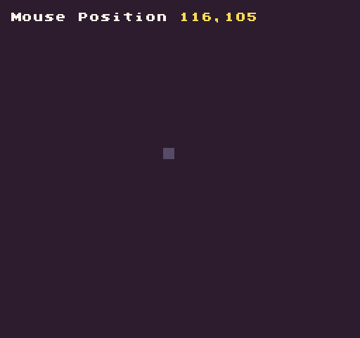

# MousePosition()

The `MousePosition()` API returns a Point for the mouse cursor's `X` and `Y` position. The mouse's `0`,`0` position is in the upper left-hand corner of the display and when the mouse is off-screen it will return `-1`. This value is read-only. 

## Usage

```csharp
MousePosition ( )
```

## Returns

| Value | Description                                                           |
|-------|-----------------------------------------------------------------------|
| bool  | Returns a point representing the mouse’s x,y position on the screen\. |

## Example

In this example, we will display the mouse position and draw an 8 x 8 pixel rectangle to display it on the screen:


## Lua

```lua
-- Store the current position of the mouse
local pos = NewPoint()

function Init()

  -- Draw the text for where the position will be displayed
  DrawText("Mouse Position", 1, 1, DrawMode.Tile, "large", 15)

end

function Update(timeDelta)

  -- Update the mouse position
  pos = MousePosition()

end

function Draw()

  -- Redraw the display
  RedrawDisplay()

  -- Test if the mouse is offscreen first
  if(pos.x == -1 or pos.y == -1) then

    -- Display that the mouse is offscreen
    DrawText("Offscreen", 128, 8, DrawMode.Sprite, "large", 14)

  else

    -- Draw a rectangle that follows the mouse on the screen
    DrawRect(pos.x, pos.y, 8, 8, 5)

    -- Display the X and Y position of the mouse
    DrawText(pos.x .. "," ..pos.y, 128, 8, DrawMode.Sprite, "large", 14)

  end

end
```


## C#

```csharp
class MousePositionExample : GameChip
{
    
    // Store the current position of the mouse
    private Point pos;

    public override void Init()
    { 
        // Draw the text for where the position will be displayed
        DrawText("Mouse Position", 1, 1, DrawMode.Tile, "large", 15);

    }

    public override void Update(int timeDelta)
    { 
        // Update the mouse position
        pos = MousePosition();

    }

    public override void Draw()
    { 
        // Redraw the display
        RedrawDisplay();

        // Test if the mouse is offscreen first
        if (pos.X == -1 || pos.Y == -1)
        {

            // Display that the mouse is offscreen
            DrawText("Offscreen", 128, 8, DrawMode.Sprite, "large", 14);

        } else { 

            // Draw a rectangle that follows the mouse on the screen
            DrawRect(pos.X, pos.Y, 8, 8, 5);

            // Display the X and Y position of the mouse
            DrawText(pos.X + "," + pos.Y, 128, 8, DrawMode.Sprite, "large", 14);

        }
    }
}
```


Running this code will output the following:




