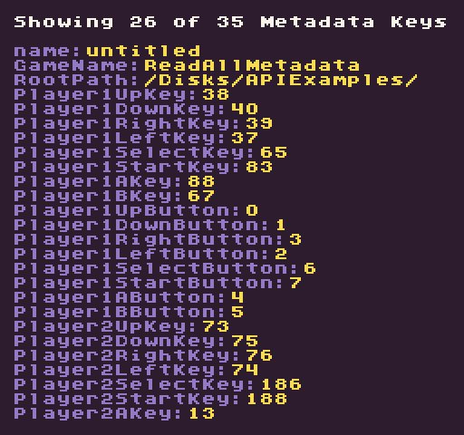

The `ReadAllMetadata()` API allows you to get a copy of all `metadata `values that were passed into the game when it loaded. This is useful if you do not know the exact key you are looking for and need to iterate through them until you find the one you need. There could be a lot of values in the game’s metadata so keep this in mind before trying to iterate over them all.

## Usage

```csharp
ReadMetaData ( key, defaultValue )
```

## Returns

| Value                      | Description                                                                                |
|----------------------------|--------------------------------------------------------------------------------------------|
| Dictionary<string, string> | Returns a copy of the metadata dictionary that was passed into the currently loaded game\. |

## Example

In this example, we are going to iterate over all of the game’s metadata keys and output what we can to the display:


## Lua

```lua
function Init()

  -- Set up the values we'll use to keep track of the metadata
  local nextRow = 3
  local maxRows = 29
  local counter = 0
  local metadata = ReadAllMetadata()

  -- Iterate over the game's metadata
  for key, value in next, metadata do

    -- We only display a key/value pair if there is space on the display
    if(nextRow &lt; maxRows ) then

      -- Draw the key value pair from the game's metadata
      DrawText(key .. ":", 8, nextRow * 8, DrawMode.TilemapCache, "large", 6)
      DrawText(value, (2 + #key) * 8, nextRow * 8, DrawMode.TilemapCache, "large", 14)

      -- Increment the row by 1 for the next loop
      nextRow = nextRow + 1
    end

    -- Keep track of the total amount of metadata keys
    counter = counter + 1

  end

  -- Display the amount displayed and the total in the game's metadata
  DrawText("Showing " .. (nextRow - 3) .." of " .. counter .. " Metadata Keys", 8, 8, DrawMode.TilemapCache, "large", 15)

end

function Draw()
  -- Redraw the display
  RedrawDisplay()
end
```


## C#

```csharp
class ReadAllMetadataExample : GameChip
{
    public override void Init()
    { 
        // Set up the values we'll use to keep track of the metadata
        var nextRow = 3;
        var maxRows = 29;
        var counter = 0;
        var metadata = ReadAllMetadata();

        // Iterate over the game's metadata
        foreach (var data in metadata)
        {
            
            // We only display a key/value pair if there is space on the display
            if(nextRow  &lt;maxRows ) 
            { 

                // Draw the key value pair from the game's metadata
                DrawText(data.Key+ ":", 8, nextRow * 8, DrawMode.TilemapCache, "large", 6);
                DrawText(data.Value, (2 + data.Key.Length) * 8, nextRow * 8, DrawMode.TilemapCache, "large", 14);

                // Increment the row by 1 for the next loop
                nextRow ++;

            }

            // Keep track of the total amount of metadata keys
            counter ++;

        }

        // Display the amount displayed and the total in the game's metadata
        DrawText("Showing " + (nextRow - 3) + " of " + counter + " Metadata Keys", 8, 8, DrawMode.TilemapCache,
            "large", 15);

    }

    public override void Draw()
    { 
        // Redraw the display
        RedrawDisplay();
    }
}
```


Running this code will output the following:




