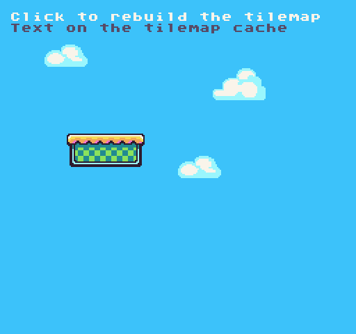

# RebuildTilemap()

The `RebuildTilemap()` API forces the tilemap to redraw the tilemap cache layer. Use this to clear any pixel data drawn on top of tiles in the tilemap cache layer.

## Usage

```csharp
RebuildTilemap ( )
```

## Example

In this example, we are going to draw some text to the tilemap and to the tilemap cache then call `RebuildTilemap()` when the mouse button is released:


## Lua

```lua
function Init()

  -- Add text to the tilemap
  DrawText("Click to rebuild the tilemap", 1, 1, DrawMode.Tile, "large", 15)
  DrawText("Text on the tilemap cache", 8, 16, DrawMode.TilemapCache, "large", 5)

end

function Update(timeDelta)

  -- Detect if the mouse button was released and trigger the tilemap to rebuild
  if(MouseButton(0, InputState.Released)) then
    RebuildTilemap()
  end

end

function Draw()
  -- Redraw the display
  RedrawDisplay()
end
```


## C#

```csharp
class RebuildTilemapExample : GameChip
{
    public override void Init()
    { 

        // Add text to the tilemap
        DrawText("Click to rebuild the tilemap", 1, 1, DrawMode.Tile, "large", 15);
        DrawText("Text on the tilemap cache", 8, 16, DrawMode.TilemapCache, "large", 5);

    }

    public override void Update(int timeDelta)
    { 

        // Detect if the mouse button was released and trigger the tilemap to rebuild
        if(MouseButton(0, InputState.Released))
        {
            RebuildTilemap();
        }

    }

    public override void Draw()
    { 
        // Redraw the display
        RedrawDisplay();
    }
}
```


Running this code will output the following:




