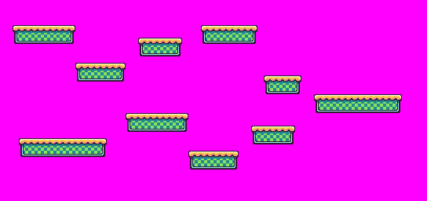
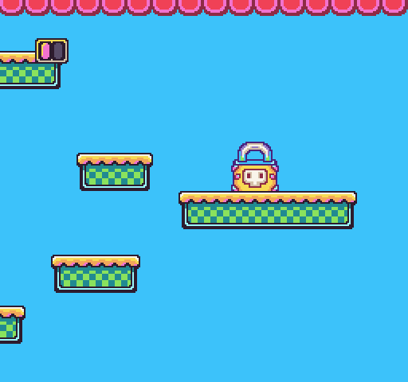

You can scroll the tilemap by calling the `ScrollPosition()` API and supplying a new scroll `X` and `Y` position. By default, calling `ScrollPosition()` with no arguments returns a `Point` with the current scroll `X` and `Y` values. If you supply an `X` and `Y` value, it updates the tilemap's scroll position the next time you call the `DrawTilemap()` API.

It’s important that some of the drawing APIs like `DrawSpriteBlock()` and `DrawSprites()` will automatically use the `ScrollPosition()` API to calculate their position on the screen and if the sprites should render or not. You’ll want to take this into account when scrolling the screen and using those APIs. Finally scrolling the tilemap past its edges will have it wrap around the screen. So you’ll need to manually manage the tilemap’s boundaries in order to keep that from happening.

## Usage

```csharp
ScrollPosition ( x, y )
```

## Arguments

| Name | Value | Description                                                                                                                                  |
|------|-------|----------------------------------------------------------------------------------------------------------------------------------------------|
| x    | int   | An optional int value representing the scroll X position of the tilemap\. If set to 0, it starts on the far left\-hand side of the tilemap\. |
| y    | int   | An optional int value representing the scroll Y position of the tilemap\. If set to 0, it starts on the top of the tilemap\.                 |

## Returns

| Value | Description                                                                        |
|-------|------------------------------------------------------------------------------------|
| Point | By default, this method returns a Point with the current scroll X and Y position\. |

## Example

In this example, we are going to scroll the tilemap and stop it before it when it reaches the end. This is what the tilemap looks like:



On top of the tilemap will be two sprites, one at a fixed position and the second that scrolls with the tilemap:


## Lua

```lua
local speed = 5
local nextPos = 0

-- We need to know the width of the screen
local screenWidth = Display().x

-- We need total columns in the tilemap and multiply that by the sprite size to get the full width
local mapWidth = TilemapSize().x * SpriteSize().x

function Update(timeDelta)

  -- We need to text if the next position plus the screen width is less than the map's width
  if(nextPos + screenWidth &lt; mapWidth) then

    -- Calculate the next position
    nextPos = nextPos + (speed * (timeDelta / 100))

    -- Update the scroll position
    ScrollPosition(nextPos)

  end

end

function Draw()

  -- Clear the background
  Clear()

  -- Draw the actual tilemap starting below the top border and manually adjust the scroll offset values
  DrawTilemap(0, 16, 32, 28, nextPos, 16)

  -- Draw the life bar sprite block but ignore the scroll position so it stays fixed on the screen
  DrawSpriteBlock(300, 16, 24, 4, 2, false, false, DrawMode.Sprite, 0, false, false)

  -- Draw the exit offscreen and it will become visible when the maps scrolls to the end
  DrawSpriteBlock(104, 432, 88, 4, 4, false, false, DrawMode.Sprite)

  -- Draw the tilemap top border over everything else and lock the x scroll value
  DrawTilemap(0, 0, 32, 2, 0)

end
```


## C#

```csharp
class ScrollPositionExample : GameChip
{
    // Use floats to store the subpixel position
    private float speed = 5;
    private float nextPos;

    // Use this point to position the  sprites
    private Point pos;

    // Store the width of the screen
    private int screenWidth;
    
    // Store the full width of the map
    private int mapWidth;

    public override void Init()
    {

        // Set the the width of the screen
        screenWidth = Display().X;
        // We need total columns in the tilemap and multiply that by the sprite size to get the full width
        mapWidth = TilemapSize().X * SpriteSize().X;

    }

    public override void Update(int timeDelta)
    {
        // We need to text if the next position plus the screen width is less than the map's width
        if (nextPos + screenWidth &lt; mapWidth)
        {

            // Calculate the next position
            nextPos = nextPos + (speed * (timeDelta / 100f));

            // Need to convert the nextPoint to an int, so we'll save it in a point
            pos.X = (int) nextPos;
            pos.Y = (int) nextPos;

            // Update the scroll position
            ScrollPosition(pos.X);

        }
    }

    public override void Draw()
    { 

        // Redraw the display
        RedrawDisplay();

        // Draw the life bar sprite block but ignore the scroll position so it stays fixed on the screen
        DrawSpriteBlock(300, 8, 8, 4, 2, false, false, DrawMode.Sprite, 0, false, false);

        // Draw the exit offscreen and it will become visible when the maps scrolls to the }
        DrawSpriteBlock(104, 432, 88, 4, 4, false, false, DrawMode.Sprite);

    }
}
```


Running this code will output the following:




